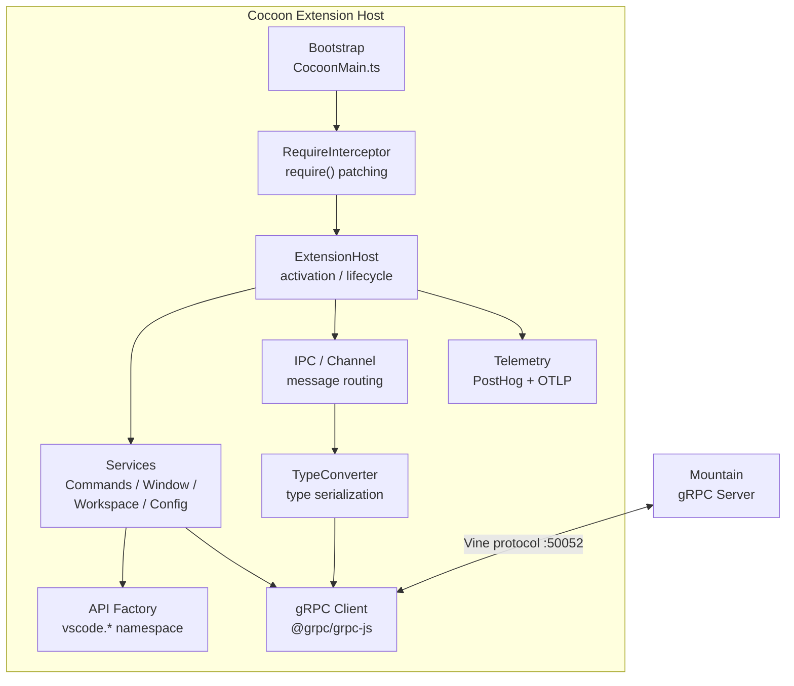

<table>
	<tr>
		<td colspan="1">
			<h3 align="center">
				<picture>
					<source media="(prefers-color-scheme: dark)" srcset="https://editor.land/Dark/Image/GitHub/Land.svg">
					<source media="(prefers-color-scheme: light)" srcset="https://editor.land/Image/GitHub/Land.svg">
					
				</picture>
			</h3>
		</td>
		<td colspan="3" valign="top">
			<h3 align="center"> Cocoon 🦋</h3>
		</td>
	</tr>
</table>

---

# **Cocoon** 🦋 Architecture

`Cocoon` is the `Node.js` extension host sidecar for `Land`.

- `Cocoon` runs VS Code extensions in a supervised `Node.js` process.
- It provides a `vscode` API shim via `Effect-TS`.
- This shim translates extension API calls into declarative Effects.
- `Effects` are either handled in-process.
- Or dispatched to `Mountain` via `gRPC` for native execution.

---

## Table of Contents

1. [Overview](#overview)
2. [Architecture](#architecture)
3. [Startup Sequence](#startup-sequence)
4. [VS Code API Shim](#vs-code-api-shim)
5. [Service Providers](#service-providers)
6. [gRPC Communication](#grpc-communication)
7. [RequireInterceptor](#requireinterceptor)
8. [Extension Lifecycle](#extension-lifecycle)
9. [Dual-Track Routing](#dual-track-routing)
10. [Related Documentation](#related-documentation)

---



## Overview 📋

`Cocoon` is a `TypeScript` application built with `Effect-TS`.

- It replicates the VS Code Extension Host API.
- It communicates with `Mountain` via `gRPC` (`Vine` protocol) on port 50052.
- It is spawned and supervised by `Mountain`'s `ProcessManagement` module.

| Attribute    | Value                                                                                                               |
| ------------ | ------------------------------------------------------------------------------------------------------------------- |
| Language     | `TypeScript` (`Effect-TS` v3.21)                                                                                    |
| Runtime      | `Node.js` (managed by `SideCar`)                                                                                    |
| IPC          | `gRPC` (`Vine` protocol)                                                                                            |
| Dependencies | `effect`, `@effect/platform`, `@effect/platform-node`, `@grpc/grpc-js`, `@codeeditorland/output`, `google-protobuf` |
| Managed by   | `Mountain` `ProcessManagement/CocoonManagement.rs`                                                                  |

---

## Architecture 🏗️

```
+------------------------------------------------------------------+
|                        Cocoon                                     |
|                                                                   |
|  +------------------+  +------------------+  +------------------+ |
|  | Bootstrap/       |  | Core/            |  | PatchProcess/    | |
|  | CocoonMain.ts    |  | ExtensionHost.ts |  | process.ts       | |
|  | Initialization   |  | Activation logic |  | Signal handling  | |
|  +------------------+  +------------------+  +------------------+ |
|                                                                   |
|  +------------------+  +------------------+  +------------------+ |
|  | Services/        |  | API/             |  | IPC/             | |
|  | - Commands.ts    |  | APIFactory.ts   |  | Channel.ts       | |
|  | - Window.ts      |  | API construction |  | Message routing  | |
|  | - Workspace.ts   |  | per extension   |  |                  | |
|  | - Configuration  |  |                  |  |                  | |
|  +------------------+  +------------------+  +------------------+ |
|                                                                   |
|  +------------------+  +------------------+  +------------------+ |
|  | ModuleInterceptor|  | Telemetry/       |  | TypeConverter/   | |
|  | (require         |  | PostHog + OTLP   |  | Command, Dialog,  | |
|  |  interception)   |  |                  |  | Webview converters| |
|  +------------------+  +------------------+  +------------------+ |
+------------------------------------------------------------------+
```

### Module Map 🗺️

| Path                                            | Purpose                                          |
| ----------------------------------------------- | ------------------------------------------------ |
| `Source/Bootstrap/Implementation/CocoonMain.ts` | Entry point; initialization prelude              |
| `Source/PatchProcess/`                          | Process hardening, signal handling, log piping   |
| `Source/Core/ExtensionHost.ts`                  | Extension activation and lifecycle               |
| `Source/Core/RequireInterceptor.ts`             | Require() patching for VS Code module loading    |
| `Source/Core/ApiFactory.ts`                     | Constructs vscode.\\\* API objects per extension |
| `Source/Services/Commands.ts`                   | Command registration and execution               |
| `Source/Services/Window.ts`                     | Window and editor management                     |
| `Source/Services/Workspace.ts`                  | Workspace and file system operations             |
| `Source/Services/Configuration.ts`              | Configuration read/write                         |
| `Source/Services/gRPC/Client.ts`                | gRPC client for Mountain communication           |
| `Source/API/`                                   | API surface construction and type definitions    |
| `Source/ModuleInterceptor/`                     | ESM and CommonJS module interception             |
| `Source/TypeConverter/`                         | Type conversion between extensions and gRPC      |
| `Source/Telemetry/`                             | PostHog + OTLP telemetry                         |
| `Source/IPC/`                                   | Internal message channel system                  |
| `Source/Utility/Tier.ts`                        | Tier configuration reader                        |
| `Source/WebviewPanel/`                          | Webview panel lifecycle management               |
| `Source/Generated/`                             | Proto-generated TypeScript types                 |
| `Source/Configuration/ESBuild/`                 | Build configuration                              |

---

## Startup Sequence 🚀

```
1. Node.js process starts (bootstrap-fork.js)
    |
    v
2. PatchProcess/index.ts executes:
    - console.log piping to Mountain's log sink
    - Unhandled rejection tracking
    - SIGTERM/SIGINT signal handling
    - Parent process monitoring (VSCODE_PARENT_PID)
    |
    v
3. IpcProvider starts gRPC client
    - Connects to Mountain on NetworkCocoonPort (default: 50052)
    - Sends $initialHandshake gRPC notification
    - Waits for initExtensionHost request
    |
    v
4. globalThis.__LandTiers populated
    - Reads esbuild-substituted __LandTier_<Capability>__ identifiers
    - Falls through to process.env.Tier<Capability>
    - Falls through to hard-coded defaults
    |
    v
5. RequireInterceptor installed
    - Patches Node.js require() for VS Code bundle loading
    - Maps electron-less requires to Tauri equivalents
    |
    v
6. Mountain sends Initialize gRPC request with InitData
    - Workspace info, extension manifests, configuration snapshot
    |
    v
7. InitDataLayer created from InitData payload
    |
    v
8. FullAppInitialization Effect runs
    - Resolves ExtensionHostProvider
    - Activates startup extensions (* activation event)
    |
    v
Extension host ready for use
```

---

## VS Code API Shim 📦

`Cocoon` constructs VS Code API objects for each extension via `ApiFactory.ts`:

```typescript
// Cocoon constructs a vscode namespace for each extension
const vscode = ApiFactory.create(extensionId, {
	commands: CommandsProvider,
	window: WindowProvider,
	workspace: WorkspaceProvider,
	languages: LanguagesProvider,
	env: EnvironmentProvider,
	// ... all vscode.* namespaces
});
```

### API Namespace Providers 📋

| Namespace             | Provider            | Track                       |
| --------------------- | ------------------- | --------------------------- |
| `vscode.commands`     | CommandsProvider    | A + S (Stock + Sky-direct)  |
| `vscode.window`       | WindowProvider      | A (Stock Node)              |
| `vscode.workspace`    | WorkspaceProvider   | A + B (Stock + Rust-native) |
| `vscode.languages`    | LanguagesProvider   | A (Stock Node)              |
| `vscode.env`          | EnvironmentProvider | A (Stock Node)              |
| `vscode.extensions`   | ExtensionsProvider  | A (Stock Node)              |
| `vscode.workspace.fs` | FileSystemProvider  | B (Rust-native via gRPC)    |
| `vscode.tasks`        | TasksProvider       | A (Stock Node)              |
| `vscode.debug`        | DebugProvider       | A + B                       |
| `vscode.tests`        | TestsProvider       | A (Stock Node)              |
| `vscode.Notebook*`    | NotebookProvider    | A (Stock Node)              |
| `vscode.WebviewPanel` | WebviewProvider     | B (Mountain-backed)         |

---

## Service Providers 🔌

Each service is implemented as an `Effect-TS` `Layer`:

| Service               | Module                      | Key Methods                                                                             |
| --------------------- | --------------------------- | --------------------------------------------------------------------------------------- |
| CommandsProvider      | `Services/Commands.ts`      | `registerCommand`, `executeCommand`, `getCommands`                                      |
| WindowProvider        | `Services/Window.ts`        | `createWebviewPanel`, `showTextDocument`, `activeTextEditor`, `showInformationMessage`  |
| WorkspaceProvider     | `Services/Workspace.ts`     | `workspaceFolders`, `openTextDocument`, `findFiles`, `applyEdit`, `getConfiguration`    |
| LanguagesProvider     | `Services/Language/`        | `registerHoverProvider`, `registerCompletionProvider`, `registerDefinitionProvider`     |
| ConfigurationProvider | `Services/Configuration.ts` | `get`, `has`, `inspect`, `update`, `onDidChange`                                        |
| WebviewProvider       | `Services/WebviewPanel/`    | `createWebviewPanel`, `postMessage`, `onDidReceiveMessage`                              |
| FileSystemProvider    | `Services/File/`            | `readFile`, `writeFile`, `stat`, `readDirectory`, `createDirectory`, `delete`, `rename` |

---

## gRPC Communication 🌐

`Cocoon` communicates with `Mountain` via the `Vine` `gRPC` protocol.

### Client Implementation 💻

```typescript
// gRPC client connects to Mountain on port 50051
const client = new ExtensionHostClient(
	`127.0.0.1:${NetworkMountainPort}`,
	grpc.credentials.createInsecure(),
);

// Sending a command to Mountain
const response: CommandResponse = await new Promise((resolve, reject) => {
	client.executeCommand(
		CommandRequest.fromPartial({
			commandId: "workbench.action.files.save",
			args: [serialize(args)],
			callerId: extensionId,
		}),
		(error, response) => {
			if (error) reject(error);
			else resolve(response);
		},
	);
});
```

### Connection Management 🔗

| Feature      | Implementation                                |
| ------------ | --------------------------------------------- |
| Connection   | Unary gRPC calls + bidirectional streaming    |
| Heartbeat    | 5-second interval via `Heartbeat` RPC         |
| Reconnection | Automatic on disconnect (exponential backoff) |
| Timeout      | 30-second request timeout                     |
| Backpressure | gRPC flow control                             |

---

## RequireInterceptor 🪝

The `RequireInterceptor` patches `Node.js`'s `require()` to enable VS Code
module loading.

### Interception Rules 📋

| Module Pattern            | Replacement                        | Behavior                                |
| ------------------------- | ---------------------------------- | --------------------------------------- |
| `electron`                | (empty stub)                       | No-op module with expected method stubs |
| `original-fs`             | `fs`                               | Redirect to Node.js standard library    |
| `keytar`                  | Custom stub                        | OS keychain via Mountain gRPC           |
| `spdlog`                  | Custom stub                        | No-op logging                           |
| `vscode-windows-registry` | Custom stub                        | No-op (macOS-only)                      |
| `./extHost*.js`           | Load from `@codeeditorland/output` | VS Code stock source                    |
| `./mainThread*.js`        | Load from `@codeeditorland/output` | VS Code stock source                    |
| `vscode`                  | `ApiFactory` construct             | Extension-specific API surface          |

### Installation ⚙️

```typescript
// Installed before any VS Code source code is loaded
const interceptor = new RequireInterceptor();
interceptor.install();

// After installation, all require() calls go through interceptor
const vscode = require("vscode"); // Returns per-extension API surface
```

---

## Extension Lifecycle 🔄

```
1. Extension Discovery
   - Mountain scans extension directories
   - Sends extension manifests in InitData

2. Extension Loading
   - RequireInterceptor loads extension's main module
   - Extension's activate() function is called
   - Extension passes activate(extContext) where extContext.subscriptions
     tracks disposables

3. Extension Registration
   - Extension calls vscode.commands.registerCommand(...)
   - Calls vscode.languages.registerHoverProvider(...)
   - Calls vscode.window.registerWebviewPanelSerializer(...)
   - All registrations are tracked by their respective providers

4. Normal Operation
   - Extension API calls dispatch through providers
   - Providers either handle in-process (Track A)
     or send gRPC to Mountain (Track B)

5. Deactivation
   - Mountain sends DeactivateExtension gRPC request
   - Extension's deactivate() function is called
   - All subscriptions disposed
   - Module unloaded
```

---

## Dual-Track Routing 🛤️

`Cocoon` routes extension API calls through two tracks:

| Track               | Implementation                   | Latency    | When Used                                  |
| ------------------- | -------------------------------- | ---------- | ------------------------------------------ |
| **A - Stock Node**  | Unmodified VS Code `extHost*.ts` | In-process | Default for all APIs                       |
| **B - Rust Native** | gRPC `ActionEffect` to Mountain  | ~1ms       | I/O-heavy APIs (fs, terminal, search, git) |

### Routing Decision 🧭

```typescript
// From Cocoon's tier router (simplified)
if (Tier.FileSystem === "Layer4" && operation.isIoHeavy) {
    // Track B: Ship ActionEffect to Mountain via gRPC
    return await spineClient.performAction(ActionEffect.ReadFile { path });
} else {
    // Track A: Handle in-process via extHost*.ts
    return await stockImplementation.readFile(uri);
}
```

### Track Distribution by API 📊

| API                             | Default Track | Rationale                       |
| ------------------------------- | ------------- | ------------------------------- |
| `commands.registerCommand`      | A             | In-process bookkeeping          |
| `commands.executeCommand`       | A             | In-process dispatch             |
| `window.showInformationMessage` | A             | In-process dialog               |
| `workspace.openTextDocument`    | A             | Content in memory               |
| `workspace.fs.readFile`         | B             | Native file I/O (faster)        |
| `workspace.findFiles`           | B             | Native search (ripgrep)         |
| `window.createWebviewPanel`     | B             | Mountain owns webview lifecycle |
| `env.clipboard`                 | B             | Native clipboard access         |

---

## Related Documentation 📚

- [Mountain](https://github.com/CodeEditorLand/Mountain/tree/Current/Documentation/GitHub/Architecture.md) -
  `gRPC` server and `ProcessManagement`
- [Wind](https://github.com/CodeEditorLand/Wind/tree/Current/Documentation/GitHub/Architecture.md) -
  Frontend service layer (parallel API surface)
- [Output](https://github.com/CodeEditorLand/Output/tree/Current/Documentation/GitHub/Architecture.md) -
  Compiled platform code consumer
- [Vine](https://github.com/CodeEditorLand/Vine/tree/Current/Documentation/GitHub/Architecture.md) -
  `gRPC` protocol definitions
- [Polyfills](https://github.com/CodeEditorLand/Land/tree/Current/Documentation/GitHub/Polyfills.md) -
  Initialization prelude
- [EditorCore](https://github.com/CodeEditorLand/Land/tree/Current/Documentation/GitHub/EditorCore.md) -
  VS Code API coverage strategy

---

## Shim Compatibility

| 🟠 Low-Level Shim | 🔵 Coverage Shim |
|-------------------|-----------------|
| Tier: `TierShim=Own\|Preempt` | Tier: `TierShim=Proxy\|Replace` |
| Engine prototype hooks | Service routing + audit |

> This Element supports the Land deep-shim interception system. Gated behind
> `TierShim` env var (default: `None` — zero overhead).
>
> **Cocoon shim architecture:** `Source/Shim/NodeModuleInterceptor.ts` —
> intercepts Node.js `Module._load` for fs/child_process at Layer D.

---

**Project Maintainers:** Source Open
([Source/Open@Editor.Land](mailto:Source/Open@Editor.Land)) |
[GitHub Repository](https://github.com/CodeEditorLand/Cocoon) |
[Report an Issue](https://github.com/CodeEditorLand/Cocoon/issues)
