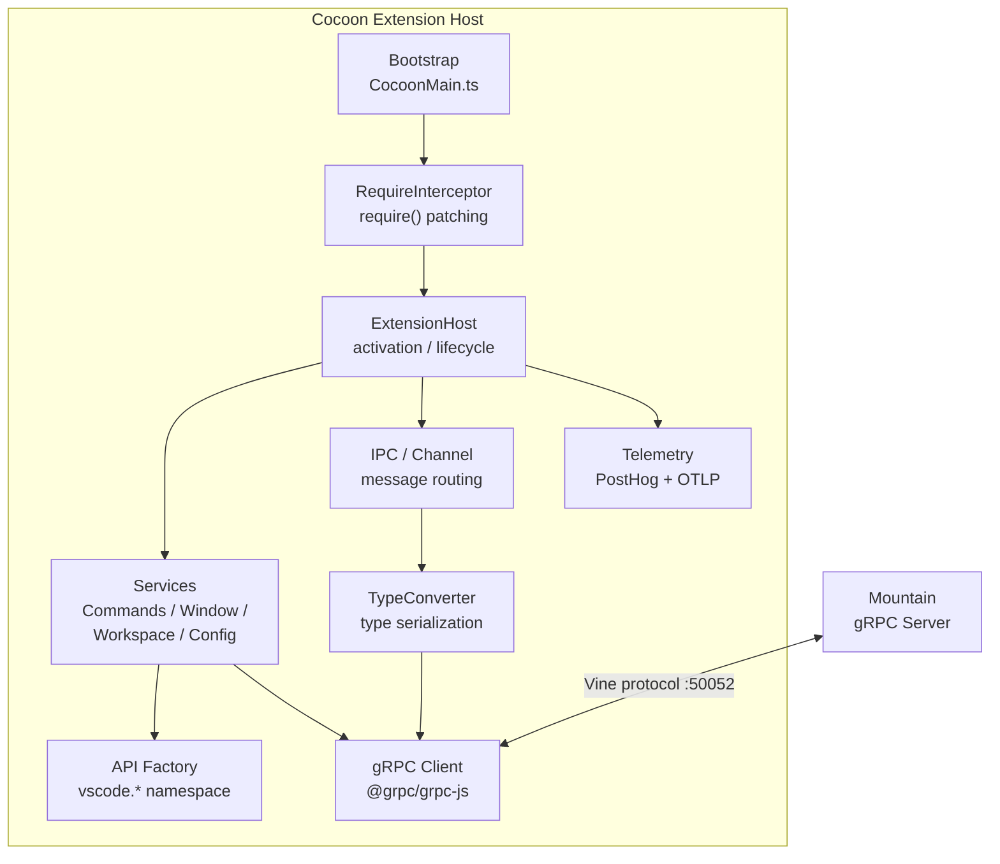

<table>
	<tr>
		<td colspan="1">
			<h3 align="center">
				<picture>
					<source media="(prefers-color-scheme: dark)" srcset="https://editor.land/Dark/Image/GitHub/Land.svg">
					<source media="(prefers-color-scheme: light)" srcset="https://editor.land/Image/GitHub/Land.svg">
					
				</picture>
			</h3>
		</td>
		<td colspan="3" valign="top"><h3 align="center">Cocoon&#x2001;🦋</h3></td>
	</tr>
</table>

---

# **Cocoon** Architecture&#x2001;🦋

`Cocoon` is the Node.js extension host sidecar for `Land`.

- `Cocoon` runs VS Code extensions in a supervised Node.js process.
- It provides a `vscode` API shim via `Effect-TS`.
- This shim translates extension API calls into declarative Effects.
- `Effects` are either handled in-process.
- Or dispatched to `Mountain` via `gRPC` for native execution.

---

## Table of Contents

1. [Overview](#overview)
2. [Architecture](#architecture)
3. [Startup Sequence](#startup-sequence)
4. [VS Code API Shim](#vs-code-api-shim)
5. [Service Providers](#service-providers)
6. [gRPC Communication](#grpc-communication)
7. [RequireInterceptor](#requireinterceptor)
8. [Extension Lifecycle](#extension-lifecycle)
9. [Dual-Track Routing](#dual-track-routing)
10. [Related Documentation](#related-documentation)

---


```mermaid
graph TB
    subgraph Cocoon["Cocoon Extension Host"]
        BS["Bootstrap<br/>CocoonMain.ts"]
        RI["RequireInterceptor<br/>require() patching"]
        EH["ExtensionHost<br/>activation / lifecycle"]
        GRPC_C["gRPC Client<br/>@grpc/grpc-js"]
        SVC["Services<br/>Commands / Window /<br/>Workspace / Config"]
        API["API Factory<br/>vscode.* namespace"]
        IPC["IPC / Channel<br/>message routing"]
        TC["TypeConverter<br/>type serialization"]
        TM["Telemetry<br/>PostHog + OTLP"]

        BS --> RI
        RI --> EH
        EH --> SVC
        SVC --> API
        SVC --> GRPC_C
        EH --> IPC
        IPC --> TC
        TC --> GRPC_C
        EH --> TM
    end

    MOUNTAIN["Mountain<br/>gRPC Server"] <-->|"Vine protocol :50052"| GRPC_C
```

## Overview&#x2001;📋

`Cocoon` is a `TypeScript` application built with `Effect-TS`.

- It replicates the VS Code Extension Host API.
- It communicates with `Mountain` via `gRPC` (`Vine` protocol) on port 50052.
- It is spawned and supervised by `Mountain`'s `ProcessManagement` module.

| Attribute    | Value                                                                                                               |
| ------------ | ------------------------------------------------------------------------------------------------------------------- |
| Language     | `TypeScript` (`Effect-TS` v3.21)                                                                                    |
| Runtime      | Node.js (managed by `SideCar`)                                                                                    |
| IPC          | `gRPC` (`Vine` protocol)                                                                                            |
| Dependencies | `effect`, `@effect/platform`, `@effect/platform-node`, `@grpc/grpc-js`, `@codeeditorland/output`, `google-protobuf` |
| Managed by   | [Mountain ProcessManagement/CocoonManagement.rs](https://github.com/CodeEditorLand/Mountain/tree/Current/Source/ProcessManagement/CocoonManagement.rs) |

> [!NOTE]
>
> Node.js is the runtime, not a path in this repository, so it is named
> here in plain prose rather than as a code path.

---

## Architecture&#x2001;🏗️

```
+------------------------------------------------------------------+
|                        Cocoon                                     |
|                                                                   |
|  +------------------+  +------------------+  +------------------+ |
|  | Bootstrap/       |  | Core/            |  | PatchProcess/    | |
|  | CocoonMain.ts    |  | ExtensionHost.ts |  | process.ts       | |
|  | Initialization   |  | Activation logic |  | Signal handling  | |
|  +------------------+  +------------------+  +------------------+ |
|                                                                   |
|  +------------------+  +------------------+  +------------------+ |
|  | Services/        |  | API/             |  | IPC/             | |
|  | - Commands.ts    |  | APIFactory.ts   |  | Channel.ts       | |
|  | - Window.ts      |  | API construction |  | Message routing  | |
|  | - Workspace.ts   |  | per extension   |  |                  | |
|  | - Configuration  |  |                  |  |                  | |
|  +------------------+  +------------------+  +------------------+ |
|                                                                   |
|  +------------------+  +------------------+  +------------------+ |
|  | ModuleInterceptor|  | Telemetry/       |  | TypeConverter/   | |
|  | (require         |  | PostHog + OTLP   |  | Command, Dialog,  | |
|  |  interception)   |  |                  |  | Webview converters| |
|  +------------------+  +------------------+  +------------------+ |
+------------------------------------------------------------------+
```

> [!IMPORTANT]
>
> The box diagram above is the historical sketch and uses short display
> names; the [Module Map](#module-map) below carries the real, current
> paths as they exist on disk.

### Naming Corrections&#x2001;🔧

Earlier revisions of this document named modules that never existed under
this layout. Each is recorded here with the real path that replaces it, so
a reader following an old reference knows where the code actually went.

Names in the left column are quoted as plain text on purpose: they are
former spellings, not paths you can open.

| Claimed previously                              | Real location                                                                                                                                          |
| ----------------------------------------------- | -------------------------------------------------------------------------------------------------------------------------------------------------------- |
| Source/Bootstrap/Implementation/CocoonMain.ts   | [`Bootstrap/Implementation/Cocoon/Main.ts`](https://github.com/CodeEditorLand/Cocoon/tree/Current/Source/Bootstrap/Implementation/Cocoon/Main.ts)       |
| Source/Core/ExtensionHost.ts                    | [`Services/Extension/Host/Service.ts`](https://github.com/CodeEditorLand/Cocoon/tree/Current/Source/Services/Extension/Host/Service.ts)                 |
| Source/Core/RequireInterceptor.ts               | [`Services/Module/Interceptor.ts`](https://github.com/CodeEditorLand/Cocoon/tree/Current/Source/Services/Module/Interceptor.ts)                         |
| Source/Core/ApiFactory.ts, ApiFactory.ts        | [`Services/API/Factory/Service.ts`](https://github.com/CodeEditorLand/Cocoon/tree/Current/Source/Services/API/Factory/Service.ts)                       |
| Source/Services/Commands.ts, Services/Commands.ts | [`Services/Command.ts`](https://github.com/CodeEditorLand/Cocoon/tree/Current/Source/Services/Command.ts) - singular                                 |
| Source/Services/gRPC/Client.ts                  | [`Services/Mountain/gRPC/Client.ts`](https://github.com/CodeEditorLand/Cocoon/tree/Current/Source/Services/Mountain/gRPC/Client.ts)                     |
| Source/Generated/                               | [`Codegen/`](https://github.com/CodeEditorLand/Cocoon/tree/Current/Source/Codegen) emits into Effect/Generated/ at build time                           |

> [!WARNING]
>
> There is no Source/Core directory in this repository - the modules once
> filed under it live under
> [`Services/`](https://github.com/CodeEditorLand/Cocoon/tree/Current/Source/Services).

### Module Map&#x2001;🗺️

Every path below exists in the source tree and links to its canonical
location on the `Current` branch.

| Path                                                                                                                          | Purpose                                        |
| ----------------------------------------------------------------------------------------------------------------------------- | ---------------------------------------------- |
| [`Bootstrap/`](https://github.com/CodeEditorLand/Cocoon/tree/Current/Source/Bootstrap)                 | Entry point; initialization prelude            |
| [`PatchProcess/`](https://github.com/CodeEditorLand/Cocoon/tree/Current/Source/PatchProcess)           | Process hardening, signal handling, log piping |
| [`Services/`](https://github.com/CodeEditorLand/Cocoon/tree/Current/Source/Services)                   | Extension activation, lifecycle and API surface |
| [`Service/`](https://github.com/CodeEditorLand/Cocoon/tree/Current/Source/Service)                     | `Effect-TS` layer wiring and service registry  |
| [`Services/Command.ts`](https://github.com/CodeEditorLand/Cocoon/tree/Current/Source/Services/Command.ts) | Command registration and execution          |
| [`Services/Window.ts`](https://github.com/CodeEditorLand/Cocoon/tree/Current/Source/Services/Window.ts) | Window and editor management                  |
| [`Services/Workspace.ts`](https://github.com/CodeEditorLand/Cocoon/tree/Current/Source/Services/Workspace.ts) | Workspace and file system operations    |
| [`Services/Configuration.ts`](https://github.com/CodeEditorLand/Cocoon/tree/Current/Source/Services/Configuration.ts) | Configuration read/write        |
| [`Services/gRPC/`](https://github.com/CodeEditorLand/Cocoon/tree/Current/Source/Services/gRPC)         | gRPC server for Mountain communication         |
| [`Services/API/`](https://github.com/CodeEditorLand/Cocoon/tree/Current/Source/Services/API)           | API surface construction and type definitions  |
| [`Services/ModuleInterceptor/`](https://github.com/CodeEditorLand/Cocoon/tree/Current/Source/Services/ModuleInterceptor) | ESM and CommonJS module interception |
| [`TypeConverter/`](https://github.com/CodeEditorLand/Cocoon/tree/Current/Source/TypeConverter)         | Type conversion between extensions and gRPC    |
| [`Telemetry/`](https://github.com/CodeEditorLand/Cocoon/tree/Current/Source/Telemetry)                 | PostHog + OTLP telemetry                       |
| [`IPC/`](https://github.com/CodeEditorLand/Cocoon/tree/Current/Source/IPC)                             | Internal message channel system                |
| [`Utility/Tier.ts`](https://github.com/CodeEditorLand/Cocoon/tree/Current/Source/Utility/Tier.ts)      | Tier configuration reader                      |
| [`WebviewPanel/`](https://github.com/CodeEditorLand/Cocoon/tree/Current/Source/WebviewPanel)           | Webview panel lifecycle management             |
| [`Codegen/`](https://github.com/CodeEditorLand/Cocoon/tree/Current/Source/Codegen)                     | Proto-generated TypeScript types               |
| [`Configuration/ESBuild/`](https://github.com/CodeEditorLand/Cocoon/tree/Current/Source/Configuration/ESBuild) | Build configuration                    |
| [`Interfaces/`](https://github.com/CodeEditorLand/Cocoon/tree/Current/Source/Interfaces)               | Service interface contracts                    |
| [`Platform/`](https://github.com/CodeEditorLand/Cocoon/tree/Current/Source/Platform)                   | OS, environment and process abstraction        |
| [`Integration/`](https://github.com/CodeEditorLand/Cocoon/tree/Current/Source/Integration)             | High-level Mountain client wrapper             |
| [`Debug/`](https://github.com/CodeEditorLand/Cocoon/tree/Current/Source/Debug)                         | Inspection HTTP surface                        |
| [`Shim/`](https://github.com/CodeEditorLand/Cocoon/tree/Current/Source/Shim)                           | Deep-shim `Module._load` interception          |
| [`Scripts/`](https://github.com/CodeEditorLand/Cocoon/tree/Current/Source/Scripts)                     | Benchmark harness                              |

---

## Startup Sequence&#x2001;🚀

```
1. Node.js process starts (bootstrap-fork.js)
    |
    v
2. PatchProcess/index.ts executes:
    - console.log piping to Mountain's log sink
    - Unhandled rejection tracking
    - SIGTERM/SIGINT signal handling
    - Parent process monitoring (VSCODE_PARENT_PID)
    |
    v
3. IpcProvider starts gRPC client
    - Connects to Mountain on NetworkCocoonPort (default: 50052)
    - Sends $initialHandshake gRPC notification
    - Waits for initExtensionHost request
    |
    v
4. globalThis.__LandTiers populated
    - Reads esbuild-substituted __LandTier_<Capability>__ identifiers
    - Falls through to process.env.Tier<Capability>
    - Falls through to hard-coded defaults
    |
    v
5. RequireInterceptor installed
    - Patches Node.js require() for VS Code bundle loading
    - Maps electron-less requires to Tauri equivalents
    |
    v
6. Mountain sends Initialize gRPC request with InitData
    - Workspace info, extension manifests, configuration snapshot
    |
    v
7. InitDataLayer created from InitData payload
    |
    v
8. FullAppInitialization Effect runs
    - Resolves ExtensionHostProvider
    - Activates startup extensions (* activation event)
    |
    v
Extension host ready for use
```

### Bootstrap and WebSocket&#x2001;🥾

[`Bootstrap/Implementation/Cocoon/Main.ts`](https://github.com/CodeEditorLand/Cocoon/tree/Current/Source/Bootstrap/Implementation/Cocoon/Main.ts)
is the real entry module. It installs the shim, imports the tier
dispatcher, then hands control to `runBootstrap`.

    // Bootstrap/Implementation/Cocoon/Main.ts - real prelude order
    import installNodeModuleInterceptor from "../../../Shim/NodeModuleInterceptor.js";
    installNodeModuleInterceptor();
    import { runBootstrap } from "../../../Service/Bootstrap.js";

> [!NOTE]
>
> The interceptor is installed synchronously before any other import so no
> extension can reach an unpatched `fs`.

[`Bootstrap/WebSocket/Server.ts`](https://github.com/CodeEditorLand/Cocoon/tree/Current/Source/Bootstrap/WebSocket/Server.ts)
adds a JSON-RPC `WebSocket` transport for direct `Sky` to `Cocoon` traffic,
authenticated by a shared secret.

    // Bootstrap/WebSocket/Server.ts - auth surface
    // Auth: secret via URL ?secret=, Sec-WebSocket-Protocol, or X-Land-Secret

> [!NOTE]
>
> This is the only inbound socket `Cocoon` opens that does not originate
> from `Mountain`.

### Init Data&#x2001;🌱

[`Services/Init/Data.ts`](https://github.com/CodeEditorLand/Cocoon/tree/Current/Source/Services/Init/Data.ts)
defines the payload `Mountain` sends at handshake.

    // Services/Init/Data.ts
    export interface InitData {
        readonly commit: string; readonly version: string;
        readonly parentPid: number; readonly extensions: ReadonlyArray<unknown>;
    }

> [!NOTE]
>
> `parentPid` is what the process monitor watches to exit when the editor dies.

### Platform Abstraction&#x2001;🖥️

[`Platform/`](https://github.com/CodeEditorLand/Cocoon/tree/Current/Source/Platform)
isolates every OS-specific decision behind one module group.

| Module                                                                                                              | Responsibility                                    |
| --------------------------------------------------------------------------------------------------------------------- | ------------------------------------------------- |
| [`Platform/OS.ts`](https://github.com/CodeEditorLand/Cocoon/tree/Current/Source/Platform/OS.ts)                     | OS detection, path separators, architecture enums |
| [`Platform/Environment.ts`](https://github.com/CodeEditorLand/Cocoon/tree/Current/Source/Platform/Environment.ts)   | Reads, validates and caches environment variables |
| [`Platform/FiddeeRoot.ts`](https://github.com/CodeEditorLand/Cocoon/tree/Current/Source/Platform/FiddeeRoot.ts)     | Resolves the `$HOME/.fiddee` user dotfile root    |
| [`Platform/Logger.ts`](https://github.com/CodeEditorLand/Cocoon/tree/Current/Source/Platform/Logger.ts)             | Platform-level log sink                           |
| [`Platform/Process.ts`](https://github.com/CodeEditorLand/Cocoon/tree/Current/Source/Platform/Process.ts)           | Process metadata and lifetime helpers             |
| [`Platform/VSCode/`](https://github.com/CodeEditorLand/Cocoon/tree/Current/Source/Platform/VSCode)                  | `VSCode` type aliases used across the shim        |

    // Platform/OS.ts - the platform vocabulary
    export type PlatformName = "Web" | "Windows" | "Mac" | "Linux";
    export const PATH_SEPARATOR_WINDOWS = "\\";

> [!NOTE]
>
> Every other module asks `Platform` rather than reading `process.platform`.

---

## VS Code API Shim&#x2001;📦

`Cocoon` constructs VS Code API objects for each extension via its
ApiFactory, implemented in
[`Services/API/Factory/Service.ts`](https://github.com/CodeEditorLand/Cocoon/tree/Current/Source/Services/API/Factory/Service.ts):

```typescript
// Cocoon constructs a vscode namespace for each extension
const vscode = ApiFactory.create(extensionId, {
	commands: CommandsProvider,
	window: WindowProvider,
	workspace: WorkspaceProvider,
	languages: LanguagesProvider,
	env: EnvironmentProvider,
	// ... all vscode.* namespaces
});
```

> [!IMPORTANT]
>
> The snippet keeps the historical `ApiFactory.create` spelling; the real
> implementation is
> [`Services/API/Factory/Service.ts`](https://github.com/CodeEditorLand/Cocoon/tree/Current/Source/Services/API/Factory/Service.ts).

### API Namespace Providers&#x2001;📋

| Namespace             | Provider            | Track                       |
| --------------------- | ------------------- | --------------------------- |
| `vscode.commands`     | CommandsProvider    | A + S (Stock + Sky-direct)  |
| `vscode.window`       | WindowProvider      | A (Stock Node)              |
| `vscode.workspace`    | WorkspaceProvider   | A + B (Stock + Rust-native) |
| `vscode.languages`    | LanguagesProvider   | A (Stock Node)              |
| `vscode.env`          | EnvironmentProvider | A (Stock Node)              |
| `vscode.extensions`   | ExtensionsProvider  | A (Stock Node)              |
| `vscode.workspace.fs` | FileSystemProvider  | B (Rust-native via gRPC)    |
| `vscode.tasks`        | TasksProvider       | A (Stock Node)              |
| `vscode.debug`        | DebugProvider       | A + B                       |
| `vscode.tests`        | TestsProvider       | A (Stock Node)              |
| `vscode.Notebook*`    | NotebookProvider    | A (Stock Node)              |
| `vscode.WebviewPanel` | WebviewProvider     | B (Mountain-backed)         |

### Interfaces&#x2001;📐

[`Interfaces/`](https://github.com/CodeEditorLand/Cocoon/tree/Current/Source/Interfaces)
holds the contracts that let a provider be swapped without touching call
sites.

- [`IAPI/Factory/Service.ts`](https://github.com/CodeEditorLand/Cocoon/tree/Current/Source/Interfaces/IAPI/Factory/Service.ts) - constructs the API surface with per-extension scoping.
- [`IGRPC/Server/Service.ts`](https://github.com/CodeEditorLand/Cocoon/tree/Current/Source/Interfaces/IGRPC/Server/Service.ts) - handles `Mountain` requests and notifications.
- [`IAPIFactory.ts`](https://github.com/CodeEditorLand/Cocoon/tree/Current/Source/Interfaces/IAPIFactory.ts) - the legacy flat alias kept for existing imports.
- [`I/`](https://github.com/CodeEditorLand/Cocoon/tree/Current/Source/Interfaces/I) - one interface per service: `Configuration`, `Terminal`, `Security`, `Module`, `Mountain`, `Extension`.

    // Interfaces/IAPI/Factory/Service.ts
    export interface APIConstructionRequest { extensionId: string; extensionDescription: any; }

> [!NOTE]
>
> Every API object is built per extension, so one extension cannot reach
> another's state.

### Extensions Scanner&#x2001;🔎

[`Services/Extensions/Scanner.ts`](https://github.com/CodeEditorLand/Cocoon/tree/Current/Source/Services/Extensions/Scanner.ts)
is the facade over the extension registry populated from `InitData`.

    // Services/Extensions/Scanner.ts
    export const ScanAllExtensions = (...)
    export const ScanSystemExtensions = (...)

> [!NOTE]
>
> It is shaped like VS Code's `IExtensionsScannerService` so the registry
> can later be swapped out underneath it.

---

## Service Providers&#x2001;🔌

Each service is implemented as an `Effect-TS` `Layer`:

| Service               | Module                      | Key Methods                                                                             |
| --------------------- | --------------------------- | --------------------------------------------------------------------------------------- |
| CommandsProvider      | `Services/Command.ts`       | `registerCommand`, `executeCommand`, `getCommands`                                      |
| WindowProvider        | `Services/Window.ts`        | `createWebviewPanel`, `showTextDocument`, `activeTextEditor`, `showInformationMessage`  |
| WorkspaceProvider     | `Services/Workspace.ts`     | `workspaceFolders`, `openTextDocument`, `findFiles`, `applyEdit`, `getConfiguration`    |
| LanguagesProvider     | `Services/Language/`        | `registerHoverProvider`, `registerCompletionProvider`, `registerDefinitionProvider`     |
| ConfigurationProvider | `Services/Configuration.ts` | `get`, `has`, `inspect`, `update`, `onDidChange`                                        |
| WebviewProvider       | `Services/Window/Webview/`  | `createWebviewPanel`, `postMessage`, `onDidReceiveMessage`                              |
| FileSystemProvider    | `Services/File/`            | `readFile`, `writeFile`, `stat`, `readDirectory`, `createDirectory`, `delete`, `rename` |

### Supporting Services&#x2001;🧰

Beyond the `vscode` namespaces, `Services/` carries the machinery that keeps
the host honest under load.

| Module                                                                                                                                   | What it does                                            |
| ------------------------------------------------------------------------------------------------------------------------------------------ | ------------------------------------------------------- |
| [`Services/Dev/Log.ts`](https://github.com/CodeEditorLand/Cocoon/tree/Current/Source/Services/Dev/Log.ts)                                | `CocoonDevLog`, the breadcrumb logger every module imports |
| [`Services/Error/Handling/Service.ts`](https://github.com/CodeEditorLand/Cocoon/tree/Current/Source/Services/Error/Handling/Service.ts)  | Circuit breaker, retry and recovery                     |
| [`Services/Metrics/Collector.ts`](https://github.com/CodeEditorLand/Cocoon/tree/Current/Source/Services/Metrics/Collector.ts)            | Counter map for service instrumentation                 |
| [`Services/Performance/Monitoring/Service.ts`](https://github.com/CodeEditorLand/Cocoon/tree/Current/Source/Services/Performance/Monitoring/Service.ts) | Zero-overhead stub; use `Telemetry` instead |
| [`Services/Security/Service.ts`](https://github.com/CodeEditorLand/Cocoon/tree/Current/Source/Services/Security/Service.ts)              | Policy enforcement and audit logging                    |
| [`Services/Terminal/Service.ts`](https://github.com/CodeEditorLand/Cocoon/tree/Current/Source/Services/Terminal/Service.ts)              | Deprecated wrapper, retained pending cleanup            |
| [`Services/Health.ts`](https://github.com/CodeEditorLand/Cocoon/tree/Current/Source/Services/Health.ts)                                  | Liveness reporting back to `Mountain`                   |
| [`Services/Echo/Action/Client.ts`](https://github.com/CodeEditorLand/Cocoon/tree/Current/Source/Services/Echo/Action/Client.ts)          | Bidirectional `Echo` action traffic with the Spine      |

    // Services/Error/Handling/Service.ts - the breaker states
    state: "CLOSED" | "OPEN" | "HALF_OPEN";

> [!NOTE]
>
> A provider that trips the breaker stops calling `Mountain` until the
> half-open probe succeeds.

### Handler Fan-out&#x2001;📮

[`Services/Handler/`](https://github.com/CodeEditorLand/Cocoon/tree/Current/Source/Services/Handler)
turns each inbound `Mountain` notification into a domain event on one of two
emitters.

    // Services/Handler/Notification/Handler.ts - two channels
    // Emitter               -> configurationChanged, windowFocused, webview.message:<handle>
    // WorkspaceEventEmitter -> didOpenTextDocument, didChangeTextDocument

> [!NOTE]
>
> Text-document events are split onto their own emitter because they fire
> once per keystroke.

[`Services/Handler/Handler/Context.ts`](https://github.com/CodeEditorLand/Cocoon/tree/Current/Source/Services/Handler/Handler/Context.ts)
passes the shared `Emitter` and registry to each handler without creating a
circular dependency.

### Effect Layer Registry&#x2001;🧵

[`Service/`](https://github.com/CodeEditorLand/Cocoon/tree/Current/Source/Service)
(singular) is where the `Effect` layers are composed and handed out.

    // Service/Mapping.ts - the live layer set
    import { BootstrapLive, ExtensionLive, HealthLive, ModuleInterceptorLive,
             MountainClientLive, RPCServerLive, TelemetryLive } from "../Effect/index.js";

> [!NOTE]
>
> [`Service/Mapping.ts`](https://github.com/CodeEditorLand/Cocoon/tree/Current/Source/Service/Mapping.ts)
> is the single registry every consumer resolves against.

---

## gRPC Communication&#x2001;🌐

`Cocoon` communicates with `Mountain` via the `Vine` `gRPC` protocol.

### Client Implementation&#x2001;💻

```typescript
// gRPC client connects to Mountain on port 50051
const client = new ExtensionHostClient(
	`127.0.0.1:${NetworkMountainPort}`,
	grpc.credentials.createInsecure(),
);

// Sending a command to Mountain
const response: CommandResponse = await new Promise((resolve, reject) => {
	client.executeCommand(
		CommandRequest.fromPartial({
			commandId: "workbench.action.files.save",
			args: [serialize(args)],
			callerId: extensionId,
		}),
		(error, response) => {
			if (error) reject(error);
			else resolve(response);
		},
	);
});
```

### Connection Management&#x2001;🔗

| Feature      | Implementation                                |
| ------------ | --------------------------------------------- |
| Connection   | Unary gRPC calls + bidirectional streaming    |
| Heartbeat    | 5-second interval via `Heartbeat` RPC         |
| Reconnection | Automatic on disconnect (exponential backoff) |
| Timeout      | 30-second request timeout                     |
| Backpressure | gRPC flow control                             |

### Server Side and Integration&#x2001;📡

`Cocoon` is not only a client: it also serves the `CocoonService` protocol
so `Mountain` can call into the extension host.

- [`Services/gRPC/Server/Service.ts`](https://github.com/CodeEditorLand/Cocoon/tree/Current/Source/Services/gRPC/Server/Service.ts) - implements `CocoonService` with bidirectional streaming, cancellation and keepalive.
- [`Services/Mountain/gRPC/Client.ts`](https://github.com/CodeEditorLand/Cocoon/tree/Current/Source/Services/Mountain/gRPC/Client.ts) - the outbound client.
- [`Integration/Mountain/Client.ts`](https://github.com/CodeEditorLand/Cocoon/tree/Current/Source/Integration/Mountain/Client.ts) - a convenience wrapper over that client.

    // Services/gRPC/Server/Service.ts
    // Implements the CocoonService protocol defined in Mountain's Vine.proto

> [!NOTE]
>
> Both directions speak the same `Vine` schema, which is why the port is
> shared rather than duplicated.

### IPC Message Layer&#x2001;✉️

[`IPC/`](https://github.com/CodeEditorLand/Cocoon/tree/Current/Source/IPC)
carries the in-process channel that sits under the wire.

| Module                                                                                                          | Role                                          |
| ------------------------------------------------------------------------------------------------------------------ | --------------------------------------------- |
| [`IPC/Channel.ts`](https://github.com/CodeEditorLand/Cocoon/tree/Current/Source/IPC/Channel.ts)                 | Priority, direction and delivery-status enums |
| [`IPC/Message.ts`](https://github.com/CodeEditorLand/Cocoon/tree/Current/Source/IPC/Message.ts)                 | Re-export barrel for the `Message/` atoms     |
| [`IPC/Message/`](https://github.com/CodeEditorLand/Cocoon/tree/Current/Source/IPC/Message)                      | Serialize, deserialize, batch, unbatch, `VSBuffer` |
| [`IPC/Protocol.ts`](https://github.com/CodeEditorLand/Cocoon/tree/Current/Source/IPC/Protocol.ts)               | Request / response / notification contracts   |
| [`IPC/Handler.ts`](https://github.com/CodeEditorLand/Cocoon/tree/Current/Source/IPC/Handler.ts)                 | Dispatch of decoded messages                  |

    // IPC/Channel.ts - the delivery vocabulary
    export enum MessagePriority { ... }
    export enum DeliveryStatus { ... }

> [!NOTE]
>
> Batching lives in `Message/Batch` so a burst of notifications costs one
> wire round trip.

---

## RequireInterceptor&#x2001;🪝

The `RequireInterceptor` patches Node.js's `require()` to enable VS Code
module loading.

### Interception Rules&#x2001;📋

| Module Pattern            | Replacement                        | Behavior                                |
| ------------------------- | ---------------------------------- | --------------------------------------- |
| `electron`                | (empty stub)                       | No-op module with expected method stubs |
| `original-fs`             | `fs`                               | Redirect to Node.js standard library    |
| `keytar`                  | Custom stub                        | OS keychain via Mountain gRPC           |
| `spdlog`                  | Custom stub                        | No-op logging                           |
| `vscode-windows-registry` | Custom stub                        | No-op (macOS-only)                      |
| `./extHost*.js`           | Load from `@codeeditorland/output` | VS Code stock source                    |
| `./mainThread*.js`        | Load from `@codeeditorland/output` | VS Code stock source                    |
| `vscode`                  | `ApiFactory` construct             | Extension-specific API surface          |

### Installation&#x2001;⚙️

```typescript
// Installed before any VS Code source code is loaded
const interceptor = new RequireInterceptor();
interceptor.install();

// After installation, all require() calls go through interceptor
const vscode = require("vscode"); // Returns per-extension API surface
```

### Where the Interception Really Lives&#x2001;🧷

Three modules share this responsibility, at three different depths.

| Module                                                                                                                                | Depth                                              |
| ----------------------------------------------------------------------------------------------------------------------------------------- | -------------------------------------------------- |
| [`Services/Module/Interceptor.ts`](https://github.com/CodeEditorLand/Cocoon/tree/Current/Source/Services/Module/Interceptor.ts)       | AST-based sandboxing and secure path resolution    |
| [`Services/ModuleInterceptor/`](https://github.com/CodeEditorLand/Cocoon/tree/Current/Source/Services/ModuleInterceptor)              | The `ESM` and `CommonJS` rule tables               |
| [`Shim/NodeModuleInterceptor.ts`](https://github.com/CodeEditorLand/Cocoon/tree/Current/Source/Shim/NodeModuleInterceptor.ts)         | `Module._load` patch for `fs` / `child_process`    |

    // Services/Module/Interceptor.ts - stated responsibilities
    // - Intercept and validate all module require/import calls
    // - Perform AST-based security analysis on loaded modules

> [!NOTE]
>
> The `Shim` layer is the lowest hook and is compiled out entirely when
> `TierShim=None`.

---

## Extension Lifecycle&#x2001;🔄

```
1. Extension Discovery
   - Mountain scans extension directories
   - Sends extension manifests in InitData

2. Extension Loading
   - RequireInterceptor loads extension's main module
   - Extension's activate() function is called
   - Extension passes activate(extContext) where extContext.subscriptions
     tracks disposables

3. Extension Registration
   - Extension calls vscode.commands.registerCommand(...)
   - Calls vscode.languages.registerHoverProvider(...)
   - Calls vscode.window.registerWebviewPanelSerializer(...)
   - All registrations are tracked by their respective providers

4. Normal Operation
   - Extension API calls dispatch through providers
   - Providers either handle in-process (Track A)
     or send gRPC to Mountain (Track B)

5. Deactivation
   - Mountain sends DeactivateExtension gRPC request
   - Extension's deactivate() function is called
   - All subscriptions disposed
   - Module unloaded
```

### Extension Context and Host&#x2001;🧬

- [`Services/Extension/Host/Service.ts`](https://github.com/CodeEditorLand/Cocoon/tree/Current/Source/Services/Extension/Host/Service.ts) - owns activation, records `codeLoadingTime` and `activateCallTime`.
- [`Services/Extension/Context.ts`](https://github.com/CodeEditorLand/Cocoon/tree/Current/Source/Services/Extension/Context.ts) - builds the `extContext` handed to `activate()`.
- [`Services/Extension.ts`](https://github.com/CodeEditorLand/Cocoon/tree/Current/Source/Services/Extension.ts) - the service tag other layers depend on.

    // Services/Extension/Host/Service.ts
    interface IExtensionDescription { identifier: string; main?: string; activationEvents: string[]; }

> [!NOTE]
>
> `activationEvents` is what the startup step matches against to decide
> which extensions wake on boot.

---

## Dual-Track Routing&#x2001;🛤️

`Cocoon` routes extension API calls through two tracks:

| Track               | Implementation                   | Latency    | When Used                                  |
| ------------------- | -------------------------------- | ---------- | ------------------------------------------ |
| **A - Stock Node**  | Unmodified VS Code `extHost*.ts` | In-process | Default for all APIs                       |
| **B - Rust Native** | gRPC `ActionEffect` to Mountain  | ~1ms       | I/O-heavy APIs (fs, terminal, search, git) |

### Routing Decision&#x2001;🧭

```typescript
// From Cocoon's tier router (simplified)
if (Tier.FileSystem === "Layer4" && operation.isIoHeavy) {
    // Track B: Ship ActionEffect to Mountain via gRPC
    return await spineClient.performAction(ActionEffect.ReadFile { path });
} else {
    // Track A: Handle in-process via extHost*.ts
    return await stockImplementation.readFile(uri);
}
```

### Track Distribution by API&#x2001;📊

| API                             | Default Track | Rationale                       |
| ------------------------------- | ------------- | ------------------------------- |
| `commands.registerCommand`      | A             | In-process bookkeeping          |
| `commands.executeCommand`       | A             | In-process dispatch             |
| `window.showInformationMessage` | A             | In-process dialog               |
| `workspace.openTextDocument`    | A             | Content in memory               |
| `workspace.fs.readFile`         | B             | Native file I/O (faster)        |
| `workspace.findFiles`           | B             | Native search (ripgrep)         |
| `window.createWebviewPanel`     | B             | Mountain owns webview lifecycle |
| `env.clipboard`                 | B             | Native clipboard access         |

### Fallback Between Tracks&#x2001;🪃

[`Services/Dual/Track.ts`](https://github.com/CodeEditorLand/Cocoon/tree/Current/Source/Services/Dual/Track.ts)
is the backstop that makes the migration safe: every cross-process method
tries `Mountain` first and falls back to the Node implementation when
`Mountain` reports an unknown method.

    // Services/Dual/Track.ts
    export async function TryMountainThenNode<T>(...)
    export function IsUnknownMethodError(Err: unknown): boolean

> [!NOTE]
>
> As `Mountain` grows a Rust handler the fallback path simply goes quiet -
> no `Cocoon` edit is required.

---

## Type Conversion&#x2001;🔁

[`TypeConverter/`](https://github.com/CodeEditorLand/Cocoon/tree/Current/Source/TypeConverter)
translates between the `vscode` object graph and the flat DTOs the wire
carries.

| Converter                                                                                                                     | Covers                                        |
| --------------------------------------------------------------------------------------------------------------------------------- | --------------------------------------------- |
| [`TypeConverter/Command.ts`](https://github.com/CodeEditorLand/Cocoon/tree/Current/Source/TypeConverter/Command.ts)           | Command payloads                              |
| [`TypeConverter/Main/`](https://github.com/CodeEditorLand/Cocoon/tree/Current/Source/TypeConverter/Main)                      | `URI`, `Range`, `Text/Edit`, `View/Column`, `Markdown/String`, `Workspace/Folder` |
| [`TypeConverter/Dialog/`](https://github.com/CodeEditorLand/Cocoon/tree/Current/Source/TypeConverter/Dialog)                  | Open / save dialog options and results        |
| [`TypeConverter/Quick/Input.ts`](https://github.com/CodeEditorLand/Cocoon/tree/Current/Source/TypeConverter/Quick/Input.ts)   | Quick pick and input box                      |
| [`TypeConverter/Status/Bar.ts`](https://github.com/CodeEditorLand/Cocoon/tree/Current/Source/TypeConverter/Status/Bar.ts)     | Status bar items                              |
| [`TypeConverter/TreeView/`](https://github.com/CodeEditorLand/Cocoon/tree/Current/Source/TypeConverter/TreeView)              | Tree items and options                        |
| [`TypeConverter/Task.ts`](https://github.com/CodeEditorLand/Cocoon/tree/Current/Source/TypeConverter/Task.ts)                 | Task definitions                              |
| [`TypeConverter/Workspace/Edit.ts`](https://github.com/CodeEditorLand/Cocoon/tree/Current/Source/TypeConverter/Workspace/Edit.ts) | Workspace edits                           |
| [`TypeConverter/Webview/`](https://github.com/CodeEditorLand/Cocoon/tree/Current/Source/TypeConverter/Webview)                | Webview options                               |

    // TypeConverter/Main/URI.ts - the whole contract, both directions
    export const FromAPI = (TheURI: VSCodeURI): UriComponents => TheURI.toJSON();
    export const ToAPI = (DTO: UriComponents): VSCodeURI => URI.revive(DTO);

> [!NOTE]
>
> Conversion is always explicit and total, so no `vscode` class instance
> ever reaches the socket.

---

## Webview Panels&#x2001;🖼️

[`WebviewPanel/`](https://github.com/CodeEditorLand/Cocoon/tree/Current/Source/WebviewPanel)
keeps the `Cocoon` half of a panel whose real window is owned by `Mountain`.

| Module                                                                                                                          | Role                                       |
| ------------------------------------------------------------------------------------------------------------------------------------- | ------------------------------------------ |
| [`WebviewPanel/Factory.ts`](https://github.com/CodeEditorLand/Cocoon/tree/Current/Source/WebviewPanel/Factory.ts)               | Creates panels and holds the registry      |
| [`WebviewPanel/Panel.ts`](https://github.com/CodeEditorLand/Cocoon/tree/Current/Source/WebviewPanel/Panel.ts)                   | The panel handle handed to the extension   |
| [`WebviewPanel/Message.ts`](https://github.com/CodeEditorLand/Cocoon/tree/Current/Source/WebviewPanel/Message.ts)               | `postMessage` traffic in both directions   |
| [`WebviewPanel/Serializer.ts`](https://github.com/CodeEditorLand/Cocoon/tree/Current/Source/WebviewPanel/Serializer.ts)         | Panel state to and from `Mountain` DTOs    |
| [`WebviewPanel/State.ts`](https://github.com/CodeEditorLand/Cocoon/tree/Current/Source/WebviewPanel/State.ts)                   | Persisted panel state                      |

    // WebviewPanel/Factory.ts
    export interface CreatePanelOptions { ... }
    export interface PanelRegistryEntry { ... }

> [!NOTE]
>
> The registry entry is what survives a reload; the panel handle does not.

---

## Telemetry&#x2001;📈

[`Telemetry/`](https://github.com/CodeEditorLand/Cocoon/tree/Current/Source/Telemetry)
ships two independent, dependency-free bridges.

- [`Telemetry/OTLPBridge.ts`](https://github.com/CodeEditorLand/Cocoon/tree/Current/Source/Telemetry/OTLPBridge.ts) - fire-and-forget span export to `OTLPEndpoint/v1/traces`, imported lazily so production bundles drop it.
- [`Telemetry/Post/Hog/Bridge.ts`](https://github.com/CodeEditorLand/Cocoon/tree/Current/Source/Telemetry/Post/Hog/Bridge.ts) - composes the `PostHog` atoms and exposes `CaptureEvent`, `CaptureError`, `Initialize`.
- [`Telemetry/PostHog/`](https://github.com/CodeEditorLand/Cocoon/tree/Current/Source/Telemetry/PostHog) - `Buffer`, `Configuration`, `Event`, `Identifier`, `Transport`.

    // Telemetry/PostHog/Event.ts
    export const Create = (Name: string, Properties: Properties = {}): Event => ({ ... });

> [!NOTE]
>
> Both bridges no-op when `Report=false`, so a build with telemetry off
> pays nothing.

---

## Build and Codegen&#x2001;🏭

### Codegen&#x2001;⚗️

[`Codegen/`](https://github.com/CodeEditorLand/Cocoon/tree/Current/Source/Codegen)
scans VS Code's extension-host sources and emits the typed upstream bridge.

| Stage                                                                                                                                | Does                                                |
| ---------------------------------------------------------------------------------------------------------------------------------------- | --------------------------------------------------- |
| [`Codegen/Extract/`](https://github.com/CodeEditorLand/Cocoon/tree/Current/Source/Codegen/Extract)                                   | Finds `extHost*.ts` files and iterates decorators   |
| [`Codegen/Type/`](https://github.com/CodeEditorLand/Cocoon/tree/Current/Source/Codegen/Type)                                         | The decorator record type                           |
| [`Codegen/Emit/`](https://github.com/CodeEditorLand/Cocoon/tree/Current/Source/Codegen/Emit)                                         | Writes the schema, idempotently                     |
| [`Codegen/Run/`](https://github.com/CodeEditorLand/Cocoon/tree/Current/Source/Codegen/Run)                                           | Drives the pipeline end to end                      |

    // Codegen/Codegen.ts - invoked by prepublishOnly.sh, exits non-zero on CodegenProblem
    import { RunExtHostCodegen } from "./Run/Ext/Host/Codegen.js";

> [!NOTE]
>
> Re-running on an unchanged tree produces byte-identical output, so the
> build stays reproducible.

### Build Scripts&#x2001;🧱

- [`ESBuild.ts`](https://github.com/CodeEditorLand/Cocoon/tree/Current/Source/ESBuild.ts) and [`ESBuild.js`](https://github.com/CodeEditorLand/Cocoon/tree/Current/Source/ESBuild.js) - the bundler entry, source and shipped form.
- [`Configuration/ESBuild/`](https://github.com/CodeEditorLand/Cocoon/tree/Current/Source/Configuration/ESBuild) - `Bootstrap`, `Cocoon` and `Target` build configs.
- [`Configuration/Mountain/Config.ts`](https://github.com/CodeEditorLand/Cocoon/tree/Current/Source/Configuration/Mountain/Config.ts) - connection defaults for the `Mountain` link.
- [`Run.sh`](https://github.com/CodeEditorLand/Cocoon/tree/Current/Source/Run.sh) - local launch helper.
- [`prepublishOnly.sh`](https://github.com/CodeEditorLand/Cocoon/tree/Current/Source/prepublishOnly.sh) - runs codegen before publish.
- [`Scripts/PerformanceBenchmark.js`](https://github.com/CodeEditorLand/Cocoon/tree/Current/Source/Scripts/PerformanceBenchmark.js) - the benchmark harness.

    # Source/prepublishOnly.sh drives the generator
    node Codegen/Codegen.js

> [!NOTE]
>
> Codegen runs at publish time, never at extension activation.

---

## Diagnostics and Utilities&#x2001;🔬

### Debug Server&#x2001;🐞

[`Debug/Server.ts`](https://github.com/CodeEditorLand/Cocoon/tree/Current/Source/Debug/Server.ts)
is the `Node` half of a dual-layer inspection surface that speaks the same
wire protocol as `Mountain`'s Rust `DebugServer`.

    // Debug/Server.ts - gated by the unified DebugServer env var
    export function Start(): number | null   // port DebugServerPortCocoon, default 9934
    export function Stop(): void

> [!NOTE]
>
> It only listens when `DebugServer` is set to `cocoon`, `both`, `all` or
> `dual`.

### PatchProcess&#x2001;🩹

[`PatchProcess/`](https://github.com/CodeEditorLand/Cocoon/tree/Current/Source/PatchProcess)
hardens the process before extension code runs: `Loader`, `Patcher`,
`Security`, `Validator` and the `Type/Converter` bridge.

### Utility&#x2001;🧮

| Module                                                                                                                    | Purpose                                             |
| ------------------------------------------------------------------------------------------------------------------------------- | --------------------------------------------------- |
| [`Utility/Tier.ts`](https://github.com/CodeEditorLand/Cocoon/tree/Current/Source/Utility/Tier.ts)                         | Resolves tier flags from `__LandTiers` or `process.env` |
| [`Utility/Glob/To/Regex.ts`](https://github.com/CodeEditorLand/Cocoon/tree/Current/Source/Utility/Glob/To/Regex.ts)       | VS Code glob to anchored `RegExp`                   |
| [`Utility/Event/Stream.ts`](https://github.com/CodeEditorLand/Cocoon/tree/Current/Source/Utility/Event/Stream.ts)         | Bridges the VS Code `Event` API                     |
| [`Utility/Land/Fix/Log.ts`](https://github.com/CodeEditorLand/Cocoon/tree/Current/Source/Utility/Land/Fix/Log.ts)         | `LandFixLog`, survives `drop: ["console"]`          |
| [`Utility/Result.ts`](https://github.com/CodeEditorLand/Cocoon/tree/Current/Source/Utility/Result.ts)                     | The shared result type                              |

    // Utility/Glob/To/Regex.ts - one shared implementation
    const GlobToRegex = (Glob: string): RegExp => { ... };

> [!NOTE]
>
> `workspace.findFiles` and `languages.match` both call this, which is why
> their pattern semantics agree.

---

## Related Documentation&#x2001;📚

- [Mountain](https://github.com/CodeEditorLand/Mountain/tree/Current/Documentation/GitHub/Architecture.md) -
  `gRPC` server and `ProcessManagement`
- [Wind](https://github.com/CodeEditorLand/Wind/tree/Current/Documentation/GitHub/Architecture.md) -
  Frontend service layer (parallel API surface)
- [Output](https://github.com/CodeEditorLand/Output/tree/Current/Documentation/GitHub/Architecture.md) -
  Compiled platform code consumer
- [Vine](https://github.com/CodeEditorLand/Vine/tree/Current/Documentation/GitHub/Architecture.md) -
  `gRPC` protocol definitions
- [Polyfills](https://github.com/CodeEditorLand/Land/tree/Current/Documentation/GitHub/Polyfills.md) -
  Initialization prelude
- [EditorCore](https://github.com/CodeEditorLand/Land/tree/Current/Documentation/GitHub/EditorCore.md) -
  VS Code API coverage strategy

---

## Shim Compatibility

| 🟠 Low-Level Shim             | 🔵 Coverage Shim                |
| ----------------------------- | ------------------------------- |
| Tier: `TierShim=Own\|Preempt` | Tier: `TierShim=Proxy\|Replace` |
| Engine prototype hooks        | Service routing + audit         |

> This Element supports the Land deep-shim interception system. Gated behind
> `TierShim` env var (default: `None` - zero overhead).
>
> **Cocoon shim architecture:** `Source/Shim/NodeModuleInterceptor.ts` -
> intercepts Node.js `Module._load` for fs/child_process at Layer D.

---

**Project Maintainers:** Source Open
([Source/Open@Editor.Land](mailto:Source/Open@Editor.Land)) |
[GitHub Repository](https://github.com/CodeEditorLand/Cocoon) |
[Report an Issue](https://github.com/CodeEditorLand/Cocoon/issues)
