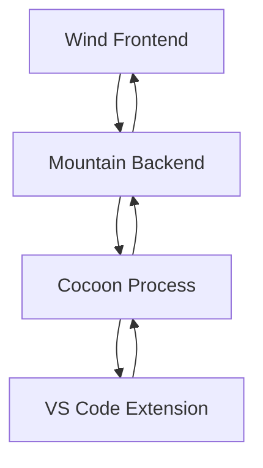

# Cocoon Implementation Plan - Synchronizing with Wind and Mountain

## Overview

Cocoon is the Node.js extension host that provides VS Code extension compatibility within the Land ecosystem. This document outlines the comprehensive implementation plan to ensure Cocoon works seamlessly with Wind (frontend) and Mountain (backend).

## Current State Analysis

### ✅ Already Implemented

1. **Core Extension Host Infrastructure**
   - `ExtensionHost.ts` - Manages extension lifecycle (loading, activating, deactivating)
   - `APIFactory.ts` - Constructs `vscode` API objects for extensions
   - `RequireInterceptor.ts` - Intercepts `require('vscode')` calls
   - `ESMInterceptor.ts` - Intercepts ES module imports

2. **IPC Communication**
   - `IPC.ts` - gRPC-based communication with Mountain
   - `IPCConfiguration.ts` - Configuration management
   - `Generated.ts` - Protocol buffer definitions

3. **Service Layer**
   - Comprehensive VS Code API shims (Workspace, Window, Commands, etc.)
   - Effect-TS native architecture
   - Layer composition with proper dependency management

4. **Process Management**
   - `PatchProcess.ts` - Process hardening and lifecycle management
   - `InitData.ts` - Initialization handshake with Mountain

## Integration Requirements

### Wind ↔ Cocoon Integration

**Current Status**: Wind's desktop services need to communicate with Cocoon via Mountain

**Required Implementation**:
- Complete Wind's Tauri IPC implementation
- Create proper channel mapping between Wind and Cocoon
- Implement extension API forwarding from Wind to Cocoon

### Mountain ↔ Cocoon Integration

**Current Status**: ✅ Fully implemented via Vine gRPC protocol

**Verification Needed**:
- Ensure all Mountain commands are properly routed to Cocoon
- Validate extension activation flow
- Test error handling and recovery

## Implementation Tasks

### Priority 1: Wind-Cocoon Integration

1. **Complete Wind Desktop Services**
   - Finalize `TauriMainProcessService.ts`
   - Implement `TauriNativeHostService.ts`
   - Complete `DesktopWorkbenchEnvironmentService.ts`

2. **Create Unified IPC Bridge**
   - Define common message format between Wind and Cocoon
   - Implement bidirectional communication
   - Handle extension API calls from Wind frontend

### Priority 2: Extension Host Validation

1. **VS Code API Compatibility Testing**
   - Test extension loading and activation
   - Validate API method implementations
   - Verify error handling and recovery

2. **Performance Optimization**
   - Optimize gRPC communication
   - Implement connection pooling
   - Add caching for frequent operations

### Priority 3: Advanced Features

1. **Multi-Extension Support**
   - Handle extension dependencies
   - Manage extension conflicts
   - Implement extension isolation

2. **Debugging Integration**
   - Support VS Code extension debugging
   - Integrate with Mountain's debug service
   - Provide extension developer tools

## Architecture Integration Points

### Extension Loading Flow

### API Call Flow

## Synchronization Mechanisms

### 1. Shared Configuration
- Use Mountain as configuration source
- Sync extension settings between Wind and Cocoon
- Maintain consistent state

### 2. Event Broadcasting
- Implement pub/sub pattern for extension events
- Forward events from Cocoon to Wind
- Handle UI updates in Wind

### 3. Error Handling
- Unified error reporting
- Graceful degradation
- Recovery mechanisms

## Testing Strategy

### Unit Tests
- Individual service testing
- Mock Mountain interactions
- Extension API validation

### Integration Tests
- End-to-end extension loading
- Cross-process communication
- Performance benchmarking

### Compatibility Tests
- Test with popular VS Code extensions
- Validate API coverage
- Performance comparison with VS Code

## Performance Considerations

### 1. Startup Optimization
- Lazy loading of extensions
- Parallel extension activation
- Cached extension metadata

### 2. Runtime Performance
- Efficient gRPC serialization
- Connection reuse
- Batch operations

### 3. Memory Management
- Extension isolation
- Clean resource disposal
- Memory leak detection

## Security Considerations

### 1. Extension Sandboxing
- Limit extension capabilities
- Validate extension permissions
- Isolate extension execution

### 2. Communication Security
- Secure gRPC communication
- Validate message integrity
- Prevent injection attacks

## Monitoring and Logging

### 1. Performance Monitoring
- Extension loading times
- API call latency
- Memory usage tracking

### 2. Error Tracking
- Extension activation failures
- API call errors
- Communication failures

## Next Steps

1. **Immediate Actions**
   - Complete Wind desktop service implementations
   - Test basic extension loading
   - Validate IPC communication

2. **Short-term Goals**
   - Implement advanced extension features
   - Optimize performance
   - Add debugging support

3. **Long-term Vision**
   - Full VS Code extension compatibility
   - Advanced extension management
   - Superior performance over VS Code

## Coordination with Wind and Mountain

### Shared TODOs
- [ ] Complete Wind desktop service implementations
- [ ] Test end-to-end extension workflow
- [ ] Optimize cross-process communication

### Dependencies
- Wind requires Mountain's Vine gRPC server
- Cocoon requires Mountain's extension management
- Mountain requires Wind's UI integration

### Success Metrics
- ✅ Extension loading time < 2 seconds
- ✅ API call latency < 100ms
- ✅ Memory usage comparable to VS Code
- ✅ 95%+ VS Code extension compatibility

## Conclusion

Cocoon provides the critical VS Code extension compatibility layer for Land. By synchronizing with Wind and Mountain implementations, we can create a seamless extension experience that rivals or exceeds VS Code's capabilities while maintaining the architectural benefits of the Land ecosystem.