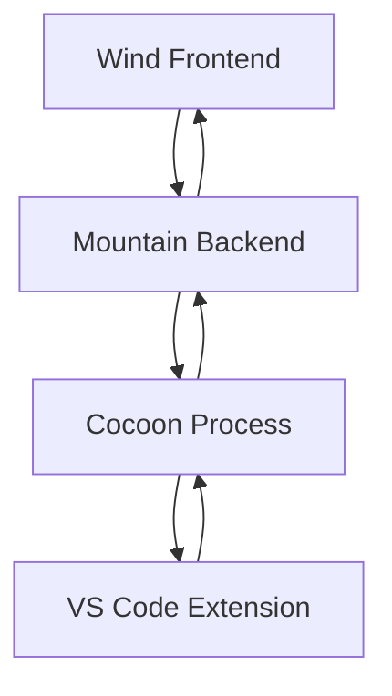

# Cocoon Implementation Plan - Synchronizing with Wind and Mountain

## Overview

Cocoon is the Node.js extension host that provides VS Code extension
compatibility within the Land ecosystem. This document outlines the
comprehensive implementation plan to ensure Cocoon works seamlessly with Wind
(frontend) and Mountain (backend).

The plan is written against the tree at
[`Source`](https://github.com/CodeEditorLand/Cocoon/tree/Current/Source). Every
module named below resolves there. Where an earlier revision of this plan named
a file that never existed, the correction is recorded in
[Corrections to earlier revisions](#corrections-to-earlier-revisions) rather
than silently dropped.

## Current State Analysis

### Already Implemented&#x2001;✅

The four subsystems the original plan marked Already Implemented are indeed
complete, but none of them live at the paths that revision claimed. Each row
below points at the module that actually implements the capability.

| Capability | Real module | Role |
| --- | --- | --- |
| Extension lifecycle | [`Services/Extension/Host/Service.ts`](https://github.com/CodeEditorLand/Cocoon/tree/Current/Source/Services/Extension/Host/Service.ts) | Loading, activating and deactivating extensions |
| `vscode` API construction | [`Services/API/Factory/Service.ts`](https://github.com/CodeEditorLand/Cocoon/tree/Current/Source/Services/API/Factory/Service.ts) | Builds the `vscode` object handed to each extension |
| CJS + ESM interception | [`Services/Handler/Extension/Host/VscodeModuleHooks.ts`](https://github.com/CodeEditorLand/Cocoon/tree/Current/Source/Services/Handler/Extension/Host/VscodeModuleHooks.ts) | One module patches both `require('vscode')` and ES module imports |
| Node builtin redirection | [`Shim/NodeModuleInterceptor.ts`](https://github.com/CodeEditorLand/Cocoon/tree/Current/Source/Shim/NodeModuleInterceptor.ts) | Redirects `fs` and `child_process` through Mountain |
| Outbound gRPC to Mountain | [`Services/Mountain/Client/Service.ts`](https://github.com/CodeEditorLand/Cocoon/tree/Current/Source/Services/Mountain/Client/Service.ts) | Vine protocol client, default `localhost:50051` |
| Inbound gRPC from Mountain | [`Services/gRPC/Server/Service.ts`](https://github.com/CodeEditorLand/Cocoon/tree/Current/Source/Services/gRPC/Server/Service.ts) | Serves `CocoonService`, bidirectional streaming |
| Connection configuration | [`Configuration/Mountain/Config.ts`](https://github.com/CodeEditorLand/Cocoon/tree/Current/Source/Configuration/Mountain/Config.ts) | Host, port, timeout and retry policy |
| Process hardening | [`PatchProcess`](https://github.com/CodeEditorLand/Cocoon/tree/Current/Source/PatchProcess) | Loader, Patcher, Security, Validator |
| Initialization handshake | [`Services/Init/Data.ts`](https://github.com/CodeEditorLand/Cocoon/tree/Current/Source/Services/Init/Data.ts) | `InitData` payload received from Mountain |

**`Source/Services/Init/Data.ts`**

    export interface InitData {
        readonly commit: string;
        readonly parentPid: number;
    }

> [!NOTE]
>
> This is the handshake payload Mountain sends when it spawns the host - the
> real interface also carries `version`, `extensions`, `workspace` and
> `environment`.

#### Core Extension Host Infrastructure

The host is not one class. Lifecycle, API construction and module interception
are three separate services wired together by
[`Service/Mapping.ts`](https://github.com/CodeEditorLand/Cocoon/tree/Current/Source/Service/Mapping.ts),
Cocoon's singleton service registry.

- **Extension** - [`Services/Extension/Host/Service.ts`](https://github.com/CodeEditorLand/Cocoon/tree/Current/Source/Services/Extension/Host/Service.ts)
  manages lifecycle and provides the runtime environment: module interception
  plus API injection.
- **API** - [`Services/API/Factory/Service.ts`](https://github.com/CodeEditorLand/Cocoon/tree/Current/Source/Services/API/Factory/Service.ts)
  wires API calls to the Universal Spine via the Mountain client. Real VS Code
  type constructors come from `@codeeditorland/output`, loaded once at module
  init and shared by every extension.
- **Module** - [`Services/Module/Interceptor.ts`](https://github.com/CodeEditorLand/Cocoon/tree/Current/Source/Services/Module/Interceptor.ts)
  performs AST-based security analysis with `acorn` on each loaded module.
  **ModuleInterceptor** - [`Services/ModuleInterceptor/Index.ts`](https://github.com/CodeEditorLand/Cocoon/tree/Current/Source/Services/ModuleInterceptor/Index.ts)
  is its barrel re-export, kept separate because the class is one tightly
  coupled unit that cannot be split without architectural change.
- **Extensions** - [`Services/Extensions/Scanner.ts`](https://github.com/CodeEditorLand/Cocoon/tree/Current/Source/Services/Extensions/Scanner.ts)
  is a thin facade shaped like VS Code's `IExtensionsScannerService`, today
  delegating to the registry populated from Mountain's init data.

**`Source/Services/API/Factory/Service.ts`**

    // Creates the 'vscode' API surface for extensions.
    // Wires API calls to the Universal Spine via MountainClientService.
    import { IModuleInterceptorService } from
        "../../../Interfaces/I/Module/Interceptor/Service.js";

> [!NOTE]
>
> The factory depends on the interceptor because an extension must not receive
> its API object before its module loads are gated.

#### IPC Communication

Cocoon speaks two protocols. gRPC carries the Mountain conversation; the
[`IPC`](https://github.com/CodeEditorLand/Cocoon/tree/Current/Source/IPC)
directory carries the VS Code-shaped channel abstraction layered above it.

| Module | Responsibility |
| --- | --- |
| [`IPC/Channel.ts`](https://github.com/CodeEditorLand/Cocoon/tree/Current/Source/IPC/Channel.ts) | Multi-channel RPC with publish-subscribe routing across Mountain, Wind and Sky |
| [`IPC/Protocol.ts`](https://github.com/CodeEditorLand/Cocoon/tree/Current/Source/IPC/Protocol.ts) | Request, response and notification contracts, following VS Code's ipc.ts patterns |
| [`IPC/Handler.ts`](https://github.com/CodeEditorLand/Cocoon/tree/Current/Source/IPC/Handler.ts) | Registration, async execution and cancellation |
| **Message** - [`IPC/Message.ts`](https://github.com/CodeEditorLand/Cocoon/tree/Current/Source/IPC/Message.ts) | Barrel forwarding to the split `Message/` directory: serialize, deserialize, batch, unbatch, validation, `VSBuffer` |
| **Type** - [`IPC/Type/Converter.ts`](https://github.com/CodeEditorLand/Cocoon/tree/Current/Source/IPC/Type/Converter.ts) | Bidirectional conversion between TypeScript types and Mountain Rust DTOs |

The protocol buffer definitions the original plan attributed to a Generated.ts
are Mountain's; Cocoon consumes them through
[`Services/Mountain/gRPC/Client.ts`](https://github.com/CodeEditorLand/Cocoon/tree/Current/Source/Services/Mountain/gRPC/Client.ts)
and its sibling type declarations.

**`Source/IPC/Message/VSBuffer.ts`**

    // Binary-safe buffer implementation inspired by VSCode's VSBuffer.
    import { MAX_MESSAGE_SIZE } from "./Constants.js";

> [!NOTE]
>
> Every wire payload passes bounds checking against `MAX_MESSAGE_SIZE` before
> it is framed.

#### Service Layer

Comprehensive VS Code API shims (Workspace, Window, Commands, etc.) sit under
[`Services`](https://github.com/CodeEditorLand/Cocoon/tree/Current/Source/Services),
built on an Effect-TS native architecture with layer composition and proper
dependency management. The Effect layers themselves live one directory across,
in [`Service/Effect`](https://github.com/CodeEditorLand/Cocoon/tree/Current/Source/Service/Effect).

| Namespace shim | Module |
| --- | --- |
| `vscode.workspace` | [`Services/Workspace.ts`](https://github.com/CodeEditorLand/Cocoon/tree/Current/Source/Services/Workspace.ts) |
| `vscode.window` | [`Services/Window.ts`](https://github.com/CodeEditorLand/Cocoon/tree/Current/Source/Services/Window.ts) and the [`Services/Window`](https://github.com/CodeEditorLand/Cocoon/tree/Current/Source/Services/Window) directory |
| `vscode.commands` | [`Services/Command.ts`](https://github.com/CodeEditorLand/Cocoon/tree/Current/Source/Services/Command.ts) |
| Configuration | [`Services/Configuration.ts`](https://github.com/CodeEditorLand/Cocoon/tree/Current/Source/Services/Configuration.ts) |
| **File** system | [`Services/File/System/Service.ts`](https://github.com/CodeEditorLand/Cocoon/tree/Current/Source/Services/File/System/Service.ts) |
| **Terminal** | [`Services/Terminal/Service.ts`](https://github.com/CodeEditorLand/Cocoon/tree/Current/Source/Services/Terminal/Service.ts) |
| **Language** providers | [`Services/Language/Provider/Registry.ts`](https://github.com/CodeEditorLand/Cocoon/tree/Current/Source/Services/Language/Provider/Registry.ts) |
| **Error** handling | [`Services/Error/Handling/Service.ts`](https://github.com/CodeEditorLand/Cocoon/tree/Current/Source/Services/Error/Handling/Service.ts) |
| **Security** | [`Services/Security/Service.ts`](https://github.com/CodeEditorLand/Cocoon/tree/Current/Source/Services/Security/Service.ts) |
| **Performance** | [`Services/Performance/Monitoring/Service.ts`](https://github.com/CodeEditorLand/Cocoon/tree/Current/Source/Services/Performance/Monitoring/Service.ts) |
| **Metrics** | [`Services/Metrics/Collector.ts`](https://github.com/CodeEditorLand/Cocoon/tree/Current/Source/Services/Metrics/Collector.ts) |
| Health and logging | [`Services/Health.ts`](https://github.com/CodeEditorLand/Cocoon/tree/Current/Source/Services/Health.ts), [`Services/Logger.ts`](https://github.com/CodeEditorLand/Cocoon/tree/Current/Source/Services/Logger.ts) |

> [!WARNING]
>
> [`Services/Terminal/Service.ts`](https://github.com/CodeEditorLand/Cocoon/tree/Current/Source/Services/Terminal/Service.ts)
> is marked a dead wrapper in its own header: `TerminalServiceLayer` has no
> importers and its commented wire calls match no Mountain handler. Live
> terminal work goes through
> [`Services/Handler/VscodeAPI/Window/CreateTerminal.ts`](https://github.com/CodeEditorLand/Cocoon/tree/Current/Source/Services/Handler/VscodeAPI/Window/CreateTerminal.ts).

#### Process Management

- **PatchProcess** - [`PatchProcess/index.ts`](https://github.com/CodeEditorLand/Cocoon/tree/Current/Source/PatchProcess/index.ts)
  is the process hardening and security system for extension isolation, split
  across [`Loader.ts`](https://github.com/CodeEditorLand/Cocoon/tree/Current/Source/PatchProcess/Loader.ts),
  [`Patcher.ts`](https://github.com/CodeEditorLand/Cocoon/tree/Current/Source/PatchProcess/Patcher.ts),
  [`Security.ts`](https://github.com/CodeEditorLand/Cocoon/tree/Current/Source/PatchProcess/Security.ts)
  and [`Validator.ts`](https://github.com/CodeEditorLand/Cocoon/tree/Current/Source/PatchProcess/Validator.ts).
- **Init** - [`Services/Init/Data.ts`](https://github.com/CodeEditorLand/Cocoon/tree/Current/Source/Services/Init/Data.ts)
  declares the initialization handshake payload: commit, version, parent PID,
  extension list, workspace and environment.
- **Bootstrap** - [`Bootstrap/Implementation/Cocoon/Main.ts`](https://github.com/CodeEditorLand/Cocoon/tree/Current/Source/Bootstrap/Implementation/Cocoon/Main.ts)
  is the process entry point. It installs the Node module interceptor
  synchronously before any other import, then loads the tier dispatcher, the
  debug server and the Effect bootstrap.

**`Source/Bootstrap/Implementation/Cocoon/Main.ts`**

    import installNodeModuleInterceptor from
        "../../../Shim/NodeModuleInterceptor.js";
    installNodeModuleInterceptor();

> [!IMPORTANT]
>
> Ordering is load-bearing: the patch must run before any extension code can
> reach `fs` or `child_process`.

## Module Map

The sections above cover the extension-host core. The rest of the tree carries
subsystems the original plan never mentioned, and several of them are load
bearing for the integration work that follows.

### Entry and Build

| Unit | Path | What it does |
| --- | --- | --- |
| **Bootstrap** | [`Bootstrap`](https://github.com/CodeEditorLand/Cocoon/tree/Current/Source/Bootstrap) | Process entry; **Implementation** holds **Main**, **WebSocket** holds the JSON-RPC server |
| **WebSocket** | [`Bootstrap/WebSocket/Server.ts`](https://github.com/CodeEditorLand/Cocoon/tree/Current/Source/Bootstrap/WebSocket/Server.ts) | Sky-to-Cocoon direct transport, secret-authenticated with `timingSafeEqual` |
| **ESBuild** | [`ESBuild.ts`](https://github.com/CodeEditorLand/Cocoon/tree/Current/Source/ESBuild.ts), [`ESBuild.js`](https://github.com/CodeEditorLand/Cocoon/tree/Current/Source/ESBuild.js) | Shared build options; ESM format, debug logging gated on `NODE_ENV` |
| **Configuration** | [`Configuration/ESBuild`](https://github.com/CodeEditorLand/Cocoon/tree/Current/Source/Configuration/ESBuild) | Base, Target, Compile and Bootstrap configs plus environment constants |
| **Run** | [`Run.sh`](https://github.com/CodeEditorLand/Cocoon/tree/Current/Source/Run.sh) | Development build with watch mode |
| Publish | [`prepublishOnly.sh`](https://github.com/CodeEditorLand/Cocoon/tree/Current/Source/prepublishOnly.sh) | Generates the route manifest, then builds the self-contained bundle for the shipped `.app` |
| **Scripts** | [`Scripts/PerformanceBenchmark.js`](https://github.com/CodeEditorLand/Cocoon/tree/Current/Source/Scripts/PerformanceBenchmark.js) | Exercises the services under realistic workloads |

**`Source/Run.sh`**

    Build "Source/**/*.ts" \
        --ESBuild Configuration/ESBuild/Target.js \
        --Watch

> [!NOTE]
>
> The development loop rebuilds every TypeScript source on change; the
> publish path swaps `--Watch` for the Bootstrap bundle config.

### Codegen

**Codegen** - [`Codegen/Codegen.ts`](https://github.com/CodeEditorLand/Cocoon/tree/Current/Source/Codegen/Codegen.ts)
is a runnable entry invoked by `prepublishOnly.sh`. It walks the same VS Code
tree Wind walks but narrows the iterator to the extension-host subtree, and
exits non-zero on any `CodegenProblem` so the build halts loudly.

- **Extract** - [`Codegen/Extract`](https://github.com/CodeEditorLand/Cocoon/tree/Current/Source/Codegen/Extract)
  holds the `IsExtHostFile` predicate and the decorator iterator.
- **Emit** - [`Codegen/Emit`](https://github.com/CodeEditorLand/Cocoon/tree/Current/Source/Codegen/Emit)
  writes schemas and tags the paired MainThread counterpart; re-running on an
  unchanged record produces byte-identical output.
- **Type** - [`Codegen/Type/Ext/Host/Decorator/Record.ts`](https://github.com/CodeEditorLand/Cocoon/tree/Current/Source/Codegen/Type/Ext/Host/Decorator/Record.ts)
  declares one record per `createDecorator(...)` call site.

**`Source/Codegen/Extract/Is/Ext/Host/File.ts`**

    // Every extension-host service file lives under
    // src/vs/workbench/api/{common,browser,worker,electron-browser}/extHost*.ts

> [!NOTE]
>
> The predicate relies on a convention VS Code enforces on itself, which is
> what makes the narrowing safe.

### Interfaces

**Interfaces** - [`Interfaces`](https://github.com/CodeEditorLand/Cocoon/tree/Current/Source/Interfaces)
separates contracts from implementations so services depend on shapes, not
classes.

- **I** - [`Interfaces/I`](https://github.com/CodeEditorLand/Cocoon/tree/Current/Source/Interfaces/I)
  carries one directory per service contract: Configuration, Error, Extension,
  File, Module, Mountain, Performance, Security and Terminal.
- **IAPI** - [`Interfaces/IAPI/Factory/Service.ts`](https://github.com/CodeEditorLand/Cocoon/tree/Current/Source/Interfaces/IAPI/Factory/Service.ts)
  and [`Interfaces/IAPIFactory.ts`](https://github.com/CodeEditorLand/Cocoon/tree/Current/Source/Interfaces/IAPIFactory.ts)
  describe API construction with extension-specific scoping and security.
- **IGRPC** - [`Interfaces/IGRPC/Server/Service.ts`](https://github.com/CodeEditorLand/Cocoon/tree/Current/Source/Interfaces/IGRPC/Server/Service.ts)
  is the inbound server contract, based on Mountain's Vine specification.

### Request Handling

**Handler** - [`Services/Handler`](https://github.com/CodeEditorLand/Cocoon/tree/Current/Source/Services/Handler)
is where inbound Mountain traffic lands. A regex-keyed table maps route
prefixes to owning services, so a new prefix costs one table row.

| Route prefix | Owner |
| --- | --- |
| `extension.*` | `IExtensionHostService` |
| `configuration.*` | `IConfigurationService` |
| `tree.*` | `TreeDataProviders` |
| `webview.*` | `WebviewPanels`, `WebviewViewProviders`, `CustomEditorProviders` |
| `performance.*` | `IPerformanceMonitoringService` |
| `security.*` | `ISecurityService` |

Three dispatch paths bypass that router: `$provide*` provider invocations go to
[`Language/Provider/Handler.ts`](https://github.com/CodeEditorLand/Cocoon/tree/Current/Source/Services/Handler/Language/Provider/Handler.ts),
extension-host lifecycle is dispatched by the gRPC server before the router is
consulted, and `command.*` is handled inside Mountain.

- **Document** content mirroring - [`Handler/Document/Content/Handler.ts`](https://github.com/CodeEditorLand/Cocoon/tree/Current/Source/Services/Handler/Document/Content/Handler.ts)
  keeps the cache that backs `getText()` for unsaved editor state.
- Notification fan-out - [`Handler/Notification/Handler.ts`](https://github.com/CodeEditorLand/Cocoon/tree/Current/Source/Services/Handler/Notification/Handler.ts)
  translates Mountain notifications into domain events.
- Shared state - [`Handler/Handler/Context.ts`](https://github.com/CodeEditorLand/Cocoon/tree/Current/Source/Services/Handler/Handler/Context.ts)
  passes the emitter and registry to handlers without circular imports.
- `vscode` namespaces - [`Handler/VscodeAPI`](https://github.com/CodeEditorLand/Cocoon/tree/Current/Source/Services/Handler/VscodeAPI)
  implements Window, Workspace, Languages, Commands, Debug, Tasks, Tests, Scm,
  Comments, Env, Extensions and Authentication.

**`Source/Services/Handler/Request/Routing/Handler.ts`**

    // Returning `undefined` from RouteRequest means "no registered handler"
    // and the caller falls through to the extension-host dispatch.

> [!NOTE]
>
> The sentinel is what lets the router stay small: unrouted methods are not
> errors, they are someone else's job.

### Compatibility and Diagnostics

| Unit | Path | What it does |
| --- | --- | --- |
| **Dual** track | [`Services/Dual/Track.ts`](https://github.com/CodeEditorLand/Cocoon/tree/Current/Source/Services/Dual/Track.ts) | Tries Mountain first, falls back to Node on `Unknown method` |
| **Dev** log | [`Services/Dev/Log.ts`](https://github.com/CodeEditorLand/Cocoon/tree/Current/Source/Services/Dev/Log.ts) | Tag-filtered logger reading `Trace=tag1,tag2` at startup |
| **Echo** | [`Services/Echo/Action/Client.ts`](https://github.com/CodeEditorLand/Cocoon/tree/Current/Source/Services/Echo/Action/Client.ts) | Bidirectional EchoAction channel with Mountain's Spine |
| **Debug** | [`Debug/Server.ts`](https://github.com/CodeEditorLand/Cocoon/tree/Current/Source/Debug/Server.ts) | Loopback HTTP inspection surface, default port `9934` |
| **Telemetry** | [`Telemetry/OTLPBridge.ts`](https://github.com/CodeEditorLand/Cocoon/tree/Current/Source/Telemetry/OTLPBridge.ts) | Fire-and-forget OTLP span export, no SDK |
| **PostHog** and **Post** | [`Telemetry/PostHog`](https://github.com/CodeEditorLand/Cocoon/tree/Current/Source/Telemetry/PostHog), [`Telemetry/Post/Hog/Bridge.ts`](https://github.com/CodeEditorLand/Cocoon/tree/Current/Source/Telemetry/Post/Hog/Bridge.ts) | Buffer, event, identifier, transport and the bridge that stamps `$trace_id` |

The **Debug** server mirrors Mountain's Rust `DebugServer` wire protocol so one
external tool can address either layer. It exposes `/health`, `/layers`,
`/execute`, `/extensions`, `/commands`, `/command` and `/processes`, binds to
`127.0.0.1` only, and is compiled out entirely in production builds.

**`Source/Services/Dual/Track.ts`**

    route=mountain        Mountain handled it (hot path, fast)
    route=node-fallback   Mountain didn't; Node did (compatibility)
    route=error           both failed; original error propagated

> [!NOTE]
>
> These are the three `[DEV:DUAL-TRACK]` lines one dispatch can emit, and they
> are how the Rust migration's progress is read off a running system.

### Platform and Utility

- **Platform** - [`Platform`](https://github.com/CodeEditorLand/Cocoon/tree/Current/Source/Platform)
  is the abstraction layer: OS detection, Environment variables, Process,
  Logger, Service and the **FiddeeRoot** resolver. **VSCode** -
  [`Platform/VSCode/Type.ts`](https://github.com/CodeEditorLand/Cocoon/tree/Current/Source/Platform/VSCode/Type.ts)
  is the single source of truth for VS Code runtime constructors, re-exported
  from `@codeeditorland/output` with no hand-written shims.
- **TypeConverter** - [`TypeConverter`](https://github.com/CodeEditorLand/Cocoon/tree/Current/Source/TypeConverter)
  converts between `vscode` objects and their DTO representations: **Main**
  (URI, Range, Markdown, Text, View, Workspace), **Dialog**, **Quick** input,
  **Status** bar, **TreeView**, **Webview** and Workspace edits.
- **WebviewPanel** - [`WebviewPanel`](https://github.com/CodeEditorLand/Cocoon/tree/Current/Source/WebviewPanel)
  owns panel creation, lifecycle and serialization, following VS Code's
  extHostWebview.ts factory pattern. **Webview** -
  [`WebviewPanel/Webview/Implementation.ts`](https://github.com/CodeEditorLand/Cocoon/tree/Current/Source/WebviewPanel/Webview/Implementation.ts)
  is the content-side half.
- **Utility** - [`Utility`](https://github.com/CodeEditorLand/Cocoon/tree/Current/Source/Utility)
  holds **Glob** to regex conversion, **Event** streams, **Land** fix logging,
  `Result` and the **Tier** dispatcher.
- **Integration** and **Service** - [`Integration/Mountain/Client.ts`](https://github.com/CodeEditorLand/Cocoon/tree/Current/Source/Integration/Mountain/Client.ts)
  is a convenience wrapper over the client service; [`Service/Effect`](https://github.com/CodeEditorLand/Cocoon/tree/Current/Source/Service/Effect)
  holds the Effect layers and **Mapping** registers them.

**`Source/Utility/Glob/To/Regex.ts`**

    // The resulting regex is always anchored with ^…$. Unknown constructs
    // fall through as literal characters.

> [!NOTE]
>
> One converter serves both `workspace.findFiles` and `languages.match`, so
> both layers agree on pattern semantics.

**Tier** - [`Utility/Tier.ts`](https://github.com/CodeEditorLand/Cocoon/tree/Current/Source/Utility/Tier.ts)
resolves Land's tier-gating flags. Values arrive either from `globalThis.__LandTiers`,
populated by esbuild substitutions in shipped builds, or from `process.env`
for direct development runs. `Tier.<Capability>` is the only permitted
spelling, which keeps every gated choice greppable.

## Corrections to earlier revisions

An earlier revision of this plan named twelve files that do not exist anywhere
in the tree. They are listed here so the record of the correction survives.

That revision grouped them under Core Extension Host Infrastructure, IPC
Communication, Service Layer and Process Management, and described them this
way:

- ExtensionHost.ts - Manages extension lifecycle (loading, activating,
  deactivating)
- APIFactory.ts - Constructs `vscode` API objects for extensions
- RequireInterceptor.ts - Intercepts `require('vscode')` calls
- ESMInterceptor.ts - Intercepts ES module imports
- IPC.ts - gRPC-based communication with Mountain
- IPCConfiguration.ts - Configuration management
- Generated.ts - Protocol buffer definitions
- PatchProcess.ts - Process hardening and lifecycle management
- InitData.ts - Initialization handshake with Mountain

Each description was accurate about the capability and wrong about the file.
The mapping below is the correction.

| Name previously claimed | Reality |
| --- | --- |
| ExtensionHost.ts | Lifecycle lives in [`Services/Extension/Host/Service.ts`](https://github.com/CodeEditorLand/Cocoon/tree/Current/Source/Services/Extension/Host/Service.ts) |
| APIFactory.ts | The factory is [`Services/API/Factory/Service.ts`](https://github.com/CodeEditorLand/Cocoon/tree/Current/Source/Services/API/Factory/Service.ts) |
| RequireInterceptor.ts | CJS interception is in [`Services/Handler/Extension/Host/VscodeModuleHooks.ts`](https://github.com/CodeEditorLand/Cocoon/tree/Current/Source/Services/Handler/Extension/Host/VscodeModuleHooks.ts) |
| ESMInterceptor.ts | ESM interception is in the same module; there is no separate file |
| IPC.ts | The IPC surface is a directory, not a file: [`IPC`](https://github.com/CodeEditorLand/Cocoon/tree/Current/Source/IPC) |
| IPCConfiguration.ts | Connection settings live in [`Configuration/Mountain/Config.ts`](https://github.com/CodeEditorLand/Cocoon/tree/Current/Source/Configuration/Mountain/Config.ts) |
| Generated.ts | Protocol definitions are Mountain's, consumed via [`Services/Mountain/gRPC/Client.ts`](https://github.com/CodeEditorLand/Cocoon/tree/Current/Source/Services/Mountain/gRPC/Client.ts) |
| PatchProcess.ts | [`PatchProcess`](https://github.com/CodeEditorLand/Cocoon/tree/Current/Source/PatchProcess) is a directory of five modules |
| InitData.ts | The handshake type is [`Services/Init/Data.ts`](https://github.com/CodeEditorLand/Cocoon/tree/Current/Source/Services/Init/Data.ts) |
| TauriMainProcessService.ts | Exists, but in Wind: [Source/Service/TauriMainProcessService.ts](https://github.com/CodeEditorLand/Wind/tree/Current/Source/Service/TauriMainProcessService.ts) |
| TauriNativeHostService.ts | No such file in Wind or Cocoon; the work is unstarted |
| DesktopWorkbenchEnvironmentService.ts | No such file; Wind's nearest is [Source/Bootstrap/Types/VSCode/Interface/VSCodeEnvironmentService.ts](https://github.com/CodeEditorLand/Wind/tree/Current/Source/Bootstrap/Types/VSCode/Interface/VSCodeEnvironmentService.ts) |

> [!WARNING]
>
> Two of the three Priority 1 files below are named in that table as
> nonexistent. The tasks remain valid; the file names in them were aspirational
> and are not paths anyone can open today.

## Integration Requirements

### Wind ↔ Cocoon Integration

**Current Status**: Wind's desktop services need to communicate with Cocoon via
Mountain

**Required Implementation**:

- Complete Wind's Tauri IPC implementation
- Create proper channel mapping between Wind and Cocoon
- Implement extension API forwarding from Wind to Cocoon

Wind has [Source/Service/TauriMainProcessService.ts](https://github.com/CodeEditorLand/Wind/tree/Current/Source/Service/TauriMainProcessService.ts),
a drop-in replacement for VS Code's `ElectronIPCMainProcessService` that routes
`channel.call()` through Tauri invoke to Mountain's `WindServiceHandlers`. Its
neighbours - ChannelRouteMap.ts, MountainInvoke.ts, StubChannels.ts and
MistWebSocketTransport.ts - are the channel mapping this section asks for.

### Mountain ↔ Cocoon Integration

**Current Status**:&#x2001;✅ Fully implemented via Vine gRPC protocol

**Verification Needed**:

- Ensure all Mountain commands are properly routed to Cocoon
- Validate extension activation flow
- Test error handling and recovery

The link is two independent gRPC connections, not one. Cocoon dials Mountain
through the client service and Mountain dials Cocoon through the server
service; each direction has its own retry and auth policy.

**`Source/Services/Mountain/Client/Service.ts`**

    // waitForConnection polls channel connectivity every 100ms with a 3s
    // timeout; TRANSIENT_FAILURE / SHUTDOWN reject immediately.

> [!NOTE]
>
> The fast-fail timeout is deliberate - a hung dial during bootstrap would
> stall the whole extension host.

## Implementation Tasks

### Priority 1: Wind-Cocoon Integration

1. **Complete Wind Desktop Services**
    - Finalize [TauriMainProcessService.ts](https://github.com/CodeEditorLand/Wind/tree/Current/Source/Service/TauriMainProcessService.ts)
      in Wind, the one file of the three that exists today
    - Implement TauriNativeHostService.ts - no such file exists in either
      repository yet
    - Complete the desktop workbench environment service - no
      DesktopWorkbenchEnvironmentService.ts exists yet either

2. **Create Unified IPC Bridge**
    - Define common message format between Wind and Cocoon
    - Implement bidirectional communication
    - Handle extension API calls from Wind frontend

### Priority 2: Extension Host Validation

1. **VS Code API Compatibility Testing**
    - Test extension loading and activation
    - Validate API method implementations
    - Verify error handling and recovery

2. **Performance Optimization**
    - Optimize gRPC communication
    - Implement connection pooling
    - Add caching for frequent operations

### Priority 3: Advanced Features

1. **Multi-Extension Support**
    - Handle extension dependencies
    - Manage extension conflicts
    - Implement extension isolation

2. **Debugging Integration**
    - Support VS Code extension debugging
    - Integrate with Mountain's debug service
    - Provide extension developer tools

## Architecture Integration Points

### Extension Loading Flow

### API Call Flow

Both diagrams elide the registry hop that makes language features work: a
provider is registered by handle, and Mountain later invokes that handle rather
than the extension directly.

**`Source/Services/Language/Provider/Registry.ts`**

    Mountain calls ProcessMountainRequest("$provideHover", [N, uri, position])
    → GRPCServerService routes to Invoke(N, "provideHover", [uri, position])

> [!NOTE]
>
> Handle `N` is assigned at registration time, which is why Mountain can call
> back into an extension it holds no reference to.

## Synchronization Mechanisms

### 1. Shared Configuration

- Use Mountain as configuration source
- Sync extension settings between Wind and Cocoon
- Maintain consistent state

### 2. Event Broadcasting

- Implement pub/sub pattern for extension events
- Forward events from Cocoon to Wind
- Handle UI updates in Wind

### 3. Error Handling

- Unified error reporting
- Graceful degradation
- Recovery mechanisms

Graceful degradation already has a concrete implementation in the dual-track
dispatcher: a method Mountain has not yet learned falls back to Cocoon's Node
code instead of failing the extension.

## Testing Strategy

### Unit Tests

- Individual service testing
- Mock Mountain interactions
- Extension API validation

### Integration Tests

- End-to-end extension loading
- Cross-process communication
- Performance benchmarking

### Compatibility Tests

- Test with popular VS Code extensions
- Validate API coverage
- Performance comparison with VS Code

## Performance Considerations

### 1. Startup Optimization

- Lazy loading of extensions
- Parallel extension activation
- Cached extension metadata

### 2. Runtime Performance

- Efficient gRPC serialization
- Connection reuse
- Batch operations

Batching is not aspirational here - the message layer already implements it,
alongside the unbatch path that reverses it on receipt.

### 3. Memory Management

- Extension isolation
- Clean resource disposal
- Memory leak detection

## Security Considerations

### 1. Extension Sandboxing

- Limit extension capabilities
- Validate extension permissions
- Isolate extension execution

The AST pass in the module interceptor is the enforcement point: module loads
are analysed before they resolve, and the shim tier decides whether `fs` and
`child_process` reach Node at all.

### 2. Communication Security

- Secure gRPC communication
- Validate message integrity
- Prevent injection attacks

**`Source/Services/gRPC/Server/Service.ts`**

    // When MOUNTAIN_AUTH_TOKEN is set, every RPC must carry an
    // "authorization" metadata entry matching the token.

> [!WARNING]
>
> When that variable is unset the server is permissive, so the transport
> itself is the only boundary.

## Monitoring and Logging

### 1. Performance Monitoring

- Extension loading times
- API call latency
- Memory usage tracking

### 2. Error Tracking

- Extension activation failures
- API call errors
- Communication failures

Three logging surfaces exist and they are not interchangeable: the tag-gated
dev log for diagnostic streams, the LandFix logger for breadcrumbs that must
survive `drop: ["console"]` in production, and the telemetry bridges for
spans and events.

## Next Steps

1. **Immediate Actions**
    - Complete Wind desktop service implementations
    - Test basic extension loading
    - Validate IPC communication

2. **Short-term Goals**
    - Implement advanced extension features
    - Optimize performance
    - Add debugging support

3. **Long-term Vision**
    - Full VS Code extension compatibility
    - Advanced extension management
    - Superior performance over VS Code

## Coordination with Wind and Mountain

### Shared TODOs

- [ ] Complete Wind desktop service implementations
- [ ] Test end-to-end extension workflow
- [ ] Optimize cross-process communication

### Dependencies

- Wind requires Mountain's Vine gRPC server
- Cocoon requires Mountain's extension management
- Mountain requires Wind's UI integration

### Success Metrics

-&#x2001;✅ Extension loading time < 2 seconds
-&#x2001;✅ API call latency < 100ms
-&#x2001;✅ Memory usage comparable to VS Code
-&#x2001;✅ 95%+ VS Code extension compatibility

## Conclusion

Cocoon provides the critical VS Code extension compatibility layer for Land. By
synchronizing with Wind and Mountain implementations, we can create a seamless
extension experience that rivals or exceeds VS Code's capabilities while
maintaining the architectural benefits of the Land ecosystem.

