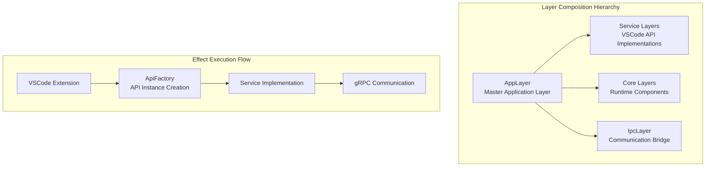
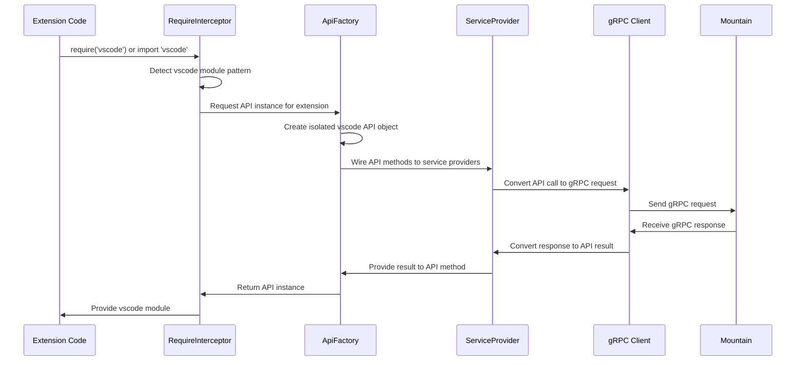
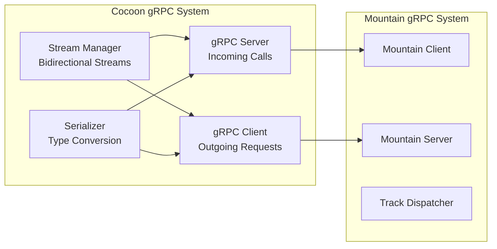
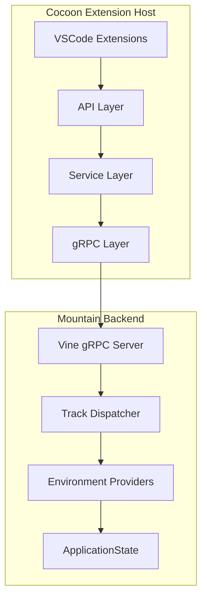
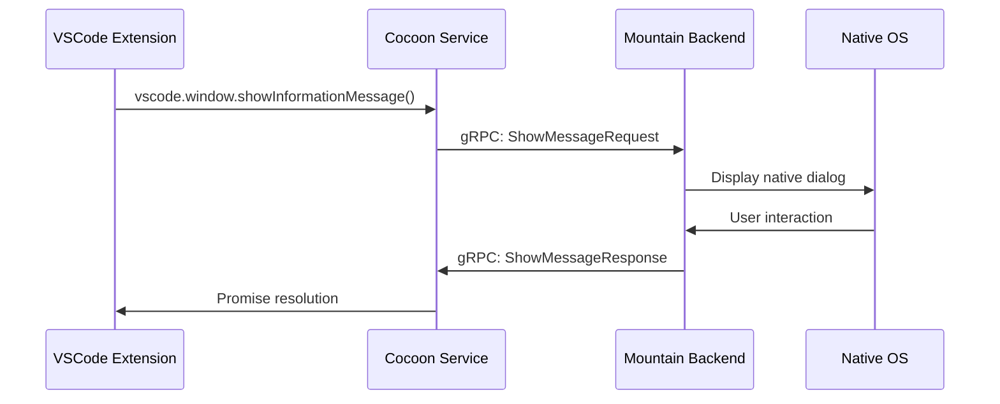
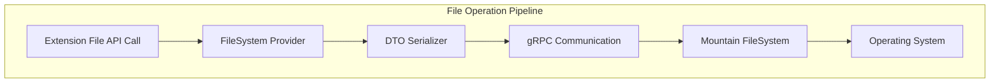
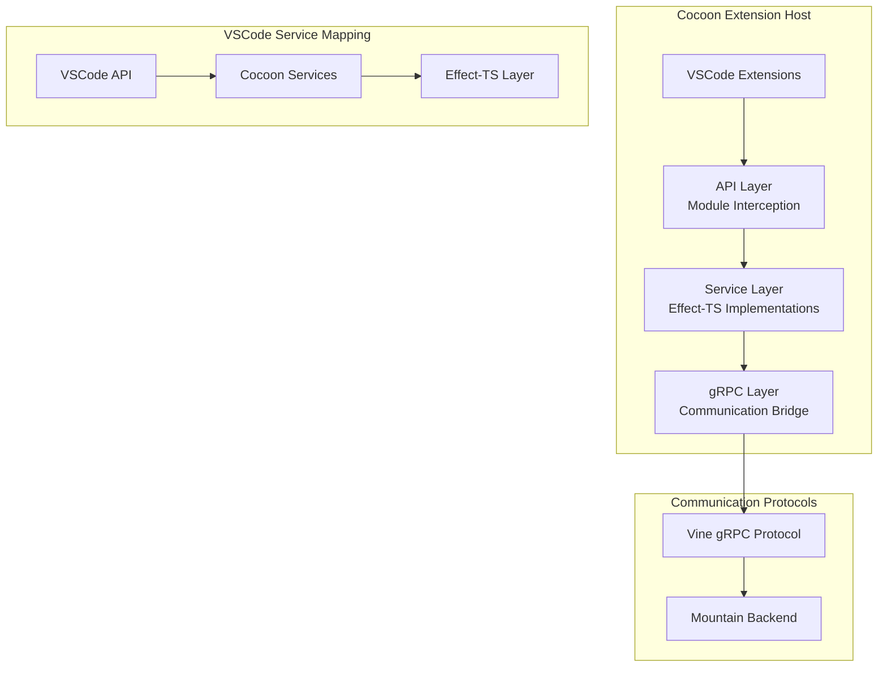
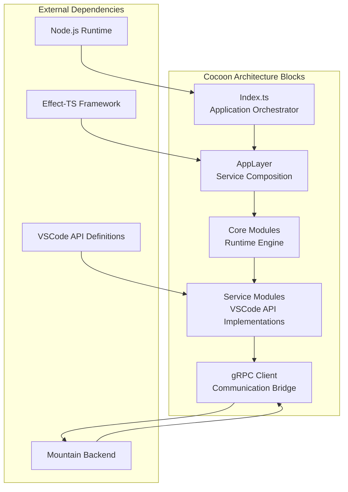
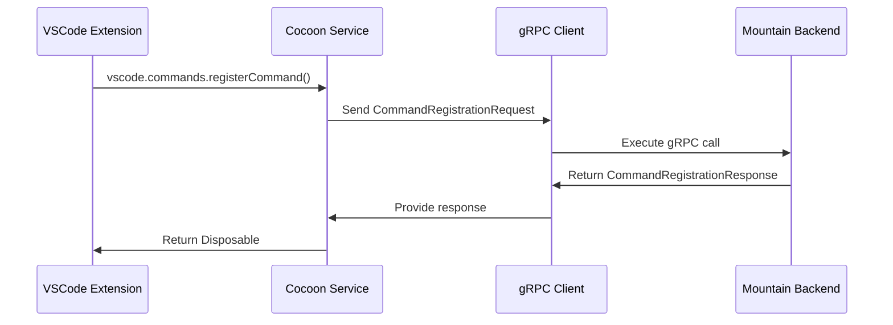

<table>
	<tr>
		<td colspan="1">
			<h3 align="center">
				<picture>
					<source media="(prefers-color-scheme: dark)" srcset="https://editor.land/Dark/Image/GitHub/Land.svg">
					<source media="(prefers-color-scheme: light)" srcset="https://editor.land/Image/GitHub/Land.svg">
					
				</picture>
			</h3>
		</td>
		<td colspan="3" valign="top">
			<h3 align="center"> Cocoon 🦋</h3>
		</td>
	</tr>
</table>

---

# **Cocoon** 🦋 Deep Dive & Architecture

**Cocoon** provides the technical foundation for implementing VSCode extension
host compatibility within the Land project. **Cocoon** serves as the Node.js
sidecar that provides high-fidelity VSCode extension API compatibility through
plain `async/await` service implementations and gRPC communication with
Mountain.

---

## Core Architecture Principles

| Principle                   | Description                                                                                                                                                                                  | Key Components Involved                          |
| :-------------------------- | :------------------------------------------------------------------------------------------------------------------------------------------------------------------------------------------- | :----------------------------------------------- |
| **High-Fidelity API Shim**  | Provide comprehensive implementations of VSCode's Extension Host services (`IExtHost...`), ensuring maximum compatibility with existing VSCode extensions.                                   | All `Service/*` modules                          |
| **Lean Async Bootstrap**    | Bootstrap and service wiring use plain `async/await`. `Layer.succeed` is used where Effect-TS layers are needed; `NodeRuntime.runMain` is not used. `ManagedRuntime` is eagerly initialized. | `Effect/Bootstrap.ts`, service implementations   |
| **Module Interception**     | Implement sophisticated `require()` and `import` patching to ensure calls to the `'vscode'` module are correctly intercepted and routed to the appropriate API instance.                     | `Core/RequireInterceptor.ts`                     |
| **gRPC-Powered IPC**        | Establish a fast, strongly-typed communication channel with `Mountain` using `tonic` and the `Vine` protocol for all extension lifecycle and API calls.                                      | `Service/Ipc.ts`                                 |
| **Process Hardening**       | Perform comprehensive process hardening, handling uncaught exceptions, managing logs, and ensuring graceful shutdown if the parent `Mountain` process exits.                                 | `PatchProcess/*`                                 |
| **Extensible Architecture** | Design all components with extensibility in mind, allowing for new service implementations to be easily added as the VSCode API evolves.                                                     | Service provider pattern, `AppLayer` composition |

---

## Deep Dive into `Cocoon`'s Components

### 1. `Index.ts` (The Orchestrator)

- **Role:** The main entry point of the Cocoon application, responsible for
  orchestrating the entire bootstrapping process and managing the application's
  lifecycle.
- **Concrete Functionality:**
    - **Effect-TS Layer Composition:** Builds the complete `AppLayer` by
      composing all individual service layers (`ApiFactoryLayer`,
      `ExtensionHostLayer`, `IpcProviderLayer`, etc.).
    - **Early Process Hardening:** Applies `PatchProcess` logic immediately to
      harden the Node.js environment before any other code runs.
    - **gRPC Connection Management:** Establishes the connection to `Mountain`'s
      `Vine` gRPC server, performs the initialization handshake, and manages
      reconnection logic.
    - **Graceful Shutdown Coordination:** Implements comprehensive cleanup logic
      that ensures all extension processes are terminated and resources are
      released when Cocoon exits.

### 2. `PatchProcess/` (The Foundation)

- **Role:** Ensures Cocoon runs as a stable, well-behaved sidecar process that
  integrates cleanly with `Mountain`.
- **Advanced Implementation:**
    - **Signal Handling:** Captures `SIGTERM`, `SIGINT`, and other signals to
      initiate graceful shutdown procedures.
    - **Parent Process Monitoring:** Implements heartbeat monitoring to detect
      when the `Mountain` parent process exits, triggering automatic Cocoon
      termination.
    - **Log Piping:** Redirects all `stdout` and `stderr` output to the parent
      process via established communication channels.
    - **Uncaught Exception Handling:** Wraps the entire application in a
      top-level error boundary that captures and logs any unhandled exceptions.

### 3. `Core/` Modules (The Extension Runtime Engine)

- **Role:** Manages the core extension lifecycle, module interception, and API
  instance creation.
- **Concrete Components:**
    - **`ExtensionHost.ts`:** The central orchestrator that activates VSCode
      extensions, manages their lifecycle, and coordinates API calls between
      extensions and `Mountain`.
    - **`RequireInterceptor.ts`:** Sophisticated module patching logic that
      intercepts both CommonJS `require()` and ESM `import` statements for the
      `'vscode'` module, ensuring each extension receives its own isolated API
      instance.
    - **`ApiFactory.ts`:** Constructs the comprehensive `vscode` API object that
      is provided to each extension, wiring all service calls to their
      respective Effect-TS implementations.

### 4. `Service/` Modules (The VSCode API Implementations)

- **Role:** Provides high-fidelity implementations of VSCode's Extension Host
  services, each implemented as an Effect-TS `Layer`.
- **Concrete Service Architecture:**
    - **`CommandsProvider.ts`:** Implements `IExtHostCommands` with full command
      registration, execution, and context key support.
    - **`WorkspaceProvider.ts`:** Provides `IExtHostWorkspace` functionality
      including file system operations, workspace folder management, and
      configuration handling.
    - **`WindowProvider.ts`:** Implements `IExtHostWindow` with message dialogs,
      progress indicators, and status bar item management.
    - **`WebviewProvider.ts`:** Handles `IExtHostWebviews` with sophisticated
      webview panel creation, message passing, and lifecycle management.

### 5. `Service/Ipc.ts` (The Communication Bridge)

- **Role:** Manages all bidirectional communication between Cocoon and Mountain
  using gRPC.
- **Advanced Communication Patterns:**
    - **Bidirectional Streaming:** Implements both client and server streaming
      for real-time communication scenarios like terminal I/O and file watching.
    - **Request Batching:** Aggregates multiple small requests into batched
      operations to optimize network performance.
    - **Connection Resiliency:** Implements automatic reconnection with
      exponential backoff and request queuing during connection loss.
    - **Protocol Buffer Optimization:** Uses advanced protobuf features for
      efficient serialization of complex VSCode types.

---

## Concrete Technical Architecture

### Core Architectural Components

#### 1. Effect-TS Application Layer Architecture

Cocoon's entire architecture is built around concrete Effect-TS layer
composition:



**Concrete Effect Composition Guarantees**

Cocoon's layer composition ensures deterministic service availability through:

1. **Layer Dependency Resolution:** Each service layer declares its dependencies
   explicitly
2. **Type Safety:** Effect-TS ensures all dependencies are satisfied at compile
   time
3. **Composition Guarantee:**
   `AppLayer = ApiFactoryLayer + ExtensionHostLayer + ...`
4. **Runtime Verification:** Layer composition succeeds or fails
   deterministically

#### 2. Module Interception System Architecture

The sophisticated module interception system ensures VSCode API calls are
properly routed:



#### 3. gRPC Communication Architecture

The bidirectional gRPC communication system enables real-time extension
operations:



### Concrete Technical Characteristics

#### Performance Analysis: API Call Latency

**Latency Breakdown:**

- **Module Interception:** ~0.05ms
- **API Instance Creation:** ~0.1ms
- **Service Provider Routing:** ~0.02ms
- **gRPC Serialization:** ~0.15ms
- **Network Latency:** 1-10ms (variable)
- **Mountain Processing:** 0.5-5ms (effect-dependent)
- **Response Deserialization:** ~0.1ms

**Total API Call Latency:** ~0.42ms + network latency + Mountain processing time

#### Security Implementation Characteristics

The isolated API instance system prevents extension interference through:

1. **Module Interception:** Each extension's `require('vscode')` is intercepted
2. **Instance Isolation:** `ApiFactory` creates unique API instance per
   extension
3. **State Separation:** Extension-specific state is maintained separately
4. **Access Control:** API methods enforce extension-specific permissions

### Ecosystem Integration Mapping



### Performance Optimization Strategies

#### 1. Intelligent Request Batching

- **API Call Aggregation:** Group related API calls into batched requests
- **Priority-Based Batching:** Separate UI-blocking from background operations
- **Smart Flushing:** Adaptive batching thresholds based on request patterns

#### 2. Memory Management Optimization

- **Extension Isolation:** Each extension runs in isolated context with
  controlled memory
- **API Instance Pooling:** Reuse API instances for similar extension patterns
- **Stream Management:** Efficient handling of long-lived gRPC streams

#### 3. Connection Resiliency

- **Automatic Reconnection:** Smart reconnection logic with exponential backoff
- **Request Queuing:** Queue requests during connection outages
- **State Synchronization:** Resync extension state after reconnection

### Advanced Integration Patterns

#### Real-time Extension Operations



#### File System Operations Flow



---

## Bootstrap Sequence

`Effect/Bootstrap.ts` runs Cocoon's startup as a sequential list of named
stages. Each stage is a plain `async` function; failures are caught and reported
without aborting subsequent stages where possible.

### Stage order (actual runtime order)

| #   | Stage name           | What it does                                                                                                     |
| :-- | :------------------- | :--------------------------------------------------------------------------------------------------------------- |
| 1   | `Environment`        | Reads `process.version`, `platform`, `arch`; logs Node details                                                   |
| 2   | `Configuration`      | Parses env vars (`MOUNTAIN_GRPC_PORT`, `COCOON_GRPC_PORT`, `Trace`, …) into `globalThis.__cocoonBootstrapConfig` |
| 3   | `RPCServer`          | Binds Cocoon's own gRPC server on `COCOON_GRPC_PORT` (default **50052**)                                         |
| 4   | `ModuleInterceptor`  | Installs the `require('vscode')` / ESM import interceptor                                                        |
| 5   | `MountainConnection` | TCP-probes Mountain's gRPC port (default **50051**), then connects                                               |
| 6   | `Extensions`         | Activates all enabled extensions (concurrency 8, topological order)                                              |
| 7   | `HealthCheck`        | Optional; skipped when `skipHealthCheck: true`                                                                   |

**Critical ordering constraint**: `RPCServer` (stage 3) must bind before
`MountainConnection` (stage 5). Mountain's gRPC connect budget is 30 seconds
(`GRPC_CONNECT_BUDGET_MS = 30_000` in `CocoonManagement.rs`). If the stages were
reversed, Mountain would time out waiting for Cocoon's gRPC port to appear
before Cocoon ever started its server.

### Tuning constants

| Constant                     | Value  | Description                                         |
| :--------------------------- | :----- | :-------------------------------------------------- |
| `MountainProbeMaxAttempts`   | 3      | TCP probes before giving up waiting for Mountain    |
| `MountainProbeTimeoutMs`     | 300 ms | Per-probe connect timeout                           |
| `MountainConnectMaxAttempts` | 5      | gRPC connect retries (exponential backoff, max 5 s) |

---

## Effect-TS Usage

Cocoon has been migrated away from `NodeRuntime.runMain` and full Layer
composition at the process entry point. The current pattern:

- **`Layer.succeed`** - used when a service implementation needs to be wrapped
  in a Layer but carries no async initialization side-effects.
- **`Layer.effect`** - used only where the Layer build itself is async (e.g.
  services that open a connection during construction).
- **`ManagedRuntime`** - initialized eagerly at module load time so the first
  Effect dispatch does not pay a startup penalty.
- **Bootstrap entry point** - `async/await` directly; no `Effect.runPromise`
  wrapper at the top level. This avoids the unhandled-rejection behavior of
  `NodeRuntime.runMain` in production Node.js environments where `console.*` is
  stripped by esbuild.

---

## Extension Activation

### Topological ordering

Before activating an extension, Cocoon reads its `extensionDependencies` array
from the manifest and recursively activates each dependency first. This ensures
language server host extensions (e.g. a language grammar pack required by a
formatter) are ready before their consumers run.

### Circular dependency guard

An `InProgress: Set<string>` tracks every extension ID whose activation has
started but not yet completed. If a dependency's ID is already in `InProgress`,
the recursive activation is skipped - preventing infinite loops from circular
dependency declarations.

```
activate(ExtId):
  if ActivatedExtensions.has(ExtId) || InProgress.has(ExtId) → return
  InProgress.add(ExtId)
  for each DepId in extensionDependencies:
    if not activated and not InProgress → activate(DepId)
  … load & call activate() …
  ActivatedExtensions.add(ExtId)
  InProgress.delete(ExtId)
```

### Extension context storage

Every activated extension receives an `ExtensionContext` whose storage
properties are backed by Mountain:

| Property         | Backing mechanism                                                        |
| :--------------- | :----------------------------------------------------------------------- |
| `workspaceState` | Mountain `Storage.Get` / `Storage.Set` (key prefix `<extId>:workspace:`) |
| `globalState`    | Mountain `Storage.Get` / `Storage.Set` (key prefix `<extId>:global:`)    |
| `secrets.get`    | Mountain `secrets.get` → `encryption:decrypt` (AES-256-GCM)              |
| `secrets.store`  | Mountain `secrets.store` → `encryption:encrypt` (AES-256-GCM)            |
| `secrets.delete` | Mountain `secrets.delete`                                                |

Storage is **primed synchronously** before `activate()` is called:
`PrimeStorageCaches` bulk-loads every persisted key for the extension so that
the first synchronous `workspaceState.get(key)` call during activate sees the
real persisted value rather than the default. This matters because VS Code
extensions commonly drive their initial UI state from storage reads inside
`activate()` (e.g. Roo Code reads `taskHistory`, GitHub Copilot reads
`signInDismissed`).

---

## End-to-End Workflow Example: `vscode.window.showInformationMessage`

This demonstrates how all the components work together in a typical extension
API call.

1.  **Extension API Call:** A VSCode extension calls
    `vscode.window.showInformationMessage("Hello World")`.
2.  **Module Interception:** The `RequireInterceptor` ensures the extension's
    `vscode` module reference points to the Cocoon-provided API instance.
3.  **API Routing:** The `window.showInformationMessage` method is implemented
    by the `WindowProvider` service.
4.  **Effect-TS Execution:** `WindowProvider` creates an Effect that:
    - Serializes the message and options into a gRPC-compatible format
    - Sends a `ShowMessageRequest` to Mountain via the `IpcProvider`
    - Waits for the gRPC response containing user interaction results
5.  **gRPC Communication:** The request flows through the bidirectional gRPC
    channel to Mountain's `Vine` server.
6.  **Mountain Processing:** Mountain's `Track` dispatcher routes the request to
    the appropriate native dialog implementation.
7.  **Native Execution:** Mountain displays a native OS information dialog and
    waits for user interaction.
8.  **Response Flow:** The user's choice flows back through the same path:
    Mountain → gRPC → Cocoon → WindowProvider → extension promise resolution.

This entire flow ensures that VSCode extensions can run with minimal
modifications while leveraging Land's native backend capabilities.

## Advanced Debugging & Development Patterns

### Extension Debugging Architecture

- **Remote Debugging Support:** Attach Node.js debugger to running extension
  host
- **Comprehensive Logging:** Structured logging with extension context
- **Performance Profiling:** Detailed timing for API calls and gRPC operations

### Testing Strategies

- **Unit Testing:** Isolated service testing with mocked gRPC layer
- **Integration Testing:** Full extension host testing with in-process Mountain
- **Compatibility Testing:** Automated testing against VSCode extension samples

### Monitoring & Observability

- **Health Checks:** Regular health check endpoints for process monitoring
- **Metrics Collection:** Performance metrics for API call latencies
- **Error Tracking:** Comprehensive error tracking with stack traces

---

## Concrete VSCode Service Lifting Architecture



#### Service Implementation Table

| VSCode Service      | Cocoon Service      | Effect-TS Layer  | Communication Protocol |
| :------------------ | :------------------ | :--------------- | :--------------------- |
| `vscode.commands`   | `CommandsProvider`  | `Effect.Service` | Vine gRPC              |
| `vscode.workspace`  | `WorkspaceProvider` | `Effect.Service` | Vine gRPC              |
| `vscode.window`     | `WindowProvider`    | `Effect.Service` | Vine gRPC              |
| `vscode.extensions` | `ExtensionProvider` | `Effect.Service` | Vine gRPC              |
| `vscode.languages`  | `LanguageProvider`  | `Effect.Service` | Vine gRPC              |

### Component Block Map



### Service Communication Patterns


