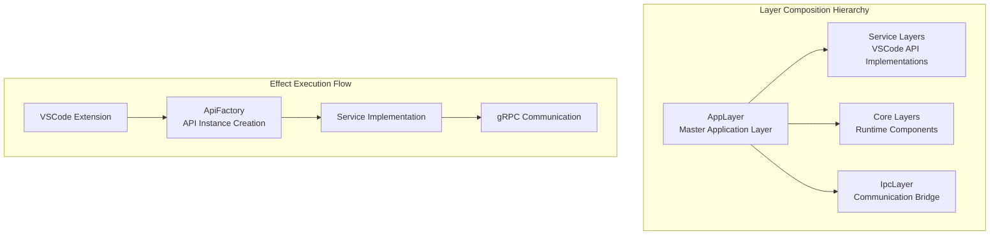
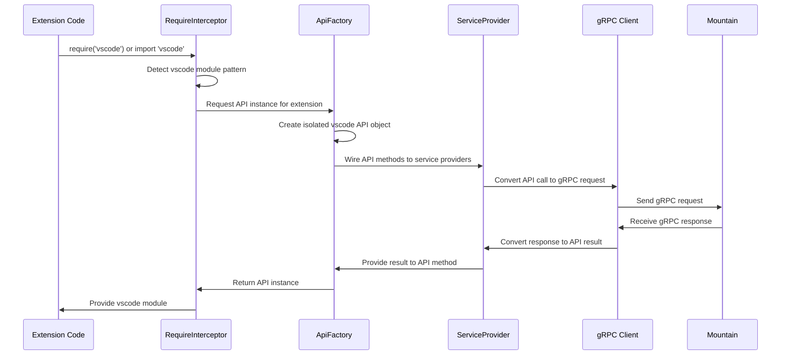
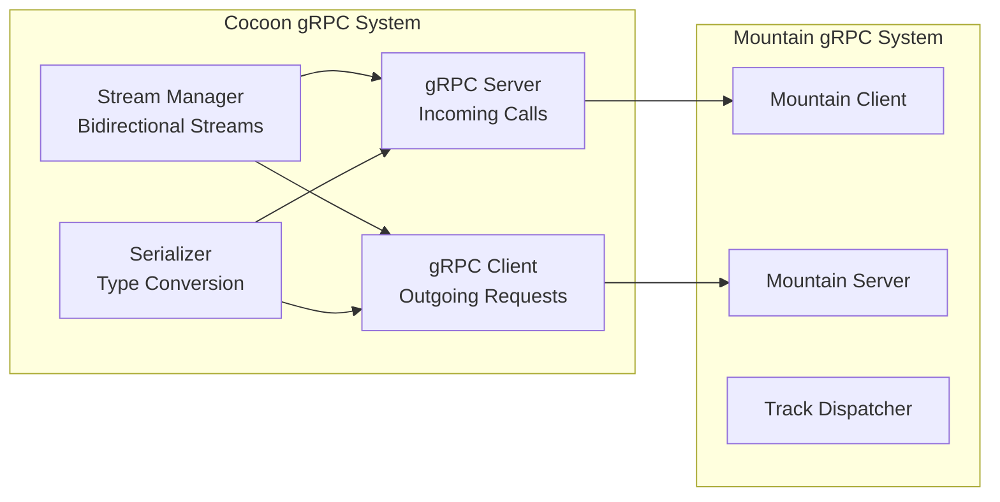
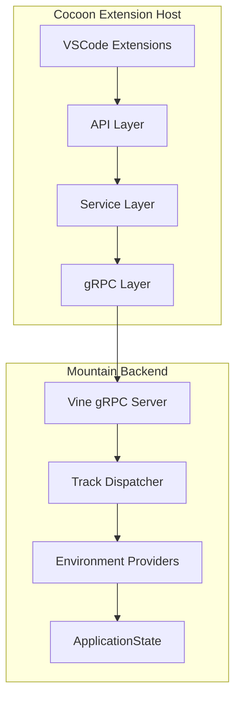
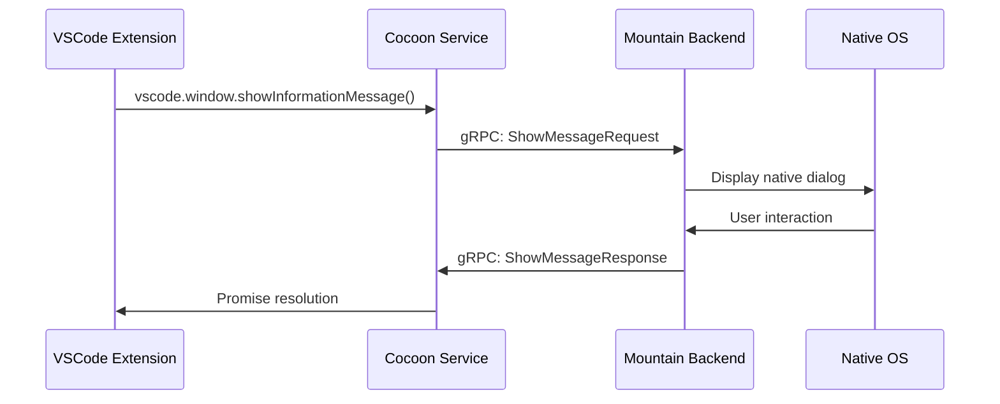
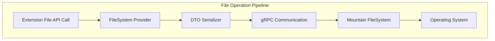
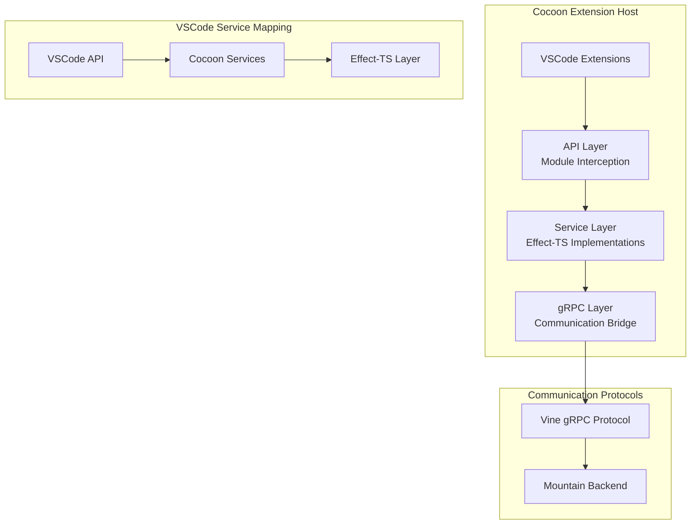
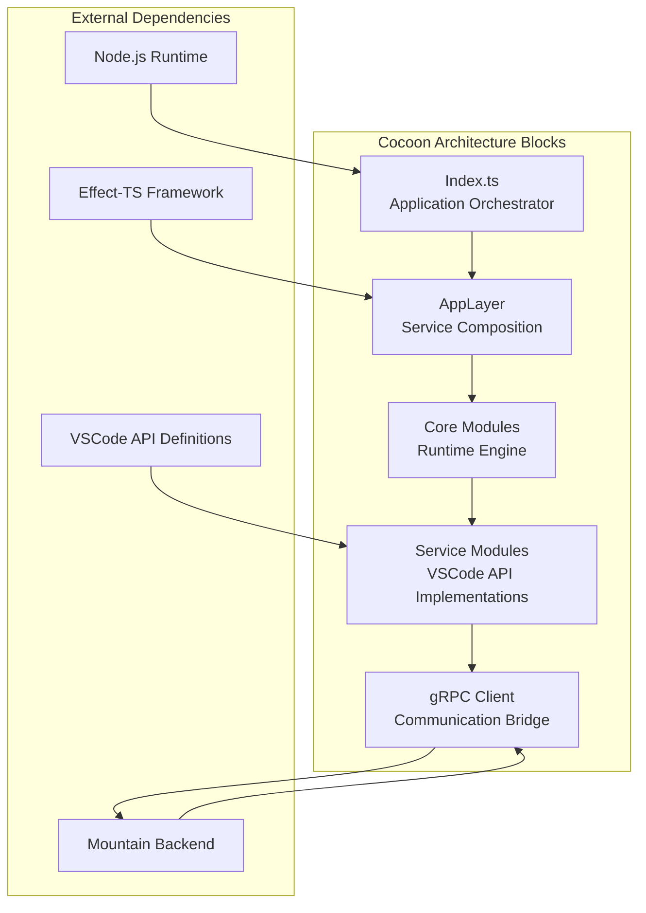
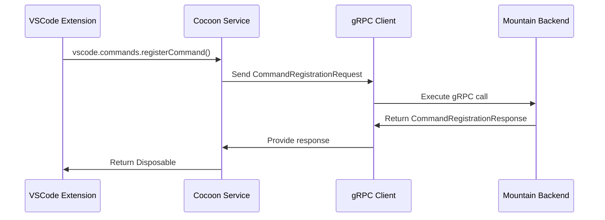

<table>
	<tr>
		<td colspan="1">
			<h3 align="center">
				<picture>
					<source media="(prefers-color-scheme: dark)" srcset="https://editor.land/Dark/Image/GitHub/Land.svg">
					<source media="(prefers-color-scheme: light)" srcset="https://editor.land/Image/GitHub/Land.svg">
					
				</picture>
			</h3>
		</td>
		<td colspan="3" valign="top"><h3 align="center">Cocoon&#x2001;🦋</h3></td>
	</tr>
</table>

---

# **Cocoon**&#x2001;Deep Dive & Architecture&#x2001;🦋

**Cocoon** provides the technical foundation for implementing VSCode extension
host compatibility within the Land project. **Cocoon** serves as the Node.js
sidecar that provides high-fidelity VSCode extension API compatibility through
plain `async/await` service implementations and gRPC communication with
Mountain.

The tree this document describes is
[`Source/`](https://github.com/CodeEditorLand/Cocoon/tree/Current/Source): 219
files across 21 top-level units. Every path named below was checked against
that tree.

---

## Core Architecture Principles

| Principle                   | Description                                                                                                                                                                                  | Key Components Involved                          |
| :-------------------------- | :------------------------------------------------------------------------------------------------------------------------------------------------------------------------------------------- | :----------------------------------------------- |
| **High-Fidelity API Shim**  | Provide comprehensive implementations of VSCode's Extension Host services (`IExtHost...`), ensuring maximum compatibility with existing VSCode extensions.                                   | All `Service/*` modules                          |
| **Lean Async Bootstrap**    | Bootstrap and service wiring use plain `async/await`. `Layer.succeed` is used where Effect-TS layers are needed; `NodeRuntime.runMain` is not used. `ManagedRuntime` is eagerly initialized. | `Effect/Bootstrap.ts`, service implementations   |
| **Module Interception**     | Implement sophisticated `require()` and `import` patching to ensure calls to the `'vscode'` module are correctly intercepted and routed to the appropriate API instance.                     | **Core/RequireInterceptor.ts**                   |
| **gRPC-Powered IPC**        | Establish a fast, strongly-typed communication channel with `Mountain` using `tonic` and the `Vine` protocol for all extension lifecycle and API calls.                                      | **Service/Ipc.ts**                               |
| **Process Hardening**       | Perform comprehensive process hardening, handling uncaught exceptions, managing logs, and ensuring graceful shutdown if the parent `Mountain` process exits.                                 | `PatchProcess/*`                                 |
| **Extensible Architecture** | Design all components with extensibility in mind, allowing for new service implementations to be easily added as the VSCode API evolves.                                                     | Service provider pattern, `AppLayer` composition |

> [!IMPORTANT]
>
> The `Key Components Involved` column above preserves the names this document
> shipped with; the corrected locations are given in Corrections to the Record.

---
## Corrections to the Record

The previous revision of this document named ten paths that do not exist in
[`Source/`](https://github.com/CodeEditorLand/Cocoon/tree/Current/Source).
There is no `Core/` directory; the provider modules live under `Services/`,
and the gRPC bridge is split across a client and a server.

| Claimed path | Status | Real location |
| :----------- | :----- | :------------ |
| **ApiFactory.ts** | renamed | [Services/API/Factory/Service.ts](https://github.com/CodeEditorLand/Cocoon/tree/Current/Source/Services/API/Factory/Service.ts) |
| **ExtensionHost.ts** | renamed | [Services/Extension/Host/Service.ts](https://github.com/CodeEditorLand/Cocoon/tree/Current/Source/Services/Extension/Host/Service.ts) |
| **RequireInterceptor.ts** | split | [VscodeModuleHooks.ts](https://github.com/CodeEditorLand/Cocoon/tree/Current/Source/Services/Handler/Extension/Host/VscodeModuleHooks.ts) + [Shim/NodeModuleInterceptor.ts](https://github.com/CodeEditorLand/Cocoon/tree/Current/Source/Shim/NodeModuleInterceptor.ts) |
| **Core/RequireInterceptor.ts** | no **Core/** exists | as above |
| **CommandsProvider.ts** | renamed | [Services/Command.ts](https://github.com/CodeEditorLand/Cocoon/tree/Current/Source/Services/Command.ts) |
| **WorkspaceProvider.ts** | renamed | [Services/Workspace.ts](https://github.com/CodeEditorLand/Cocoon/tree/Current/Source/Services/Workspace.ts) |
| **WindowProvider.ts** | renamed | [Services/Window/Index.ts](https://github.com/CodeEditorLand/Cocoon/tree/Current/Source/Services/Window/Index.ts) |
| **WebviewProvider.ts** | renamed | [WebviewPanel/Factory.ts](https://github.com/CodeEditorLand/Cocoon/tree/Current/Source/WebviewPanel/Factory.ts) |
| **Service/Ipc.ts** | split | [Mountain/Client/Service.ts](https://github.com/CodeEditorLand/Cocoon/tree/Current/Source/Services/Mountain/Client/Service.ts) + [gRPC/Server/Service.ts](https://github.com/CodeEditorLand/Cocoon/tree/Current/Source/Services/gRPC/Server/Service.ts) |
| **CocoonManagement.rs** | other repository | [Mountain: ProcessManagement/CocoonManagement.rs](https://github.com/CodeEditorLand/Mountain/tree/Current/Source/ProcessManagement/CocoonManagement.rs) |

> [!IMPORTANT]
>
> Dead design names are written in bold, not as code spans, throughout this
> document. A backticked name reads as a live path; these are names the tree no
> longer has, and only the linked location on the right is real.

> [!NOTE]
>
> `Index.ts` is also not the entry point - the real one is
> [Bootstrap/Implementation/Cocoon/Main.ts](https://github.com/CodeEditorLand/Cocoon/tree/Current/Source/Bootstrap/Implementation/Cocoon/Main.ts).

Two further claims are contradicted by the tree and are corrected in place
below. Effect-TS is nearly absent: `Layer.sync` and `Layer.effect` appear in
three files only, and `ManagedRuntime`, `Layer.succeed`, `NodeRuntime` and
`Effect.runPromise` appear in none. Most services marked `Effect.Service` carry
it as a `/* Effect.Service */` comment, not a live call.

The latency figures quoted under Performance Analysis are design targets. The
measured per-tier numbers that the code actually documents are in
[ROUTING.md](https://github.com/CodeEditorLand/Cocoon/tree/Current/Source/Services/Handler/VscodeAPI/ROUTING.md).

---
## Deep Dive into `Cocoon`'s Components

### 1. `Index.ts` (The Orchestrator)

- **Role:** The main entry point of the Cocoon application, responsible for
  orchestrating the entire bootstrapping process and managing the application's
  lifecycle.
- **Real location:**
  [Bootstrap/Implementation/Cocoon/Main.ts](https://github.com/CodeEditorLand/Cocoon/tree/Current/Source/Bootstrap/Implementation/Cocoon/Main.ts),
  built as a self-contained single-file bundle for `.app` distribution.
- **Concrete Functionality:**
    - **Effect-TS Layer Composition:** Builds the complete `AppLayer` by
      composing all individual service layers (`ApiFactoryLayer`,
      `ExtensionHostLayer`, `IpcProviderLayer`, etc.). In the tree this is the
      plain `EffectServices` record in
      [Service/Mapping.ts](https://github.com/CodeEditorLand/Cocoon/tree/Current/Source/Service/Mapping.ts),
      typed as `AppServices`.
    - **Early Process Hardening:** Applies `PatchProcess` logic immediately to
      harden the Node.js environment before any other code runs.
    - **gRPC Connection Management:** Establishes the connection to `Mountain`'s
      `Vine` gRPC server, performs the initialization handshake, and manages
      reconnection logic.
    - **Graceful Shutdown Coordination:** Implements comprehensive cleanup logic
      that ensures all extension processes are terminated and resources are
      released when Cocoon exits.

Parent death is detected by polling, not by a heartbeat: when Mountain dies
Cocoon is reparented to `launchd` and `process.ppid` becomes `1`.

```
[CocoonMain] Parent (Mountain) exited - shutting down
```

> [!NOTE]
>
> This is the exact line `Main.ts` writes when the ppid poll observes reparenting.

### 2. `PatchProcess/` (The Foundation)

- **Role:** Ensures Cocoon runs as a stable, well-behaved sidecar process that
  integrates cleanly with `Mountain`.
- **Advanced Implementation:**
    - **Signal Handling:** Captures `SIGTERM`, `SIGINT`, and other signals to
      initiate graceful shutdown procedures.
    - **Parent Process Monitoring:** Implements heartbeat monitoring to detect
      when the `Mountain` parent process exits, triggering automatic Cocoon
      termination.
    - **Log Piping:** Redirects all `stdout` and `stderr` output to the parent
      process via established communication channels.
    - **Uncaught Exception Handling:** Wraps the entire application in a
      top-level error boundary that captures and logs any unhandled exceptions.

The directory is four cooperating modules, each a real file:

| Module | Responsibility |
| :----- | :------------- |
| [Patcher.ts](https://github.com/CodeEditorLand/Cocoon/tree/Current/Source/PatchProcess/Patcher.ts) | Orchestrates hardening; `RunPatchProcess` runs once before any extension loads |
| [Security.ts](https://github.com/CodeEditorLand/Cocoon/tree/Current/Source/PatchProcess/Security.ts) | `DefaultSecurityPolicy` / `TrustedSecurityPolicy` plus tagged denial errors |
| [Validator.ts](https://github.com/CodeEditorLand/Cocoon/tree/Current/Source/PatchProcess/Validator.ts) | `ValidateFileSystemAccess`, `ValidateNetworkAccess`, `ValidateChildProcessSpawn` |
| [Loader.ts](https://github.com/CodeEditorLand/Cocoon/tree/Current/Source/PatchProcess/Loader.ts) | `InstallSecurityHooks` and `SetResourceLimits` at process start |

> [!WARNING]
>
> `SIGTERM` and `SIGINT` are handled in
> [Platform/Process.ts](https://github.com/CodeEditorLand/Cocoon/tree/Current/Source/Platform/Process.ts),
> not inside `PatchProcess/`.
### 3. `Core/` Modules (The Extension Runtime Engine)

- **Role:** Manages the core extension lifecycle, module interception, and API
  instance creation.
- **Concrete Components:**
    - **ExtensionHost.ts:** The central orchestrator that activates VSCode
      extensions, manages their lifecycle, and coordinates API calls between
      extensions and `Mountain`.
    - **RequireInterceptor.ts:** Sophisticated module patching logic that
      intercepts both CommonJS `require()` and ESM `import` statements for the
      `'vscode'` module, ensuring each extension receives its own isolated API
      instance.
    - **ApiFactory.ts:** Constructs the comprehensive `vscode` API object that
      is provided to each extension, wiring all service calls to their
      respective Effect-TS implementations.

There is no `Core/` directory. The engine is three real modules, and the
`require`/`import` split is two separate hooks rather than one interceptor:

| Concern | Real module |
| :------ | :---------- |
| Host lifecycle | [Services/Extension/Host/Service.ts](https://github.com/CodeEditorLand/Cocoon/tree/Current/Source/Services/Extension/Host/Service.ts) |
| `require`/`import` of `'vscode'` | [VscodeModuleHooks.ts](https://github.com/CodeEditorLand/Cocoon/tree/Current/Source/Services/Handler/Extension/Host/VscodeModuleHooks.ts) |
| `fs` / `child_process` redirection | [Shim/NodeModuleInterceptor.ts](https://github.com/CodeEditorLand/Cocoon/tree/Current/Source/Shim/NodeModuleInterceptor.ts) |
| API surface construction | [Services/API/Factory/Service.ts](https://github.com/CodeEditorLand/Cocoon/tree/Current/Source/Services/API/Factory/Service.ts) |
| AST security sandboxing | [Services/Module/Interceptor.ts](https://github.com/CodeEditorLand/Cocoon/tree/Current/Source/Services/Module/Interceptor.ts) |

`VscodeModuleHooks` implements the Node ESM loader contract directly:

```ts
export async function resolve(Specifier, Context, NextResolve) { ... }
export async function load(Url, Context, NextLoad) { ... }
export default InstallVscodeModuleHooks;
```

> [!NOTE]
>
> These are loader hooks, so ESM `import 'vscode'` is intercepted at resolution
> rather than by patching `require`.

The API object is not synthesised. Real VS Code classes are imported from
`@codeeditorland/output`, compiled from VS Code source, and shared across every
extension:

```ts
const VsCodeTypes = await import(
  "@codeeditorland/output/.../extHostTypes.js");
```

> [!NOTE]
>
> Loading the constructors once at module init is what makes `instanceof`
> checks inside extensions behave as they do in VS Code.

`Shim/NodeModuleInterceptor` is gated on the `TierShim` flag and has five
levels - `None`, `Proxy`, `Replace`, `Own`, `Preempt`. At the default `None`
esbuild tree-shakes the whole module away.

### 4. `Service/` Modules (The VSCode API Implementations)

- **Role:** Provides high-fidelity implementations of VSCode's Extension Host
  services, each implemented as an Effect-TS `Layer`.
- **Concrete Service Architecture:**
    - **CommandsProvider.ts:** Implements `IExtHostCommands` with full command
      registration, execution, and context key support.
    - **WorkspaceProvider.ts:** Provides `IExtHostWorkspace` functionality
      including file system operations, workspace folder management, and
      configuration handling.
    - **WindowProvider.ts:** Implements `IExtHostWindow` with message dialogs,
      progress indicators, and status bar item management.
    - **WebviewProvider.ts:** Handles `IExtHostWebviews` with sophisticated
      webview panel creation, message passing, and lifecycle management.

Those four names map onto real files, and the set is larger than four:

| Namespace | Implementation |
| :-------- | :------------- |
| `vscode.commands` | [Services/Command.ts](https://github.com/CodeEditorLand/Cocoon/tree/Current/Source/Services/Command.ts) |
| `vscode.workspace` | [Services/Workspace.ts](https://github.com/CodeEditorLand/Cocoon/tree/Current/Source/Services/Workspace.ts) |
| `vscode.window` | [Services/Window/Index.ts](https://github.com/CodeEditorLand/Cocoon/tree/Current/Source/Services/Window/Index.ts) |
| Webviews | [WebviewPanel/Factory.ts](https://github.com/CodeEditorLand/Cocoon/tree/Current/Source/WebviewPanel/Factory.ts) |
| `vscode.languages` | [Services/Language/Provider/Registry.ts](https://github.com/CodeEditorLand/Cocoon/tree/Current/Source/Services/Language/Provider/Registry.ts) |
| Configuration | [Services/Configuration.ts](https://github.com/CodeEditorLand/Cocoon/tree/Current/Source/Services/Configuration.ts) |
| Filesystem | [Services/File/System/Service.ts](https://github.com/CodeEditorLand/Cocoon/tree/Current/Source/Services/File/System/Service.ts) |
| Terminals | [Services/Terminal/Service.ts](https://github.com/CodeEditorLand/Cocoon/tree/Current/Source/Services/Terminal/Service.ts) |
| Extension registry | [Services/Extension.ts](https://github.com/CodeEditorLand/Cocoon/tree/Current/Source/Services/Extension.ts) |
| Discovery | [Services/Extensions/Scanner.ts](https://github.com/CodeEditorLand/Cocoon/tree/Current/Source/Services/Extensions/Scanner.ts) |

`Services/Window/` is itself split by widget, one file per concern:
[Dialog.ts](https://github.com/CodeEditorLand/Cocoon/tree/Current/Source/Services/Window/Dialog.ts),
[Progress.ts](https://github.com/CodeEditorLand/Cocoon/tree/Current/Source/Services/Window/Progress.ts),
[Quick/Input.ts](https://github.com/CodeEditorLand/Cocoon/tree/Current/Source/Services/Window/Quick/Input.ts),
[Status/Bar.ts](https://github.com/CodeEditorLand/Cocoon/tree/Current/Source/Services/Window/Status/Bar.ts),
[Output/Channel.ts](https://github.com/CodeEditorLand/Cocoon/tree/Current/Source/Services/Window/Output/Channel.ts),
[Text/Document.ts](https://github.com/CodeEditorLand/Cocoon/tree/Current/Source/Services/Window/Text/Document.ts),
[File/Dialogs.ts](https://github.com/CodeEditorLand/Cocoon/tree/Current/Source/Services/Window/File/Dialogs.ts) and
[Webview/Panel.ts](https://github.com/CodeEditorLand/Cocoon/tree/Current/Source/Services/Window/Webview/Panel.ts).

### 5. `Service/Ipc.ts` (The Communication Bridge)

- **Role:** Manages all bidirectional communication between Cocoon and Mountain
  using gRPC.
- **Advanced Communication Patterns:**
    - **Bidirectional Streaming:** Implements both client and server streaming
      for real-time communication scenarios like terminal I/O and file watching.
    - **Request Batching:** Aggregates multiple small requests into batched
      operations to optimize network performance.
    - **Connection Resiliency:** Implements automatic reconnection with
      exponential backoff and request queuing during connection loss.
    - **Protocol Buffer Optimization:** Uses advanced protobuf features for
      efficient serialization of complex VSCode types.

There is no single **Ipc.ts**. The bridge is a client and a server, plus a
transport-agnostic `IPC/` layer:

| Direction | Module |
| :-------- | :----- |
| Cocoon → Mountain | [Services/Mountain/Client/Service.ts](https://github.com/CodeEditorLand/Cocoon/tree/Current/Source/Services/Mountain/Client/Service.ts) |
| Mountain → Cocoon | [Services/gRPC/Server/Service.ts](https://github.com/CodeEditorLand/Cocoon/tree/Current/Source/Services/gRPC/Server/Service.ts) |
| Request dispatch | [Handler/Request/Routing/Handler.ts](https://github.com/CodeEditorLand/Cocoon/tree/Current/Source/Services/Handler/Request/Routing/Handler.ts) |
| Notification fan-out | [Handler/Notification/Handler.ts](https://github.com/CodeEditorLand/Cocoon/tree/Current/Source/Services/Handler/Notification/Handler.ts) |
| High-level wrapper | [Integration/Mountain/Client.ts](https://github.com/CodeEditorLand/Cocoon/tree/Current/Source/Integration/Mountain/Client.ts) |

Every wire send is logged with a correlation id:

```
[LandFix:Tree] wire-send method=${method} correlation=${Correlation} t=${Timestamp}
```

> [!NOTE]
>
> The correlation id is what lets a Cocoon request be matched to its Mountain
> response in a merged log.

---
## Subsystems Not Previously Documented

The sections above cover the runtime path. These twelve top-level units are
equally real and were absent from earlier revisions.

### `IPC/` - transport-agnostic message layer

[IPC/](https://github.com/CodeEditorLand/Cocoon/tree/Current/Source/IPC) is
independent of gRPC. It defines the message envelope, a batching codec and a
priority-aware channel.

- [Channel.ts](https://github.com/CodeEditorLand/Cocoon/tree/Current/Source/IPC/Channel.ts) - `MessagePriority`, `ChannelDirection`, `DeliveryStatus`
- [Handler.ts](https://github.com/CodeEditorLand/Cocoon/tree/Current/Source/IPC/Handler.ts) - `IPCHandler`, `OperationType`, `RequestHandler`
- [Message/](https://github.com/CodeEditorLand/Cocoon/tree/Current/Source/IPC/Message) - `Serialize`, `Deserialize`, `Batch`, `Unbatch`, `VSBuffer`
- [Protocol.ts](https://github.com/CodeEditorLand/Cocoon/tree/Current/Source/IPC/Protocol.ts) - framing constants

```ts
export enum MessagePriority { ... }
export class IPCHandler { ... }
export function CreateIPCHandler( ... )
```

> [!NOTE]
>
> `Batch/Messages.ts` is where "request batching" is actually implemented.

### `Interfaces/` - the contract surface

[Interfaces/](https://github.com/CodeEditorLand/Cocoon/tree/Current/Source/Interfaces)
holds every service contract as a `Symbol.for` token, so implementations can be
swapped without touching call sites. `IAPI/Factory/Service.ts` and
[IGRPC/Server/Service.ts](https://github.com/CodeEditorLand/Cocoon/tree/Current/Source/Interfaces/IGRPC/Server/Service.ts)
are the two top-level families; `I/` holds the rest.

```ts
export interface IAPIFactory { ... }
export const IAPIFactory: unique symbol = Symbol.for("IAPIFactory");
```

> [!NOTE]
>
> The interface and its token share a name, which is how a consumer asks for a
> contract without importing an implementation.

#### `IAPI/` and `I/` - the two contract families

The directory splits by who the contract is for.

- **IAPI/** - the API-construction family.
  [IAPI/Factory/Service.ts](https://github.com/CodeEditorLand/Cocoon/tree/Current/Source/Interfaces/IAPI/Factory/Service.ts)
  declares `IAPIFactoryService` alongside `APIConstructionRequest`,
  `APIConstructionResult` and `APIValidationResult`.
- **I/** - one subdirectory per runtime service:
  [I/Terminal/Service.ts](https://github.com/CodeEditorLand/Cocoon/tree/Current/Source/Interfaces/I/Terminal/Service.ts),
  [I/Security/Service.ts](https://github.com/CodeEditorLand/Cocoon/tree/Current/Source/Interfaces/I/Security/Service.ts),
  [I/Mountain/Client/Service.ts](https://github.com/CodeEditorLand/Cocoon/tree/Current/Source/Interfaces/I/Mountain/Client/Service.ts)
  and seven more.

```ts
export interface IAPIFactoryService { readonly _serviceBrand: undefined; ... }
export const IAPIFactoryService: unique symbol = Symbol.for("IAPIFactoryService");
```

> [!NOTE]
>
> The `_serviceBrand` field is a nominal-typing marker, so two structurally
> identical contracts cannot be substituted for one another by accident.

### `Platform/` - OS and process abstraction

[Platform/](https://github.com/CodeEditorLand/Cocoon/tree/Current/Source/Platform)
is Cocoon's only sanctioned route to the host:
[OS.ts](https://github.com/CodeEditorLand/Cocoon/tree/Current/Source/Platform/OS.ts),
[Process.ts](https://github.com/CodeEditorLand/Cocoon/tree/Current/Source/Platform/Process.ts),
[Environment.ts](https://github.com/CodeEditorLand/Cocoon/tree/Current/Source/Platform/Environment.ts),
[Logger.ts](https://github.com/CodeEditorLand/Cocoon/tree/Current/Source/Platform/Logger.ts) and
[FiddeeRoot.ts](https://github.com/CodeEditorLand/Cocoon/tree/Current/Source/Platform/FiddeeRoot.ts),
which mirrors the Rust atom of the same name.
[VSCode/Type.ts](https://github.com/CodeEditorLand/Cocoon/tree/Current/Source/Platform/VSCode/Type.ts)
is the single source of truth for VS Code runtime constructors.

```ts
export function DetectPlatform(): Promise< ... >
export const PlatformServiceLayer = Layer.sync( ... );
```

> [!NOTE]
>
> This is one of only three files in the tree that calls a real Effect `Layer`
> constructor.

### `TypeConverter/` - DTO boundary

[TypeConverter/](https://github.com/CodeEditorLand/Cocoon/tree/Current/Source/TypeConverter)
converts VS Code API objects to Mountain DTOs and back. The convention is a
`FromAPI` / `ToAPI` pair per type, grouped as `Main`, `Dialog`, `Quick`,
`Status`, `TreeView`, `Webview` and `Workspace`.

```ts
export const FromAPI = (TheURI: VSCodeURI): UriComponents => TheURI.toJSON();
export const ToAPI = (DTO: UriComponents): VSCodeURI => URI.revive(DTO);
```

> [!NOTE]
>
> `URI.revive` restores prototype methods that a JSON round-trip would drop.

#### `TreeView/` - the one group that needs the extension identity

Most converter groups translate a value in isolation. **TreeView/** does not:
[TreeView/Item.ts](https://github.com/CodeEditorLand/Cocoon/tree/Current/Source/TypeConverter/TreeView/Item.ts)
takes an `IExtensionDescription` as its first argument, and
[TreeView/Option.ts](https://github.com/CodeEditorLand/Cocoon/tree/Current/Source/TypeConverter/TreeView/Option.ts)
converts the `TreeViewOptions` that register a provider.

```ts
export const FromAPI = (_extension: IExtensionDescription, item: VSCode.TreeItem)
export const ToAPI = (dto: any): VSCode.TreeItem => { ... };
```

> [!NOTE]
>
> The extension description is threaded through because a tree item's icon and
> command are resolved relative to the contributing extension.

### `WebviewPanel/` - panel lifecycle

[WebviewPanel/](https://github.com/CodeEditorLand/Cocoon/tree/Current/Source/WebviewPanel)
owns `vscode.WebviewPanel`:
[Factory.ts](https://github.com/CodeEditorLand/Cocoon/tree/Current/Source/WebviewPanel/Factory.ts) creates and registers panels,
[Message.ts](https://github.com/CodeEditorLand/Cocoon/tree/Current/Source/WebviewPanel/Message.ts) routes `Request`/`Response`/`Event` traffic,
[State.ts](https://github.com/CodeEditorLand/Cocoon/tree/Current/Source/WebviewPanel/State.ts) and
[Serializer.ts](https://github.com/CodeEditorLand/Cocoon/tree/Current/Source/WebviewPanel/Serializer.ts)
persist and restore panels across restarts.

```ts
export type WebviewMessage = RequestMessage | ResponseMessage | EventMessage;
export interface MessageRouter { ... }
```

> [!NOTE]
>
> Three message shapes share one envelope, which is what lets a single router
> serve both calls and notifications.

### `Telemetry/` - OTLP and PostHog

[Telemetry/](https://github.com/CodeEditorLand/Cocoon/tree/Current/Source/Telemetry)
has two independent exporters.
[OTLPBridge.ts](https://github.com/CodeEditorLand/Cocoon/tree/Current/Source/Telemetry/OTLPBridge.ts)
is a fire-and-forget span exporter mirroring Mountain's.
[PostHog/](https://github.com/CodeEditorLand/Cocoon/tree/Current/Source/Telemetry/PostHog)
splits into `Buffer`, `Configuration`, `Event`, `Identifier` and `Transport`,
with [Post/Hog/Bridge.ts](https://github.com/CodeEditorLand/Cocoon/tree/Current/Source/Telemetry/Post/Hog/Bridge.ts)
posting batches over `node:https`.

```ts
export const CaptureSpan = ( ... )
export const WithSpan = async <Result>( ... )
```

> [!NOTE]
>
> `WithSpan` wraps an awaited operation; `CaptureSpan` records one already
> finished.

### `Codegen/` - extension-host schema generation

[Codegen/](https://github.com/CodeEditorLand/Cocoon/tree/Current/Source/Codegen)
walks the VS Code source tree and emits a schema of every extension-host
decorator. `Extract/` finds them, `Emit/` writes the schema, `Run/` and `Type/`
orchestrate and type the records.

```
[Cocoon/Codegen] OK - ${Result.RecordsEmitted} ExtHost decorators in ${Result.DurationMilliseconds}ms
```

> [!NOTE]
>
> The count in that line is how many decorators the run recognised.

#### `Extract/` and `Emit/` - the two halves of a Codegen run

The pipeline is a reader and a writer, and each half is one directory.

- **Extract/** - decides what counts and walks it. `IsExtHostFile` filters a
  path against `ExtHostPathSegments`, and `IterateExtHostDecorators` is an
  async generator that yields one record per decorator found.
- **Emit/** - serialises those records. `EmitExtHostSchema` returns an
  `EmitExtHostSchemaOutcome` carrying `OutputPath`, `Bytes` and `Members`,
  or a `CodegenProblem` if the write fails.

```ts
export const IsExtHostFile = (sourcePath: string): boolean => { ... };
export const IterateExtHostDecorators = async function* ( ... )
export const EmitExtHostSchema = async ( ... )
```

> [!NOTE]
>
> `Extract/` only ever reads and `Emit/` only ever writes, so a failed run
> leaves the previous schema on disk untouched.

### `Utility/` - shared primitives

[Utility/](https://github.com/CodeEditorLand/Cocoon/tree/Current/Source/Utility)
carries five primitives:
[Result.ts](https://github.com/CodeEditorLand/Cocoon/tree/Current/Source/Utility/Result.ts) (`Ok`/`Err`),
[Tier.ts](https://github.com/CodeEditorLand/Cocoon/tree/Current/Source/Utility/Tier.ts) (tier-gating flags),
[Glob/To/Regex.ts](https://github.com/CodeEditorLand/Cocoon/tree/Current/Source/Utility/Glob/To/Regex.ts),
[Event/Stream.ts](https://github.com/CodeEditorLand/Cocoon/tree/Current/Source/Utility/Event/Stream.ts) and
[Land/Fix/Log.ts](https://github.com/CodeEditorLand/Cocoon/tree/Current/Source/Utility/Land/Fix/Log.ts).

```ts
export type Result<T, E = Error> = Ok<T> | Err<E>;
export const CreateEventStream = <T>(): EventStream<T> => { ... };
```

> [!NOTE]
>
> `Result` is a plain discriminated union - no Effect dependency.

`Tier.ts` is load-bearing: it resolves capability flags from
`globalThis.__LandTiers` (substituted by esbuild) falling back to
`process.env.Tier<Capability>`, and those flags decide whether an operation
runs in Node or round-trips to Mountain.
### `Debug/` - the Node half of the debug server

[Debug/Server.ts](https://github.com/CodeEditorLand/Cocoon/tree/Current/Source/Debug/Server.ts)
is the extension-host half of a dual-layer debug server, listening on loopback
and exposing command hooks.

```
[CocoonDebug] Cocoon layer listening on http://127.0.0.1:${Port} (mode=${Mode})
```

> [!NOTE]
>
> `RegisterHooks` lets a caller intercept commands before the default handler.

### `Configuration/` and `ESBuild` - the build

[Configuration/ESBuild/](https://github.com/CodeEditorLand/Cocoon/tree/Current/Source/Configuration/ESBuild)
holds the build config;
[ESBuild.ts](https://github.com/CodeEditorLand/Cocoon/tree/Current/Source/ESBuild.ts)
is the root options object and
[ESBuild.js](https://github.com/CodeEditorLand/Cocoon/tree/Current/Source/ESBuild.js)
its compiled form.
[Configuration/Mountain/Config.ts](https://github.com/CodeEditorLand/Cocoon/tree/Current/Source/Configuration/Mountain/Config.ts)
carries the client settings.

```sh
Build "Source/**/*.ts" \
	--ESBuild Configuration/ESBuild/Target.js \
	--Watch
```

> [!NOTE]
>
> That is the watch-mode invocation from
> [Run.sh](https://github.com/CodeEditorLand/Cocoon/tree/Current/Source/Run.sh);
> [prepublishOnly.sh](https://github.com/CodeEditorLand/Cocoon/tree/Current/Source/prepublishOnly.sh)
> runs the same build without `--Watch`, after generating the DualTrack route
> manifest.

### `Scripts/` - benchmarking

[Scripts/PerformanceBenchmark.js](https://github.com/CodeEditorLand/Cocoon/tree/Current/Source/Scripts/PerformanceBenchmark.js)
is the only script here, and it is the measurement counterpart to the latency
targets quoted later in this document.

### `Services/` supporting modules

Beyond the API namespaces, `Services/` holds the machinery that keeps the host
honest:

| Module | What it does |
| :----- | :----------- |
| [Dual/Track.ts](https://github.com/CodeEditorLand/Cocoon/tree/Current/Source/Services/Dual/Track.ts) | Progressive Rust migration backstop - `TryMountainThenNode` falls back to the Node path when Mountain lacks a method |
| [Dev/Log.ts](https://github.com/CodeEditorLand/Cocoon/tree/Current/Source/Services/Dev/Log.ts) | `CocoonDevLog(Tag, Message)`, tag-filtered by the `Trace` variable |
| [Echo/Action/Client.ts](https://github.com/CodeEditorLand/Cocoon/tree/Current/Source/Services/Echo/Action/Client.ts) | `CocoonEchoClient` - extension-host side of the Echo Element |
| [Init/Data.ts](https://github.com/CodeEditorLand/Cocoon/tree/Current/Source/Services/Init/Data.ts) | `InitData` handshake payload |
| [Security/Service.ts](https://github.com/CodeEditorLand/Cocoon/tree/Current/Source/Services/Security/Service.ts) | Policy enforcement and audit log |
| [Error/Handling/Service.ts](https://github.com/CodeEditorLand/Cocoon/tree/Current/Source/Services/Error/Handling/Service.ts) | Circuit breaker around Mountain calls |
| [Metrics/Collector.ts](https://github.com/CodeEditorLand/Cocoon/tree/Current/Source/Services/Metrics/Collector.ts) | `MetricsCollector` counters |
| [Performance/Monitoring/Service.ts](https://github.com/CodeEditorLand/Cocoon/tree/Current/Source/Services/Performance/Monitoring/Service.ts) | Zero-overhead shim replacing a 741-line implementation |
| [Health.ts](https://github.com/CodeEditorLand/Cocoon/tree/Current/Source/Services/Health.ts) | `HealthStatus` for Mountain services and Cocoon components |
| [Logger.ts](https://github.com/CodeEditorLand/Cocoon/tree/Current/Source/Services/Logger.ts) | Internal application logging |
| [Handler/](https://github.com/CodeEditorLand/Cocoon/tree/Current/Source/Services/Handler) | Per-namespace `vscode.*` shims and their tier routing |

```ts
export async function TryMountainThenNode<T>( ... )
export function MarkUnavailable(Method: string): never { ... }
```

> [!NOTE]
>
> `DualTrack` is how a half-migrated method stays callable while its Rust side
> is still being written.
### Handler tier routing

Each `vscode.*` namespace shim decides per operation where the work happens.
The decision is a pure function in that namespace's `Route.ts`.

| Tier | Backend | Latency |
| :--- | :------ | :------ |
| **A** | Cocoon `node:fs`, `node:net`, local JS state | ~0.1-0.3 ms |
| **B** | Cocoon-local plus a fire-and-forget Mountain notification | ~0.5-2 ms |
| **C** | `MountainClient.sendRequest` over gRPC | ~3-15 ms |

> [!NOTE]
>
> These are the measured figures recorded in
> [ROUTING.md](https://github.com/CodeEditorLand/Cocoon/tree/Current/Source/Services/Handler/VscodeAPI/ROUTING.md),
> and `[DEV:<NAMESPACE>-ROUTE]` log lines make each dispatch observable.

### `Bootstrap/` - entry point and WebSocket server

[Bootstrap/Implementation/Cocoon/Main.ts](https://github.com/CodeEditorLand/Cocoon/tree/Current/Source/Bootstrap/Implementation/Cocoon/Main.ts)
is the real process entry point.
[Bootstrap/WebSocket/Server.ts](https://github.com/CodeEditorLand/Cocoon/tree/Current/Source/Bootstrap/WebSocket/Server.ts)
exposes `StartWebSocketServer` for clients that cannot speak gRPC.

```
[LandFix:WS] WebSocket server on 127.0.0.1:${_Port}
```

> [!NOTE]
>
> It binds loopback only, so the socket is unreachable off-host.

### `Shim/` and `Integration/`

[Shim/](https://github.com/CodeEditorLand/Cocoon/tree/Current/Source/Shim)
holds the tier-gated Node module interceptor described above.
[Integration/Mountain/Client.ts](https://github.com/CodeEditorLand/Cocoon/tree/Current/Source/Integration/Mountain/Client.ts)
wraps the raw gRPC client in a simplified `MountainClient` facade.

---
## Concrete Technical Architecture

### Core Architectural Components

#### 1. Effect-TS Application Layer Architecture

Cocoon's entire architecture is built around concrete Effect-TS layer
composition:


```mermaid
graph TB
    subgraph "Layer Composition Hierarchy"
        AppLayer["AppLayer<br/>Master Application Layer"]
        ServiceLayers["Service Layers<br/>VSCode API Implementations"]
        CoreLayers["Core Layers<br/>Runtime Components"]
        IpcLayer["IpcLayer<br/>Communication Bridge"]

        AppLayer --> ServiceLayers
        AppLayer --> CoreLayers
        AppLayer --> IpcLayer
    end

    subgraph "Effect Execution Flow"
        Extension["VSCode Extension"]
        ApiFactory["ApiFactory<br/>API Instance Creation"]
        ServiceImpl["Service Implementation"]
        gRPC["gRPC Communication"]

        Extension --> ApiFactory
        ApiFactory --> ServiceImpl
        ServiceImpl --> gRPC
    end
```

> [!WARNING]
>
> The diagram is the intended design. In the tree `AppLayer` is the plain
> `EffectServices` record in
> [Service/Mapping.ts](https://github.com/CodeEditorLand/Cocoon/tree/Current/Source/Service/Mapping.ts),
> and no file calls `Layer.succeed` or `ManagedRuntime`.

**Concrete Effect Composition Guarantees**

Cocoon's layer composition ensures deterministic service availability through:

1. **Layer Dependency Resolution:** Each service layer declares its dependencies
   explicitly
2. **Type Safety:** Effect-TS ensures all dependencies are satisfied at compile
   time
3. **Composition Guarantee:**
   `AppLayer = ApiFactoryLayer + ExtensionHostLayer + ...`
4. **Runtime Verification:** Layer composition succeeds or fails
   deterministically

Dependency resolution in the tree is by symbol token rather than by Layer
graph: a service asks for `IMountainClientService` and receives whatever was
registered against that symbol.

#### 2. Module Interception System Architecture

The sophisticated module interception system ensures VSCode API calls are
properly routed:


```mermaid
sequenceDiagram
    participant E as Extension Code
    participant RI as RequireInterceptor
    participant AF as ApiFactory
    participant SP as ServiceProvider
    participant IPC as gRPC Client

    E->>RI: require('vscode') or import 'vscode'
    RI->>RI: Detect vscode module pattern
    RI->>AF: Request API instance for extension
    AF->>AF: Create isolated vscode API object
    AF->>SP: Wire API methods to service providers
    SP->>IPC: Convert API call to gRPC request
    IPC->>Mountain: Send gRPC request
    Mountain->>IPC: Receive gRPC response
    IPC->>SP: Convert response to API result
    SP->>AF: Provide result to API method
    AF->>RI: Return API instance
    RI->>E: Provide vscode module
```

> [!NOTE]
>
> `RequireInterceptor` in this sequence is
> [VscodeModuleHooks.ts](https://github.com/CodeEditorLand/Cocoon/tree/Current/Source/Services/Handler/Extension/Host/VscodeModuleHooks.ts),
> and `ApiFactory` is
> [Services/API/Factory/Service.ts](https://github.com/CodeEditorLand/Cocoon/tree/Current/Source/Services/API/Factory/Service.ts).

#### 3. gRPC Communication Architecture

The bidirectional gRPC communication system enables real-time extension
operations:


```mermaid
graph LR
    subgraph "Cocoon gRPC System"
        Client["gRPC Client<br/>Outgoing Requests"]
        Server["gRPC Server<br/>Incoming Calls"]
        StreamMgr["Stream Manager<br/>Bidirectional Streams"]
        Serializer["Serializer<br/>Type Conversion"]
    end

    subgraph "Mountain gRPC System"
        MountainClient["Mountain Client"]
        MountainServer["Mountain Server"]
        TrackDispatcher["Track Dispatcher"]
    end

    Client --> MountainServer
    Server --> MountainClient
    StreamMgr --> Client
    StreamMgr --> Server
    Serializer --> Client
    Serializer --> Server
```

### Concrete Technical Characteristics

#### Performance Analysis: API Call Latency

**Latency Breakdown:**

- **Module Interception:** ~0.05ms
- **API Instance Creation:** ~0.1ms
- **Service Provider Routing:** ~0.02ms
- **gRPC Serialization:** ~0.15ms
- **Network Latency:** 1-10ms (variable)
- **Mountain Processing:** 0.5-5ms (effect-dependent)
- **Response Deserialization:** ~0.1ms

**Total API Call Latency:** ~0.42ms + network latency + Mountain processing time

> [!WARNING]
>
> These are design targets. The measured per-tier figures are the Tier A/B/C
> table above, and
> [Scripts/PerformanceBenchmark.js](https://github.com/CodeEditorLand/Cocoon/tree/Current/Source/Scripts/PerformanceBenchmark.js)
> is what produces real numbers.

#### Security Implementation Characteristics

The isolated API instance system prevents extension interference through:

1. **Module Interception:** Each extension's `require('vscode')` is intercepted
2. **Instance Isolation:** `ApiFactory` creates unique API instance per
   extension
3. **State Separation:** Extension-specific state is maintained separately
4. **Access Control:** API methods enforce extension-specific permissions

Enforcement is real and layered:
[Services/Module/Interceptor.ts](https://github.com/CodeEditorLand/Cocoon/tree/Current/Source/Services/Module/Interceptor.ts)
parses each module with `acorn` and walks the AST before it loads, while
`PatchProcess/Validator.ts` gates filesystem, network and child-process access
against the active policy.

### Ecosystem Integration Mapping


```mermaid
graph TD
    subgraph "Cocoon Extension Host"
        Extensions["VSCode Extensions"]
        ApiLayer["API Layer"]
        ServiceLayer["Service Layer"]
        gRPCLayer["gRPC Layer"]
    end

    subgraph "Mountain Backend"
        VineServer["Vine gRPC Server"]
        Track["Track Dispatcher"]
        Environment["Environment Providers"]
        AppState["ApplicationState"]
    end

    Extensions --> ApiLayer
    ApiLayer --> ServiceLayer
    ServiceLayer --> gRPCLayer
    gRPCLayer --> VineServer
    VineServer --> Track
    Track --> Environment
    Environment --> AppState
```

### Performance Optimization Strategies

#### 1. Intelligent Request Batching

- **API Call Aggregation:** Group related API calls into batched requests
- **Priority-Based Batching:** Separate UI-blocking from background operations
- **Smart Flushing:** Adaptive batching thresholds based on request patterns

Batching is implemented in
[IPC/Message/Batch/Messages.ts](https://github.com/CodeEditorLand/Cocoon/tree/Current/Source/IPC/Message/Batch/Messages.ts)
and undone by `Unbatch/Messages.ts`; priority comes from `MessagePriority` in
[IPC/Channel.ts](https://github.com/CodeEditorLand/Cocoon/tree/Current/Source/IPC/Channel.ts).

#### 2. Memory Management Optimization

- **Extension Isolation:** Each extension runs in isolated context with
  controlled memory
- **API Instance Pooling:** Reuse API instances for similar extension patterns
- **Stream Management:** Efficient handling of long-lived gRPC streams

Memory ceilings are enforced by `SetResourceLimits` in
[PatchProcess/Loader.ts](https://github.com/CodeEditorLand/Cocoon/tree/Current/Source/PatchProcess/Loader.ts),
which raises `MemoryLimitExceededError`.

#### 3. Connection Resiliency

- **Automatic Reconnection:** Smart reconnection logic with exponential backoff
- **Request Queuing:** Queue requests during connection outages
- **State Synchronization:** Resync extension state after reconnection

### Advanced Integration Patterns

#### Real-time Extension Operations


```mermaid
sequenceDiagram
    participant Ext as VSCode Extension
    participant Cocoon as Cocoon Service
    participant Mountain as Mountain Backend
    participant Native as Native OS

    Ext->>Cocoon: vscode.window.showInformationMessage()
    Cocoon->>Mountain: gRPC: ShowMessageRequest
    Mountain->>Native: Display native dialog
    Native->>Mountain: User interaction
    Mountain->>Cocoon: gRPC: ShowMessageResponse
    Cocoon->>Ext: Promise resolution
```

> [!NOTE]
>
> `showInformationMessage` is Tier C: it round-trips to Mountain because the
> dialog is Mountain-owned UI.

#### File System Operations Flow


```mermaid
graph TB
    subgraph "File Operation Pipeline"
        Ext["Extension File API Call"]
        FSProvider["FileSystem Provider"]
        Serializer["DTO Serializer"]
        gRPC["gRPC Communication"]
        MountainFS["Mountain FileSystem"]
        OS["Operating System"]

        Ext --> FSProvider
        FSProvider --> Serializer
        Serializer --> gRPC
        gRPC --> MountainFS
        MountainFS --> OS
    end
```

> [!NOTE]
>
> Whether a file operation takes this path at all is decided by
> `TierFileSystem`; at the default `Layer3` a plain `file://` read stays in
> Node.

---

## Bootstrap Sequence

`Effect/Bootstrap.ts` runs Cocoon's startup as a sequential list of named
stages. Each stage is a plain `async` function; failures are caught and reported
without aborting subsequent stages where possible.

The file is
[Service/Effect/Bootstrap.ts](https://github.com/CodeEditorLand/Cocoon/tree/Current/Source/Service/Effect/Bootstrap.ts).
Every stage returns the same record, which is what makes the run reportable:

```ts
export interface StageResult {
	readonly stageName: string;
	readonly success: boolean;
	readonly duration: number;
	readonly error: Error | undefined;
}
```

> [!NOTE]
>
> A stage records `success: false` rather than throwing, so one failure does
> not abort the run.

### Stage order (actual runtime order)

| #   | Stage name           | What it does                                                                                                     |
| :-- | :------------------- | :----------------------------------------------------------------------------------------------------------------- |
| 1   | `Environment`        | Reads `process.version`, `platform`, `arch`; logs Node details                                                   |
| 2   | `Configuration`      | Parses env vars (`MOUNTAIN_GRPC_PORT`, `COCOON_GRPC_PORT`, `Trace`, …) into `globalThis.__cocoonBootstrapConfig` |
| 3   | `RPCServer`          | Binds Cocoon's own gRPC server on `COCOON_GRPC_PORT` (default **50052**)                                         |
| 4   | `ModuleInterceptor`  | Installs the `require('vscode')` / ESM import interceptor                                                        |
| 5   | `MountainConnection` | TCP-probes Mountain's gRPC port (default **50051**), then connects                                               |
| 6   | `Extensions`         | Activates all enabled extensions (concurrency 8, topological order)                                              |
| 7   | `HealthCheck`        | Optional; skipped when `skipHealthCheck: true`                                                                   |

> [!IMPORTANT]
>
> Stages 3 and 4 run concurrently via `Promise.all`, and stage 6 activates
> nothing - it logs that activation is delegated to Mountain's
> `$activateByEvent`, so "concurrency 8, topological order" describes the
> handler, not this stage.

**Critical ordering constraint**: `RPCServer` (stage 3) must bind before
`MountainConnection` (stage 5). Mountain's gRPC connect budget is 30 seconds
(`GRPC_CONNECT_BUDGET_MS = 30_000` in `CocoonManagement.rs`). If the stages were
reversed, Mountain would time out waiting for Cocoon's gRPC port to appear
before Cocoon ever started its server.

That ordering is enforced by chaining, not by sequence: `MountainConnection` is
attached to the `RPCServer` promise, and if the server fails to bind Cocoon
calls `process.exit(1)` rather than linger as an orphan.

### Tuning constants

| Constant                     | Value  | Description                                         |
| :--------------------------- | :----- | :-------------------------------------------------- |
| `MountainProbeMaxAttempts`   | 3      | TCP probes before giving up waiting for Mountain    |
| `MountainProbeTimeoutMs`     | 300 ms | Per-probe connect timeout                           |
| `MountainConnectMaxAttempts` | 5      | gRPC connect retries (exponential backoff, max 5 s) |

Three further constants govern the probe backoff: `MountainProbeDelayMs` at
100 ms, `MountainProbeBackoffFactor` at 2, and `MountainProbeMaxDelayMs` at
500 ms.

---
## Effect-TS Usage

Cocoon has been migrated away from `NodeRuntime.runMain` and full Layer
composition at the process entry point. The current pattern:

- **`Layer.succeed`** - used when a service implementation needs to be wrapped
  in a Layer but carries no async initialization side-effects.
- **`Layer.effect`** - used only where the Layer build itself is async (e.g.
  services that open a connection during construction).
- **`ManagedRuntime`** - initialized eagerly at module load time so the first
  Effect dispatch does not pay a startup penalty.
- **Bootstrap entry point** - `async/await` directly; no `Effect.runPromise`
  wrapper at the top level. This avoids the unhandled-rejection behavior of
  `NodeRuntime.runMain` in production Node.js environments where `console.*` is
  stripped by esbuild.

> [!WARNING]
>
> The migration went further than this list records. Searching the tree finds
> no occurrence of `Layer.succeed`, `ManagedRuntime`, `NodeRuntime` or
> `Effect.runPromise`. Only `Layer.sync` and `Layer.effect` survive, in three
> files: `Platform/Service.ts`, `Services/gRPC/Server/Service.ts` and
> `Services/Performance/Monitoring/Service.ts`.

Classes that read as Effect services are annotated, not constructed:

```ts
export class CommandService extends /* Effect.Service */( ... )
```

> [!NOTE]
>
> The commented-out call is the current state of the migration - the class
> shape is retained while the Effect dependency is gone.

---

## Extension Activation

### Topological ordering

Before activating an extension, Cocoon reads its `extensionDependencies` array
from the manifest and recursively activates each dependency first. This ensures
language server host extensions (e.g. a language grammar pack required by a
formatter) are ready before their consumers run.

Dependencies are activated sequentially, so ordering is deterministic. The
implementation is `ActivateWithDeps` in
[Handler/Extension/Host/Handler.ts](https://github.com/CodeEditorLand/Cocoon/tree/Current/Source/Services/Handler/Extension/Host/Handler.ts).

### Circular dependency guard

An `InProgress: Set<string>` tracks every extension ID whose activation has
started but not yet completed. If a dependency's ID is already in `InProgress`,
the recursive activation is skipped - preventing infinite loops from circular
dependency declarations.

```
activate(ExtId):
  if ActivatedExtensions.has(ExtId) || InProgress.has(ExtId) → return
  InProgress.add(ExtId)
  for each DepId in extensionDependencies:
    if not activated and not InProgress → activate(DepId)
  … load & call activate() …
  ActivatedExtensions.add(ExtId)
  InProgress.delete(ExtId)
```

> [!NOTE]
>
> The guard is a third condition alongside `ActivatedExtensions.has` and
> `IsExtensionActivating`, all checked before recursion.

### Extension context storage

Every activated extension receives an `ExtensionContext` whose storage
properties are backed by Mountain:

| Property         | Backing mechanism                                                        |
| :--------------- | :----------------------------------------------------------------------- |
| `workspaceState` | Mountain `Storage.Get` / `Storage.Set` (key prefix `<extId>:workspace:`) |
| `globalState`    | Mountain `Storage.Get` / `Storage.Set` (key prefix `<extId>:global:`)    |
| `secrets.get`    | Mountain `secrets.get` → `encryption:decrypt` (AES-256-GCM)              |
| `secrets.store`  | Mountain `secrets.store` → `encryption:encrypt` (AES-256-GCM)            |
| `secrets.delete` | Mountain `secrets.delete`                                                |

The context object is built by
[Services/Extension/Context.ts](https://github.com/CodeEditorLand/Cocoon/tree/Current/Source/Services/Extension/Context.ts),
whose `Memento` and `ExtensionSecretStorage` classes provide those properties.

Storage is **primed synchronously** before `activate()` is called:
`PrimeStorageCaches` bulk-loads every persisted key for the extension so that
the first synchronous `workspaceState.get(key)` call during activate sees the
real persisted value rather than the default.

This matters because VS Code extensions commonly drive their initial UI state
from storage reads inside `activate()` (e.g. Roo Code reads `taskHistory`,
GitHub Copilot reads `signInDismissed`).

> [!WARNING]
>
> `workspaceState.get` is synchronous in the VS Code API. Without priming it
> would return the default, the cache would fill afterwards, and the
> extension's UI would settle into the wrong state.

---

## End-to-End Workflow Example: `vscode.window.showInformationMessage`

This demonstrates how all the components work together in a typical extension
API call.

1.  **Extension API Call:** A VSCode extension calls
    `vscode.window.showInformationMessage("Hello World")`.
2.  **Module Interception:** The `RequireInterceptor` ensures the extension's
    `vscode` module reference points to the Cocoon-provided API instance.
3.  **API Routing:** The `window.showInformationMessage` method is implemented
    by the `WindowProvider` service.

4.  **Effect-TS Execution:** `WindowProvider` creates an Effect that:
    - Serializes the message and options into a gRPC-compatible format
    - Sends a `ShowMessageRequest` to Mountain via the `IpcProvider`
    - Waits for the gRPC response containing user interaction results
5.  **gRPC Communication:** The request flows through the bidirectional gRPC
    channel to Mountain's `Vine` server.
6.  **Mountain Processing:** Mountain's `Track` dispatcher routes the request to
    the appropriate native dialog implementation.

7.  **Native Execution:** Mountain displays a native OS information dialog and
    waits for user interaction.
8.  **Response Flow:** The user's choice flows back through the same path:
    Mountain → gRPC → Cocoon → WindowProvider → extension promise resolution.

This entire flow ensures that VSCode extensions can run with minimal
modifications while leveraging Land's native backend capabilities.

In current file terms that path is `VscodeModuleHooks` → `Services/Window/`
→ `Services/Window/Dialog.ts` → `MountainClientService.sendRequest` → Mountain.

## Advanced Debugging & Development Patterns

### Extension Debugging Architecture

- **Remote Debugging Support:** Attach Node.js debugger to running extension
  host
- **Comprehensive Logging:** Structured logging with extension context
- **Performance Profiling:** Detailed timing for API calls and gRPC operations

Two loggers back this.
[Utility/Land/Fix/Log.ts](https://github.com/CodeEditorLand/Cocoon/tree/Current/Source/Utility/Land/Fix/Log.ts)
is production-survivable and emits `[LandFix:<Tag>]`;
[Services/Dev/Log.ts](https://github.com/CodeEditorLand/Cocoon/tree/Current/Source/Services/Dev/Log.ts)
is tag-filtered by the `Trace` variable and disappears from release builds.

```
${FormatTimestamp()} [LandFix:${Tag}]${LevelTag(Level)} ${Message}
```

> [!NOTE]
>
> `LandFixLog` writes to the stream directly because esbuild strips `console.*`
> from production bundles.

### Testing Strategies

- **Unit Testing:** Isolated service testing with mocked gRPC layer
- **Integration Testing:** Full extension host testing with in-process Mountain
- **Compatibility Testing:** Automated testing against VSCode extension samples

`Service/Effect/Health.ts` ships `makeMockHealth` and `Platform/Service.ts`
ships `TestPlatformService`, which are the seams these strategies use.

### Monitoring & Observability

- **Health Checks:** Regular health check endpoints for process monitoring
- **Metrics Collection:** Performance metrics for API call latencies
- **Error Tracking:** Comprehensive error tracking with stack traces

Health is reported at two levels - `Service/Effect/Health.ts` for the bootstrap
floor and `Services/Health.ts` for continuous monitoring - and both resolve to
`healthy`, `degraded`, `unhealthy` or `unknown`.

Uncaught failures are captured at module load in
[Handler/Notification/Handler.ts](https://github.com/CodeEditorLand/Cocoon/tree/Current/Source/Services/Handler/Notification/Handler.ts):

```
[LandFix:UncaughtHandlers] uncaughtException + unhandledRejection handlers installed at NotificationHandler module load
```

> [!NOTE]
>
> Installing them at module load means the boundary exists before any
> extension code can run.

---

## Concrete VSCode Service Lifting Architecture


```mermaid
graph TD
    subgraph "Cocoon Extension Host"
        Extensions["VSCode Extensions"]
        ApiLayer["API Layer<br/>Module Interception"]
        ServiceLayer["Service Layer<br/>Effect-TS Implementations"]
        gRPCLayer["gRPC Layer<br/>Communication Bridge"]

        Extensions --> ApiLayer
        ApiLayer --> ServiceLayer
        ServiceLayer --> gRPCLayer
    end

    subgraph "Communication Protocols"
        Vine["Vine gRPC Protocol"]
        Mountain["Mountain Backend"]

        gRPCLayer --> Vine
        Vine --> Mountain
    end

    subgraph "VSCode Service Mapping"
        VSCodeAPI["VSCode API"]
        CocoonServices["Cocoon Services"]
        EffectTS["Effect-TS Layer"]

        VSCodeAPI --> CocoonServices
        CocoonServices --> EffectTS
    end
```

### Service Implementation Table

| VSCode Service      | Cocoon Service      | Effect-TS Layer  | Communication Protocol |
| :------------------ | :------------------ | :--------------- | :--------------------- |
| `vscode.commands`   | `CommandsProvider`  | `Effect.Service` | Vine gRPC              |
| `vscode.workspace`  | `WorkspaceProvider` | `Effect.Service` | Vine gRPC              |
| `vscode.window`     | `WindowProvider`    | `Effect.Service` | Vine gRPC              |
| `vscode.extensions` | `ExtensionProvider` | `Effect.Service` | Vine gRPC              |
| `vscode.languages`  | `LanguageProvider`  | `Effect.Service` | Vine gRPC              |

> [!IMPORTANT]
>
> The `Cocoon Service` column holds design names. The files are
> `Services/Command.ts`, `Services/Workspace.ts`, `Services/Window/Index.ts`,
> `Services/Extension.ts` and `Services/Language/Provider/Registry.ts`, and
> `Effect.Service` is a comment in each.

### Component Block Map


```mermaid
graph TB
    subgraph "Cocoon Architecture Blocks"
        Index["Index.ts<br/>Application Orchestrator"]
        AppLayer["AppLayer<br/>Service Composition"]
        CoreModules["Core Modules<br/>Runtime Engine"]
        ServiceModules["Service Modules<br/>VSCode API Implementations"]
        gRPCClient["gRPC Client<br/>Communication Bridge"]
    end

    subgraph "External Dependencies"
        EffectTS["Effect-TS Framework"]
        NodeJS["Node.js Runtime"]
        Mountain["Mountain Backend"]
        VSCode["VSCode API Definitions"]
    end

    EffectTS --> AppLayer
    NodeJS --> Index
    Mountain --> gRPCClient
    VSCode --> ServiceModules

    Index --> AppLayer
    AppLayer --> CoreModules
    CoreModules --> ServiceModules
    ServiceModules --> gRPCClient
    gRPCClient --> Mountain
```

### Service Communication Patterns


```mermaid
sequenceDiagram
    participant Extension as VSCode Extension
    participant Cocoon as Cocoon Service
    participant gRPC as gRPC Client
    participant Mountain as Mountain Backend

    Extension->>Cocoon: vscode.commands.registerCommand()
    Cocoon->>gRPC: Send CommandRegistrationRequest
    gRPC->>Mountain: Execute gRPC call
    Mountain->>gRPC: Return CommandRegistrationResponse
    gRPC->>Cocoon: Provide response
    Cocoon->>Extension: Return Disposable
```
