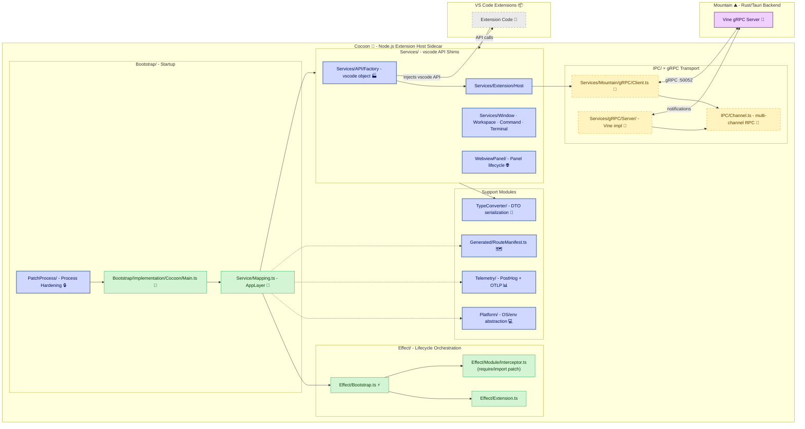

# **Cocoon** 🦋

The Extension Host for Land — Effect-TS native Node.js sidecar hosting VS Code extensions.

> **VS Code's extension host is a single Node.js event loop. One hung Promise blocks every other extension. There is no way to cancel an in-flight operation, no back-pressure, no preemption.**

_"Every extension runs in its own supervised fiber. One crash doesn't take down the rest."_

---

## Overview

`Cocoon` is a specialized `Node.js` sidecar process designed to host and execute existing VS Code extensions. It provides a comprehensive **Effect-TS native** environment that faithfully replicates the VS Code Extension Host API, allowing Land to leverage the vast VS Code extension ecosystem.

`Cocoon` communicates with the main Rust-based Land backend (`Mountain`) via **gRPC** (`Vine` protocol), ensuring a performant and strongly-typed IPC channel. It translates extension API calls into declarative `Effect`s that are sent to `Mountain` for native execution. Process hardening patches `process.exit`, handles uncaught exceptions, pipes logs to the host, and automatically terminates if the parent `Mountain` process exits.

---

## Architecture

`Cocoon` operates as a standalone `Node.js` process orchestrated by and communicating with `Mountain`.

---

## Key Components

| Component | Path | Description |
| --------- | ---- | ----------- |
| Main Entry | `Source/Bootstrap/Implementation/Cocoon/Main.ts` | Primary entry point composing all Effect-TS layers, establishing gRPC connection, handshake with Mountain |
| Bootstrap | `Source/Effect/Bootstrap.ts` | Coordinates initialization stages: environment detection, configuration, gRPC connection, module interceptor, extension registry, health checks |
| Service Mapping | `Source/Service/Mapping.ts` | Dependency injection container wiring all services into the main `AppLayer` |
| APIFactory | `Source/Services/API/Factory/Service.ts` | Constructs the `vscode` API object that extensions receive |
| Extension Host | `Source/Services/Extension/Host/Service.ts` | Manages extension activation and lifecycle with module interception and API injection |
| IPC Channel | `Source/IPC/Channel.ts` | Multi-channel RPC system management with advanced message routing |
| gRPC Client | `Source/Services/Mountain/gRPC/Client.ts` | Effect-TS wrapper for Mountain gRPC operations |
| gRPC Server | `Source/Services/gRPC/Server/Service.ts` | Cocoon's gRPC server implementing the Vine protocol with bidirectional streaming |
| PatchProcess | `Source/PatchProcess/` | Process hardening: patches `process.exit`, handles exceptions, enforces security |
| TypeConverter | `Source/TypeConverter/` | Pure functions to serialize TypeScript types into plain DTOs for gRPC transport |
| Codegen | `Source/Codegen/` | Code generation pipeline walking VS Code extension-host source to emit `IExtHost*Upstream` schemas |
| Platform | `Source/Platform/` | Platform abstraction layer providing OS, environment, and process info as Effect-TS service |
| WebviewPanel | `Source/WebviewPanel/` | Webview panel factory, implementation, and serializer managing lifecycle and state |
| Telemetry | `Source/Telemetry/` | PostHog and OTLP telemetry bridges with event buffering and identity management |
| Generated | `Source/Generated/RouteManifest.ts` | Auto-generated route manifest enumerating Mountain-side RPC methods |

---

## In the Land Project

`Cocoon` operates as a standalone Node.js process orchestrated by `Mountain`. It provides the extension runtime environment that allows existing VS Code extensions to run unmodified within Land.

- **Depends on:** `Mountain` (gRPC host), `@codeeditorland/output` (VS Code platform code), `Wind` (extraction pipeline for codegen)
- **Consumed by:** VS Code extensions running in Land
- **Protocol:** gRPC (`Vine` protocol on port `:50052`)

### Interaction Flow: `vscode.window.showInformationMessage`

1. Mountain launches Cocoon with initialization data.
2. Cocoon's `Main.ts` bootstraps: `PatchProcess` hardens the environment, `Effect/Bootstrap.ts` orchestrates initialization (environment detection, configuration, gRPC connection, module interceptor, extension registry, health checks), and `Service/Mapping.ts` builds the main `AppLayer`.
3. `ExtHostExtensionService` activates an extension, which receives a `vscode` API object from `APIFactory`.
4. The extension calls `vscode.window.showInformationMessage("Hello")`.
5. The call is routed to the `Window` service, which creates an `Effect` sending a `showMessage` gRPC request to Mountain.
6. Mountain's `Vine` layer receives the request and dispatches it to the native UI handler.
7. Mountain displays the native OS notification and awaits interaction.
8. The result flows back via gRPC response, completing the `Effect` and resolving the extension's `Promise`.

---

## Getting Started

`Cocoon` is developed as a core component of the **Land** project. It is built as part of the monorepo and requires the `Bundle=true` build variable, which triggers the `Rest` element to prepare the necessary VS Code platform code.

**Key Dependencies:**

| Package | Purpose |
| :------ | :------ |
| `effect` (v3.21.2) | Core library for the entire application structure |
| `@effect/platform` (v0.96.1) | Effect-TS platform abstractions |
| `@effect/platform-node` (v0.106.0) | Node.js-specific Effect-TS platform |
| `@grpc/grpc-js` (v1.14.3) | gRPC communication |
| `@grpc/proto-loader` (v0.8.1) | .proto file loading for gRPC |
| `@codeeditorland/output` (v0.0.1) | Compiled VS Code platform code from `Land/Dependency` |
| `google-protobuf` & `protobufjs` | Protocol buffers for gRPC |

**Debugging Cocoon:** Attach a standard Node.js debugger. Mountain must launch Cocoon with debug flags (e.g., `--inspect-brk=PORT_NUMBER`). Logs from Cocoon are automatically piped to Mountain's console via the `PatchProcess` module.

---

## API Reference

- [Main Entry Point](https://github.com/CodeEditorLand/Cocoon/tree/Current/Source/Bootstrap/Implementation/Cocoon/Main.ts) — Application bootstrap and layer composition
- [Effect Services](https://github.com/CodeEditorLand/Cocoon/tree/Current/Source/Effect/) — Lifecycle orchestration (`Bootstrap.ts`, `Extension.ts`, `Module/Interceptor.ts`)
- [Service Mapping](https://github.com/CodeEditorLand/Cocoon/tree/Current/Source/Service/Mapping.ts) — Dependency injection container and `AppLayer`
- [gRPC Client](https://github.com/CodeEditorLand/Cocoon/tree/Current/Source/Services/Mountain/gRPC/Client.ts) — Mountain gRPC client operations
- [gRPC Server](https://github.com/CodeEditorLand/Cocoon/tree/Current/Source/Services/gRPC/Server/Service.ts) — Vine protocol server with bidirectional streaming
- [TypeConverter](https://github.com/CodeEditorLand/Cocoon/tree/Current/Source/TypeConverter/) — DTO serialization for gRPC transport

---

## Related Documentation

- [Architecture Overview](https://Editor.Land/Doc/architecture) — Internal module structure
- [Why Effect-TS](https://Editor.Land/Doc/why-effect-ts) — Design rationale for Effect-TS
- [Why gRPC](https://Editor.Land/Doc/why-grpc) — Design rationale for gRPC
- [Land Documentation](../../Documentation/GitHub/README.md) — Complete documentation index
- [Wind 🌬️](https://github.com/CodeEditorLand/Wind) — Service layer (correlated frontend element)
- [Worker ⚙️](https://github.com/CodeEditorLand/Worker) — Service worker for caching and offline support
- [Vine 🌿](https://github.com/CodeEditorLand/Vine) — gRPC protocol definition

---

## License

This project is released into the public domain under the **Creative Commons CC0 Universal** license. You are free to use, modify, distribute, and build upon this work for any purpose, without any restrictions. For the full legal text, see the [`LICENSE`](https://github.com/CodeEditorLand/Cocoon/tree/Current/LICENSE) file.

---

## Changelog

See [`CHANGELOG.md`](https://github.com/CodeEditorLand/Cocoon/tree/Current/CHANGELOG.md) for a history of changes specific to **Cocoon** 🦋.

---

## Funding

This project is funded through [NGI0 Commons Fund](https://NLnet.NL/commonsfund), a fund established by [NLnet](https://NLnet.NL) with financial support from the European Commission's Next Generation Internet program, under grant agreement No 101135429.

| | | | |
| --- | --- | --- | --- |
|  |  |  |  |

---

**Project Maintainers**: Source Open ([Source/Open@editor.land](mailto:Source/Open@editor.land)) | [GitHub Repository](https://github.com/CodeEditorLand/Cocoon) | [Report an Issue](https://github.com/CodeEditorLand/Cocoon/issues) | [Security Policy](https://github.com/CodeEditorLand/Cocoon/security/policy)
