# Cocoon 🦋 — The Node.js Extension Sidecar for Land 🏞️

Welcome to **Cocoon**, a core component of the **Land Code Editor**. Cocoon is a
specialized Node.js sidecar process designed to host and run existing Visual
Studio Code extensions. It achieves this by providing a shimmed environment that
replicates the VS Code Extension Host API, allowing Land to leverage the vast
and mature VS Code extension ecosystem.

Cocoon's primary goal within the **MVP Path A** of Land is to enable high
compatibility with Node.js-based VS Code extensions. It communicates with the
main Rust-based Land backend (`Mountain`) via the `Vine` IPC protocol,
translating extension API calls into actions that `Mountain` can perform or
requests for UI updates in `Sky`.

## Key Responsibilities & Functionality

Cocoon is responsible for creating and managing the entire lifecycle of a VS
Code-compatible Node.js extension host environment. This includes:

1.  **VS Code Platform Emulation:** Loading and utilizing pre-bundled JavaScript
    code from VS Code's own platform to run the real `ExtHostExtensionService`.
2.  **API Shimming:** Intercepting `vscode.*` API calls made by extensions.
    These calls are then:
    - Handled locally within Cocoon if possible.
    - Proxied to `Mountain` via `Vine` IPC (using JSON over stdio) for
      operations requiring native access (like filesystem operations via
      `River`/`Sun`) or UI interactions in `Sky`.
3.  **Module Interception:** Managing how extensions `require()` modules,
    especially the `vscode` API itself and certain Node.js built-ins. This
    ensures extensions receive the Cocoon-provided (shimmed) API surface.
4.  **IPC Communication:** Implementing the Cocoon-side of the `Vine` IPC
    protocol for robust, structured communication with `Mountain`. This includes
    handling requests, responses, notifications, and errors.
5.  **Service Orchestration:** Setting up a Dependency Injection (DI) container
    with numerous shims that implement VS Code's internal `IExtHost...` service
    interfaces. This provides the necessary environment for the real
    `ExtHostExtensionService` to operate.
6.  **Extension Lifecycle Management:** Relies on the `ExtHostExtensionService`
    to load, activate, and deactivate extensions based on initialization data
    received from `Mountain`.
7.  **Error Handling & Reporting:** Capturing errors from extensions and
    reporting them back to `Mountain`.

**What this means for the Land Project:** Cocoon is the key enabler for running
the majority of existing VS Code extensions (those written for the Node.js
runtime) directly within the Land editor, providing a rich feature set from day
one of the MVP.

---

## Cocoon Architecture 🦋

Cocoon operates as a standalone Node.js process, carefully orchestrated by
`Mountain`.

| Component within Cocoon       | Role & Key Responsibilities                                                                                                                                                                                                                                                      |
| :---------------------------- | :------------------------------------------------------------------------------------------------------------------------------------------------------------------------------------------------------------------------------------------------------------------------------- |
| **`Node.js Process`**         | The runtime environment for Cocoon.                                                                                                                                                                                                                                              |
| **`index.ts` (Bootstrap)**    | The main entry point for Cocoon. Initializes the environment, sets up IPC with `Mountain`, configures Dependency Injection (DI), patches Node.js globals (e.g., `process.exit`), and starts the `ExtHostExtensionService`.                                                       |
| **`cocoon-ipc.ts`**           | Implements the JavaScript/TypeScript side of the `Vine` IPC protocol. Handles sending and receiving newline-delimited JSON messages over stdio to/from `Mountain`. Provides an adapter for VS Code's `RPCProtocol`.                                                              |
| **`shims/*.ts`**              | A collection of TypeScript modules, each shimming a specific VS Code `ExtHost*` service or `vscode.*` API namespace (e.g., `workspace-shim.ts`, `commands-shim.ts`). They form the bridge between the extension API calls and `Mountain` via `Vine` IPC or handle calls locally. |
| **`_baseShim.ts`**            | A foundational base class providing common utilities for all shims, including logging, RPC proxy creation, argument marshalling/revival for IPC, and event helpers.                                                                                                              |
| **Bundled VSCode JS**         | JavaScript code from VS Code's platform (e.g., `base`, `platform`, `editor`, `workbench/api/common`, `workbench/api/node`) that is bundled by the `Rest` element at build time. This includes the real `ExtHostExtensionService` and other core components that Cocoon runs.     |
| **`ExtHostExtensionService`** | The _actual_ VS Code service (from the bundled JS) responsible for loading, activating, and managing extensions. Cocoon provides its dependencies via the DI system populated with shims.                                                                                        |
| **`vscode.ts` (API Stub)**    | The module that extensions `require('vscode')` as. It's initially a stub but is populated by an API factory (created by `extHost.api.impl.ts` from bundled VSCode JS) with methods and properties backed by Cocoon's shims and the real `ExtHost` services.                      |
| **Extension Code**            | The JavaScript/TypeScript code of the VS Code extensions being run within Cocoon.                                                                                                                                                                                                |

**Interaction Flow (Simplified for an API call from an extension):**

1.  `Mountain` launches `Cocoon` and sends initialization data via `Vine`.
2.  `Cocoon`'s `index.ts` bootstraps, sets up DI, loads bundled VS Code JS, and
    starts `ExtHostExtensionService`.
3.  An extension activated in `Cocoon` calls, e.g.,
    `vscode.workspace.fs.readFile(uri)`.
4.  The call hits the `vscode` API object provided to the extension.
5.  This is routed to `workspace-shim.ts` (which provides `vscode.workspace`)
    and then to `fs-api-shim.ts` (which provides `workspace.fs`).
6.  `fs-api-shim.ts` (a `Shim`) uses `cocoon-ipc.ts` to send a `Vine` message
    (e.g., `workspacefs_readFile`) to `Mountain`.
7.  `Mountain`'s `Track` dispatcher routes this to its native Rust file system
    handler (using `River`).
8.  `Mountain` sends the file content (or an error) back to `Cocoon` via `Vine`.
9.  `cocoon-ipc.ts` receives the response, and `fs-api-shim.ts` resolves the
    promise back to the extension.

---

## Cocoon's Shim Layer: The Bridge to VS Code Extensions

The `shims/` directory is the heart of Cocoon's compatibility layer. Each shim
targets a specific piece of the VS Code Extension Host API or internal services:

| Shim File                    | Primary `vscode.*` API or Internal Service Emulated                                                                                                                     |
| :--------------------------- | :---------------------------------------------------------------------------------------------------------------------------------------------------------------------- |
| `_baseShim.ts`               | Provides common utilities (logging, RPC, marshalling) for other shims.                                                                                                  |
| `api-deprecation-shim.ts`    | `IExtHostApiDeprecationService` (handles warnings for deprecated API usage).                                                                                            |
| `commands-shim.ts`           | `vscode.commands`, `IExtHostCommands` (registers/executes commands, RPC with `MainThreadCommands`).                                                                     |
| `configuration-shim.ts`      | `vscode.workspace.getConfiguration`, `IExtHostConfiguration` (proxies to `MainThreadConfiguration`).                                                                    |
| `diagnostics-shim.ts`        | `vscode.languages.createDiagnosticCollection`, `IExtHostDiagnostics` (proxies to `MainThreadDiagnostics`).                                                              |
| `document-shim.ts`           | `vscode.workspace.textDocuments`, `vscode.TextDocument` API, `IExtHostDocuments` (manages document state, RPC with `MainThreadDocuments`).                              |
| `enablement-service-shim.ts` | `IWorkbenchExtensionEnablementService` (extension enabled/disabled state, RPC with `MainThreadExtensionEnablementService`).                                             |
| `extension-service-shim.ts`  | _(Simulated `IExtHostExtensionService`)_ Primarily for reference or "Path B" exploration. Path A uses the real `ExtHostExtensionService`.                               |
| `file-system-info-shim.ts`   | `IExtHostFileSystemInfo` (provides filesystem capabilities like case sensitivity).                                                                                      |
| `fs-api-shim.ts`             | `vscode.workspace.fs` (`vscode.FileSystem` API, direct IPC to Mountain's `workspacefs_*` handlers).                                                                     |
| `host-kind-picker-shim.ts`   | `IExtensionHostKindPicker` (determines if an extension can run in Cocoon).                                                                                              |
| `host-utils-shim.ts`         | `IHostUtils` (provides process ID, controlled exit, basic fs checks via other shims).                                                                                   |
| `language-features-shim.ts`  | Backend for `vscode.languages.register*Provider` calls. Implements `ExtHostLanguageFeaturesShape` for RPC calls from `MainThreadLanguageFeatures` (executes providers). |
| `language-models-shim.ts`    | `vscode.lm` (Language Models API), `IExtHostLanguageModels`. Proxies to `MainThreadLanguageModels`.                                                                     |
| `language-shim.ts`           | `vscode.languages` API surface (delegates provider registration to `language-features-shim.ts`).                                                                        |
| `localization-shim.ts`       | `IExtHostLocalizationService` (basic stub for NLS, as full localization is complex).                                                                                    |
| `log-shim.ts`                | `ILogService`, `ILoggerService` (provides console-based logging for Cocoon and extensions).                                                                             |
| `managed-sockets-shim.ts`    | `IExtHostManagedSockets` (basic stub, as full managed sockets are complex).                                                                                             |
| `output-channel-shim.ts`     | `vscode.window.createOutputChannel`, `IExtHostOutputService` (proxies to `MainThreadOutputService`).                                                                    |
| `proposed-api-shim.ts`       | Handles proposed API enablement checks based on `initData`.                                                                                                             |
| `secret-state-shim.ts`       | `vscode.SecretStorage` (`ExtensionContext.secrets`), `IExtHostSecretState` (direct IPC to Mountain's `secrets_*` handlers).                                             |
| `storage-paths-shim.ts`      | `IExtensionStoragePaths` (provides `ExtensionContext.storageUri`, `globalStorageUri` from `initData`).                                                                  |
| `storage-shim.ts`            | `vscode.Memento` (`ExtensionContext.workspaceState/globalState`), `IExtHostStorage` (RPC to `MainThreadStorage`).                                                       |
| `telemetry-shim.ts`          | `IExtHostTelemetry` (basic stub or console logging for telemetry events).                                                                                               |
| `terminal-service-shim.ts`   | `vscode.window.createTerminal` (and related APIs), `IExtHostTerminalService`. Proxies terminal actions via RPC, environment variables via direct IPC.                   |
| `ui-shim.ts`                 | Parts of `vscode.window` (e.g., `showInformationMessage` via direct IPC `ui_showMessage`) and `vscode.env` properties (from `initData`).                                |
| `uri-transformer-shim.ts`    | `IURITransformerService` (NO-OP for local MVP, essential for remote scenarios).                                                                                         |
| **Node.js Built-in Shims:**  |                                                                                                                                                                         |
| `crypto-shim.ts`             | `require('crypto')` (delegates to native Node.js crypto for safe operations).                                                                                           |
| `fs-shim.ts`                 | `require('fs').promises` (proxies to Mountain's `fs_*` handlers via direct IPC).                                                                                        |
| `os-shim.ts`                 | `require('os')` (delegates some, proxies `hostname`).                                                                                                                   |
| `process-shim.ts`            | `require('process')` (provides controlled access to `process` properties/methods).                                                                                      |
| `*-module-shim-factory.ts`   | Factories for `NodeRequireInterceptor` to provide the above shims for `require()`.                                                                                      |

This comprehensive shimming strategy is what allows Cocoon to provide a
high-fidelity VS Code extension environment.

---

## Getting Started with Cocoon Development

Cocoon is developed as part of the main Land project. To work on or run Cocoon:

1.  **Clone the Land Repository (if not already done):** Ensure you clone with
    submodules, as Cocoon relies on VS Code source code bundled by `Rest`.

    ```sh
    git clone ssh://git@github.com/CodeEditorLand/Land.git --recurse-submodules
    cd Land
    ```

2.  **Install Dependencies:** This installs dependencies for Land, including
    those needed to build and run Cocoon.

    ```sh
    pnpm install
    ```

3.  **Build Cocoon:** The `Bundle=true` flag is essential for Cocoon.

    ```sh
    # For development
    pnpm cross-env Browser=true Bundle=true Clean=true Dependency=Microsoft/VSCode NODE_ENV=development NODE_OPTIONS=--max-old-space-size=16384 pnpm prepublishOnly
    
    # For a release build
    pnpm cross-env Browser=true Bundle=true Clean=true Dependency=Microsoft/VSCode NODE_ENV=production NODE_OPTIONS=--max-old-space-size=16384 pnpm prepublishOnly --release
    ```

**Debugging Cocoon:**

- Since Cocoon is a Node.js process, you can attach a Node.js debugger to it.
  `Mountain` would need to launch Cocoon with the appropriate debug flags (e.g.,
  `--inspect-brk`).
- Logs from Cocoon (including `console.log` statements in the shims and
  `index.ts`) will typically appear in the console output of the `Mountain`
  process or in a dedicated log file if configured.

---

## System Architecture Diagram 🗺️

```mermaid
graph LR
    subgraph "Cocoon 🦋 (Node.js Extension Host Sidecar)"
        direction TB
        CocoonIndex["index.ts (DI, RPC, ExtSvc Init)"]
        CocoonIPC["cocoon-ipc.ts (Vine JS Layer)"]
        BaseShim["_baseShim.ts"]
        Shims["Shims (*-shim.ts)"]
        VSCodeAPIStub["vscode.ts (API Stub, populated by Factory)"]

        subgraph "VS Code Platform Code (Bundled by Rest)"
            ExtHostExtensionService["ExtHostExtensionService (Node Impl)"]
            APIImpl["extHost.api.impl.ts (API Factory Creator)"]
            RequireInterceptor["NodeRequireInterceptor / ESM Interceptor"]
            OtherExtHostServices["Other Real ExtHost Services (Debug, Tasks, etc.)"]
        end

        ExtensionCode["Extension Code (JS/TS)"]

        CocoonIndex -->|"Initializes"| CocoonIPC
        CocoonIndex -->|"Sets up DI for"| ExtHostExtensionService
        CocoonIndex -->|"Configures"| RequireInterceptor
        CocoonIndex -- Uses --> BaseShim
        RequireInterceptor --"require('vscode')"--> APIImpl
        APIImpl --"Creates vscode API object for"--> ExtensionCode
        APIImpl --"Uses DI'd (often shimmed) services"--> Shims
        APIImpl --"Uses DI'd services"--> OtherExtHostServices
        ExtHostExtensionService --"Manages/Activates"--> ExtensionCode
        ExtHostExtensionService --"Uses DI'd services"--> Shims
        ExtHostExtensionService --"Uses DI'd services"--> OtherExtHostServices
        Shims --"Inherit from"--> BaseShim
        Shims --"Use"--> CocoonIPC
        Shims --"Provide API surface via"--> VSCodeAPIStub
        BaseShim --"Uses"--> CocoonIPC
        ExtensionCode --"Calls"--> VSCodeAPIStub
    end

    subgraph "Mountain 🏞️ (Rust/Tauri Backend)"
        direction TB
        TauriApp["Tauri App (main.rs)"]
        MountainTrack["track.rs (Command/RPC Dispatcher)"]
        VineIPC["vine.rs (Vine Rust Layer)"]
        RPCServerHandlers["rpc.rs (MainThread...Shape Impls)"]
        NativeHandlers["handlers/*.rs (FS, UI, Config, etc.)"]
        MountainEnv["environment.rs (FsReader/Writer, ConfigProvider etc.)"]
        AppState["app_state.rs (Global Shared State)"]
        AppRuntime["runtime.rs (Effect Executor)"]
        RiverSunLibs["River/Sun Libs (Native FS)"]

        TauriApp --"Manages"--> AppState
        TauriApp --"Manages"--> AppRuntime
        TauriApp --"Sets up invoke handler"--> MountainTrack
        TauriApp --"Launches Cocoon & Sets up"--> VineIPC
        MountainTrack --"Receives from"--> VineIPC
        MountainTrack --"Dispatches to"--> RPCServerHandlers
        MountainTrack --"Dispatches to"--> NativeHandlers
        MountainTrack --"Uses"--> AppRuntime
        RPCServerHandlers --"Use"--> AppRuntime
        RPCServerHandlers --"Use"--> NativeHandlers
        NativeHandlers --"Use"--> AppRuntime
        NativeHandlers --"Access/Modify"--> AppState
        AppRuntime --"Contains"--> MountainEnv
        MountainEnv --"Accesses"--> AppState
        MountainEnv --"Uses"--> RiverSunLibs
        MountainEnv --"Called by"--> AppRuntime
    end

    subgraph "VS Code Original Files (Conceptual Contracts & References)"
        direction TB
        VscodeDTS["vscode.d.ts (Public API Contract)"]
        ExtHostProtocol["extHost.protocol.ts (RPC Contract)"]
        ExtHostCommonService["api/common/extHostExtensionService.ts (Abstract Logic)"]
        ExtHostMainFiles["api/common/extensionHostMain.ts & api/node/extensionHostProcess.ts (Bootstrap Ref)"]
    end

    %% IPC/RPC Communication Flow
    CocoonIPC -.->|"Vine Protocol (JSON/stdio)"| VineIPC

    %% Extension API Call Flow (Example: workspace.fs.readFile)
    ExtensionCode -->|"vscode.workspace.fs.readFile()"| Shims
    Shims -->|"IPC/RPC via Vine (e.g., workspacefs_readFile)"| MountainTrack
    MountainTrack -->|"Routes to FsApiHandler"| NativeHandlers
    NativeHandlers -->|"Calls env.readFile()"| MountainEnv
    MountainEnv -->|"Uses River"| RiverSunLibs
    RiverSunLibs -->|"Actual OS Read"| OS_Filesystem["Operating System Filesystem"]
    OS_Filesystem -.->|"Data back"| RiverSunLibs
    RiverSunLibs -.->|Data| MountainEnv
    MountainEnv -.->|Result| NativeHandlers
    NativeHandlers -.->|Response| MountainTrack
    MountainTrack -.->|"Response via Vine"| Shims
    Shims -.->|"Promise resolved"| ExtensionCode

    %% DI and Setup Flow
    CocoonIndex --"Provides shims to DI for"--> ExtHostExtensionService
    CocoonIndex --"Uses API Factory from"--> APIImpl
    ExtHostExtensionService --"Is Reference for"--> ExtHostCommonService
    CocoonIndex --"Replicates parts of"--> ExtHostMainFiles

    %% Contract Adherence
    VSCodeAPIStub -.->|"Should match"| VscodeDTS
    Shims -.->|"Implement IExtHost* / Use MainThread* Shapes from"| ExtHostProtocol
    RPCServerHandlers -.->|"Implement MainThread* / Use ExtHost* Shapes from"| ExtHostProtocol

    classDef mountain fill:#f9f,stroke:#333,stroke-width:2px;
    classDef cocoon fill:#ccf,stroke:#333,stroke-width:2px;
    classDef sky fill:#9cf,stroke:#333,stroke-width:2px;
    classDef vscode_originals fill:#cfc,stroke:#333,stroke-width:1px,color:#333;
    classDef ipc_comm fill:#ff9,stroke:#333,stroke-width:1px,stroke-dasharray: 5 5,color:DimGray;
    classDef os_resource fill:#ddd,stroke:#666,color:DarkSlateGray;

    class TauriApp,MountainTrack,VineIPC,RPCServerHandlers,NativeHandlers,MountainEnv,AppState,AppRuntime,RiverSunLibs mountain;
    class CocoonIndex,CocoonIPC,BaseShim,Shims,VSCodeAPIStub,ExtHostExtensionService,APIImpl,RequireInterceptor,OtherExtHostServices,ExtensionCode cocoon;
    class VscodeDTS,ExtHostProtocol,ExtHostCommonService,ExtHostMainFiles vscode_originals;
    class OS_Filesystem os_resource;

    linkStyle default interpolate basis
```



---

## Contribution & Future Development

Cocoon is critical for achieving initial extension compatibility in Land. Future
work on Cocoon may involve:

- **Increasing API Coverage:** Implementing more shims or expanding existing
  ones to support a wider range of VS Code extensions.
- **ESM Extension Support:** Implementing robust interception for ESM
  `import 'vscode'` statements, similar to VS Code's `NodeModuleESMInterceptor`.
- **Performance Optimization:** Analyzing and optimizing IPC communication and
  shim performance.
- **Stability & Error Handling:** Enhancing the robustness of shims and error
  reporting to `Mountain`.
- **Security Considerations:** Continuously evaluating the security implications
  of running Node.js extensions and refining the sandboxing provided by the
  shims and IPC.

We welcome contributions! Please refer to the main Land project's contribution
guidelines.

---

## Changelog 📜

Stay updated with our progress! See [`CHANGELOG.md`](CHANGELOG.md) for a history
of changes.

## Funding & Acknowledgements 🙏

Land is proud to be an open-source endeavor. Our journey is significantly
supported by:

This project is funded through
[NGI0 Commons Fund](https://nlnet.nl/commonsfund), a fund established by
[NLnet](https://nlnet.nl) with financial support from the European Commission's
[Next Generation Internet](https://ngi.eu) program. Learn more at the
[NLnet project page](https://nlnet.nl/project/Land).

| Land                                                                                                                                                | PlayForm                                                                                                                                                 | NLnet                                                                                      | NGI0 Commons Fund                                                                                                                                 |
| :-------------------------------------------------------------------------------------------------------------------------------------------------- | :------------------------------------------------------------------------------------------------------------------------------------------------------- | :----------------------------------------------------------------------------------------- | :------------------------------------------------------------------------------------------------------------------------------------------------ |
| [](https://editor.land) | [](https://playform.cloud) | [](https://nlnet.nl) | [](https://nlnet.nl/commonsfund) |
