<table>
	<tr>
		<td align="left" valign="middle">
			<h3 align="left">Cocoon&#x2001;🦋</h3>
		</td>
		<td align="left" valign="middle">
			<h3 align="left">&#x2001;+&#x2001;</h3>
		</td>
		<td align="left" valign="middle">
			<h3 align="left">
				<a href="https://Editor.Land" target="_blank">
					<picture>
						<source media="(prefers-color-scheme: dark)" srcset="https://PlayForm.Cloud/Dark/Image/GitHub/Land.svg">
						<source media="(prefers-color-scheme: light)" srcset="https://PlayForm.Cloud/Image/GitHub/Land.svg">
						
					</picture>
				</a>
			</h3>
		</td>
		<td align="left" valign="middle">
			<h3 align="left">
				<a href="https://Editor.Land" target="_blank">Land&#x2001;🏞️</a>
			</h3>
		</td>
	</tr>
</table>

---

# **Cocoon**&#x2001;🦋

The Extension Host for `Land`&#x2001;🏞️.

> **`VS Code`'s extension host is a single `Node.js` event loop. One hung
> `Promise` blocks every other extension. There is no way to cancel an in-flight
> operation, no back-pressure, no preemption.**

_\"Every extension runs in its own supervised fiber. One crash doesn't take down
the rest._\"

Welcome to **Cocoon**, a core component of the **Land**&#x2001;🏞️ Code&#x2001;🦋
Editor. `Cocoon` is a specialized `Node.js` sidecar process meticulously
designed to host and execute existing `VS Code` extensions. It achieves this by
providing a comprehensive, **`Effect-TS` native** environment that faithfully
replicates the `VS Code` Extension Host API. This allows `Land` to leverage the
vast and mature `VS Code` extension ecosystem, offering users a rich and
familiar feature set from day one.

`Cocoon`'s primary goal is to enable high compatibility with `Node.js`-based
`VS Code` extensions. It communicates with the main `Rust`-based `Land` backend
(`Mountain`) via **`gRPC`** (`Vine` protocol), ensuring a performant and
strongly-typed IPC channel. `Cocoon` translates extension API calls into
declarative `Effect`s that are sent to `Mountain` for native execution.

---

## Key Features & Architectural Highlights&#x2001;🔐

Cocoon is built entirely with Effect-TS. All services, API shims, and IPC logic
are implemented as declarative, composable Layers and Effects, ensuring maximum
robustness, testability, and type safety across the extension host.

A comprehensive set of service shims replicates the behavior of the real
`vscode.workspace`, `vscode.window`, `vscode.commands`, and other VS Code
extension APIs, providing high-fidelity compatibility for existing extensions.

All communication with the `Mountain` backend is handled via gRPC, providing a
fast, modern, and strongly-typed contract for all inter-process operations.
Bidirectional streaming enables real-time event communication between the
processes.

High-fidelity interceptors for both CJS `require()` and ESM `import` statements
ensure that calls to the `vscode` module are correctly sandboxed and routed to
the appropriate, extension-specific API instance.

Process hardening patches `process.exit`, handles uncaught exceptions, pipes
logs to the host, and automatically terminates if the parent `Mountain` process
exits, ensuring a stable and well-behaved sidecar.

---

## Deep Dive & Component Breakdown&#x2001;🔬

To understand how `Cocoon`'s internal components interact to provide the
high-fidelity `vscode` API, see the following source files:

- **[`Bootstrap/Implementation/Cocoon/Main.ts`](https://github.com/CodeEditorLand/Cocoon/tree/Current/Source/Bootstrap/Implementation/Cocoon/Main.ts)** -
  Main entry point and bootstrap orchestration. Composes all Effect-TS layers,
  establishes the gRPC connection, and starts extension host services.
- **[`Effect/Bootstrap.ts`](https://github.com/CodeEditorLand/Cocoon/tree/Current/Source/Effect/Bootstrap.ts)** -
  Coordinates initialization stages: environment detection, configuration
  loading, gRPC connection, module interceptor setup, extension registry, and
  health checks.
- **[`Service/Mapping.ts`](https://github.com/CodeEditorLand/Cocoon/tree/Current/Source/Service/Mapping.ts)** -
  Defines the dependency injection container and service composition. Wires all
  Effect-TS service layers and legacy service implementations into the main
  `AppLayer`.
- **[`Services/API/Factory/Service.ts`](https://github.com/CodeEditorLand/Cocoon/tree/Current/Source/Services/API/Factory/Service.ts)** -
  Constructs the `vscode` API object that extensions receive. Wires API calls
  through the Mountain client service for backend execution.
- **[`Services/Extension/Host/Service.ts`](https://github.com/CodeEditorLand/Cocoon/tree/Current/Source/Services/Extension/Host/Service.ts)** -
  Manages extension activation and lifecycle. Provides the extension runtime
  environment with module interception and API injection.
- **[`IPC/Channel.ts`](https://github.com/CodeEditorLand/Cocoon/tree/Current/Source/IPC/Channel.ts)** -
  Multi-channel RPC system management with advanced message routing. Handles
  bidirectional communication between Mountain, Cocoon, and monitoring layers.
- **[`Services/Mountain/gRPC/Client.ts`](https://github.com/CodeEditorLand/Cocoon/tree/Current/Source/Services/Mountain/gRPC/Client.ts)** -
  Effect-TS wrapper for Mountain gRPC operations. Provides convenient methods
  for Window, Workspace, Command, and Secret Storage calls.
- **[`Services/gRPC/Server/Service.ts`](https://github.com/CodeEditorLand/Cocoon/tree/Current/Source/Services/gRPC/Server/Service.ts)** -
  Cocoon's gRPC server implementation. Implements the Vine protocol with
  bidirectional streaming for real-time event communication. Delegates domain
  logic to handler modules.
- **[`PatchProcess/`](https://github.com/CodeEditorLand/Cocoon/tree/Current/Source/PatchProcess/)** -
  Process hardening and security controls. Patches `process.exit`, handles
  exceptions, enforces security policies, and ensures stable isolation.
- **[`TypeConverter/`](https://github.com/CodeEditorLand/Cocoon/tree/Current/Source/TypeConverter/)** -
  Pure functions to serialize TypeScript types into plain DTOs for gRPC
  transport. Organized by feature: Main (URI, Range), Dialog, TreeView, Webview,
  Task, WorkspaceEdit.
- **[`Codegen/`](https://github.com/CodeEditorLand/Cocoon/tree/Current/Source/Codegen/)** -
  Code generation pipeline that walks the VS Code extension-host source subtree
  and emits `IExtHost*Upstream` schemas grounded in real upstream definitions.
  Reuses Wind's extractor and resolver infrastructure.
- **[`Platform/`](https://github.com/CodeEditorLand/Cocoon/tree/Current/Source/Platform/)** -
  Platform abstraction layer providing `OS`, environment, and process
  information as an `Effect-TS` service. Bridges platform data for `Mountain`
  transport.
- **[`WebviewPanel/`](https://github.com/CodeEditorLand/Cocoon/tree/Current/Source/WebviewPanel/)** -
  Webview panel factory, implementation, and serializer. Manages webview
  lifecycle, messaging, and state persistence.
- **[`Telemetry/`](https://github.com/CodeEditorLand/Cocoon/tree/Current/Source/Telemetry/)** -
  Telemetry bridges for `PostHog` and `OTLP` export. Handles event buffering,
  identity management, and transport configuration.
- **[`Generated/RouteManifest.ts`](https://github.com/CodeEditorLand/Cocoon/tree/Current/Source/Generated/RouteManifest.ts)** -
  Auto-generated route manifest enumerating `Mountain`-side `RPC` methods, stock
  lift exports, and bespoke `Node` fallbacks. Regenerated on every build.

---

## `Cocoon` in the `Land`&#x2001;🏞️ Ecosystem&#x2001;🦋&#x2001;+&#x2001;🏞️

`Cocoon` operates as a standalone `Node.js` process, carefully orchestrated by
and communicating with `Mountain`.

| Component                                     | Role & Key Responsibilities                                                                                                                                                                                                                                                                       |
| :-------------------------------------------- | :------------------------------------------------------------------------------------------------------------------------------------------------------------------------------------------------------------------------------------------------------------------------------------------------ |
| **`Node.js` Process**                         | The runtime environment for `Cocoon`.                                                                                                                                                                                                                                                             |
| **`Bootstrap/Implementation/Cocoon/Main.ts`** | Primary entry point. Composes all Effect-TS layers, establishes the gRPC connection, performs the initialization handshake with Mountain, and starts extension host services.                                                                                                                     |
| **`PatchProcess/`**                           | Very early process hardening (patching `process.exit`, handling exceptions, piping logs, enforcing security policies), ensuring a stable foundation before any other code runs.                                                                                                                   |
| **`Effect/` Modules**                         | `Bootstrap.ts` coordinates initialization stages, `Extension.ts` manages extension lifecycle, `Module/Interceptor.ts` patches `require` and `import`, `Telemetry.ts` provides logging and tracing, `Health.ts` reports process health.                                                            |
| **`Services/` Modules**                       | Effect-TS layers and legacy services implementing each VS Code `IExtHost...` interface. Key services: `APIFactory`, `ExtensionHostService`, `Window`, `Workspace`, `Command`, `Terminal`, `FileSystem`, `Security`, `PerformanceMonitoring`, `Health`, and handler modules for routing API calls. |
| **`IPC/`**                                    | Protocol layer containing `Channel.ts` (multi-channel RPC), `Handler.ts`, `Message.ts`, `Protocol.ts`, `Type/Converter.ts`, and message utilities (serialize, deserialize, batch, unbatch, validation, VSBuffer).                                                                                 |
| **`Services/gRPC/Server/Service.ts`**         | gRPC server receiving Mountain requests via the Vine protocol. Delegates to ExtensionHostHandler, LanguageProviderHandler, NotificationHandler, and RequestRoutingHandler for domain logic.                                                                                                       |
| **`Services/Mountain/`**                      | `gRPC/Client.ts` provides the Effect-wrapped client for calling Mountain. `Client/Service.ts` is the lower-level implementation.                                                                                                                                                                  |
| **`Codegen/`**                                | Scans the VS Code extension-host source tree and emits `IExtHost*Upstream` schemas via decorators and extracts, reusing Wind's extraction pipeline.                                                                                                                                               |
| **`Platform/`**                               | Effect-TS layer for OS detection, environment variables, process info, and type conversion. Provides cached platform data and bridges to Mountain DTOs.                                                                                                                                           |
| **`WebviewPanel/`**                           | Webview panel factory, implementation, serialization, and state management. Handles message passing between extension webviews and the host.                                                                                                                                                      |
| **`Telemetry/`**                              | PostHog event collection, buffering, identity management, and transport. OTLP bridge for trace export.                                                                                                                                                                                            |
| **`TypeConverter/`**                          | Pure conversion functions for serializing VS Code types (Range, Position, URI, Dialog, TreeView, Webview, Task, WorkspaceEdit) into plain DTOs for gRPC transport.                                                                                                                                |
| **`Generated/`**                              | Auto-generated `RouteManifest.ts` and `RouteManifest.Report.md`. Produced by the build script to enumerate available routing tiers.                                                                                                                                                               |
| **Extension Code**                            | The JavaScript/TypeScript code of the VS Code extensions being hosted within the Cocoon environment.                                                                                                                                                                                              |

### Interaction Flow: `vscode.window.showInformationMessage`&#x2001;🔄

1. Mountain launches Cocoon with initialization data.
2. Cocoon's
   [`Bootstrap/Implementation/Cocoon/Main.ts`](https://github.com/CodeEditorLand/Cocoon/tree/Current/Source/Bootstrap/Implementation/Cocoon/Main.ts)
   bootstraps the application:
    - `PatchProcess` hardens the environment.
    - `Effect/Bootstrap.ts` orchestrates initialization stages (environment
      detection, configuration, gRPC connection, module interceptor setup,
      extension registry, health checks).
    - The main `AppLayer` is built via
      [`Service/Mapping.ts`](https://github.com/CodeEditorLand/Cocoon/tree/Current/Source/Service/Mapping.ts),
      composing all Effect-TS services.
3. `ExtHostExtensionService` activates an extension. The extension receives a
   `vscode` API object constructed by
   [`APIFactory`](https://github.com/CodeEditorLand/Cocoon/tree/Current/Source/Services/API/Factory/Service.ts).
4. The extension calls `vscode.window.showInformationMessage("Hello")`.
5. The call is routed to the
   [`Window`](https://github.com/CodeEditorLand/Cocoon/tree/Current/Source/Services/Window.ts)
   service.
6. `Window` creates an `Effect` that sends a `showMessage` `gRPC` request to
   `Mountain` via
   [`Mountain gRPC Client`](https://github.com/CodeEditorLand/Cocoon/tree/Current/Source/Services/Mountain/gRPC/Client.ts).
7. Mountain's `Vine` layer receives the request. Its `Track` dispatcher routes
   it to the native UI handler.
8. Mountain displays the native OS notification and awaits user interaction.
9. The result is sent back to `Cocoon` via a `gRPC` response.
10. The `Effect` in Cocoon completes, resolving the `Promise` returned to the
    extension's API call.

---

## System Architecture Diagram&#x2001;🏗️

```mermaid
graph LR
    classDef mountain fill:#f0d0ff,stroke:#9b59b6,stroke-width:2px,color:#2c0050;
    classDef cocoon   fill:#d0d8ff,stroke:#4a6fa5,stroke-width:2px,color:#001050;
    classDef effectts fill:#d4f5d4,stroke:#27ae60,stroke-width:1px,color:#0a3a0a;
    classDef vscode   fill:#ebebeb,stroke:#888,stroke-width:1px,stroke-dasharray:5 5,color:#333;

    subgraph "Cocoon - Node.js SideCar&#x2001;🦋"
        direction TB
        Bootstrap["Bootstrap/Implementation/CocoonMain.ts&#x2001;🚀"]:::effectts
        AppLayer["Cocoon AppLayer&#x2001;🧩"]:::effectts
        EffectModules["Effect/ Modules - Bootstrap, Telemetry, Extension&#x2001;⚡"]:::effectts
        PatchProcess["PatchProcess/ - Process Hardening&#x2001;🔒"]:::cocoon
        APIServices["Services/ - APIFactory, ExtensionHost, Window, Workspace…&#x2001;📚"]:::cocoon
        IPCProtocol["IPC/Channel.ts + IPC/ Protocol&#x2001;📡"]:::cocoon
        GRPCClient["Services/Mountain/gRPC/Client.ts&#x2001;🌿"]:::cocoon
        GRPCServer["Services/gRPC/Server/Service.ts&#x2001;🔌"]:::cocoon
        TypeConverter["TypeConverter/ - DTO Serialization&#x2001;🔄"]:::cocoon
        CodegenModule["Codegen/ - ExtHost Schema Generation&#x2001;🔨"]:::cocoon
        PlatformModule["Platform/ - OS, Env, Process Abstraction&#x2001;💻"]:::cocoon
        WebviewPanel["WebviewPanel/ - Panel Factory & Lifecycle&#x2001;🌐"]:::cocoon
        TelemetryModule["Telemetry/ - PostHog & OTLP Bridges&#x2001;📊"]:::cocoon
        GeneratedRoute["Generated/RouteManifest.ts&#x2001;🗺️"]:::cocoon

        Bootstrap --> AppLayer
        AppLayer --> EffectModules
        AppLayer --> APIServices
        AppLayer --> IPCProtocol
        APIServices --> GRPCClient
        APIServices --> GRPCServer
        APIServices --> TypeConverter
        GRPCClient --> IPCProtocol
        PatchProcess --> Bootstrap

        AppLayer -.-> CodegenModule
        AppLayer -.-> PlatformModule
        AppLayer -.-> WebviewPanel
        AppLayer -.-> TelemetryModule
    end

    subgraph "Mountain - Rust/Tauri Backend&#x2001;⛰️"
        VineGRPC["Vine - gRPC Server&#x2001;🌿"]:::mountain
    end

    subgraph "VS Code Extension&#x2001;📦"
        ExtensionCode["Extension Code&#x2001;📜"]:::vscode
    end

    APIServices -- provides `vscode` object to --> ExtensionCode
    ExtensionCode -- makes API calls --> APIServices
    GRPCClient <-- gRPC --> VineGRPC
    GRPCServer <-- gRPC --> VineGRPC
```

---

## Getting Started&#x2001;🚀

`Cocoon` is developed as a core component of the **Land**&#x2001;🏞️ project. It
is built as part of the monorepo and requires the `Bundle=true` build variable,
which triggers the `Rest` element to prepare the necessary `VS Code` platform
code for `Cocoon` to consume.

**Key Dependencies:**

| Package                            | Purpose                                               |
| :--------------------------------- | :---------------------------------------------------- |
| `effect` (v3.21.2)                 | Core library for the entire application structure     |
| `@effect/platform` (v0.96.1)       | Effect-TS platform abstractions                       |
| `@effect/platform-node` (v0.106.0) | Node.js-specific Effect-TS platform                   |
| `@grpc/grpc-js` (v1.14.3)          | gRPC communication                                    |
| `@grpc/proto-loader` (v0.8.1)      | .proto file loading for gRPC                          |
| `@codeeditorland/output` (v0.0.1)  | Compiled VS Code platform code from `Land/Dependency` |
| `google-protobuf` & `protobufjs`   | Protocol buffers for gRPC                             |

**Debugging `Cocoon`:**

Since `Cocoon` is a `Node.js` process, attach a standard `Node.js` debugger.
`Mountain` must launch `Cocoon` with the appropriate debug flags (e.g.,
`--inspect-brk=PORT_NUMBER`).

Logs from `Cocoon` are automatically piped to the parent `Mountain` process via
the `PatchProcess` module and will appear in `Mountain`'s console output.

---

## See Also&#x2001;🔗

- [Cocoon Documentation](https://editor.land/Doc/cocoon)
- [Architecture Overview](https://editor.land/Doc/architecture)
- [Why `Effect-TS`](https://editor.land/Doc/why-effect-ts)
- [Why `gRPC`](https://editor.land/Doc/why-grpc)
- [`Mountain`](https://github.com/CodeEditorLand/Mountain)
- [`Wind`](https://github.com/CodeEditorLand/Wind)
- [`Vine`](https://github.com/CodeEditorLand/Vine)

---

## License&#x2001;⚖️

This project is released into the public domain under the **Creative Commons CC0
Universal** license. You are free to use, modify, distribute, and build upon
this work for any purpose, without any restrictions. For the full legal text,
see the [`LICENSE`](https://github.com/CodeEditorLand/Cocoon/tree/Current/)
file.

---

## Changelog&#x2001;📜

See [`CHANGELOG.md`](https://github.com/CodeEditorLand/Cocoon/tree/Current/) for
a history of changes specific to **Cocoon**&#x2001;🦋.

---

## Funding \& Acknowledgements&#x2001;🙏🏻

**Cocoon**&#x2001;🦋 is a core element of the **Land**&#x2001;🏞️ ecosystem. This
project is funded through [NGI0 Commons Fund](https://NLnet.NL/commonsfund), a
fund established by [NLnet](https://NLnet.NL) with financial support from the
European Commission's [Next Generation Internet](https://ngi.eu) program. Learn
more at the [NLnet project page](https://NLnet.NL/project/Land).

The project is operated by PlayForm, based in Sofia, Bulgaria.

PlayForm acts as the open-source steward for Code Editor Land under the NGI0
Commons Fund grant.

<table>
	<thead>
		<tr>
			<th align="left"><strong>Land</strong></th>
			<th align="left"><strong>PlayForm</strong></th>
			<th align="left"><strong>NLnet</strong></th>
			<th align="left"><strong>NGI0 Commons Fund</strong></th>
		</tr>
	</thead>
	<tbody>
		<tr>
			<td align="left" valign="middle">
				
			</td>
			<td align="left" valign="middle">
				
			</td>
			<td align="left" valign="middle">
				
			</td>
			<td align="left" valign="middle">
				
			</td>
		</tr>
	</tbody>
</table>

---

**Project Maintainers**: Source Open
([Source/Open@Editor.Land](mailto:Source/Open@Editor.Land)) |
[GitHub Repository](https://github.com/CodeEditorLand/Cocoon) |
[Report an Issue](https://github.com/CodeEditorLand/Cocoon/issues) |
[Security Policy](https://github.com/CodeEditorLand/Cocoon/security/policy)
