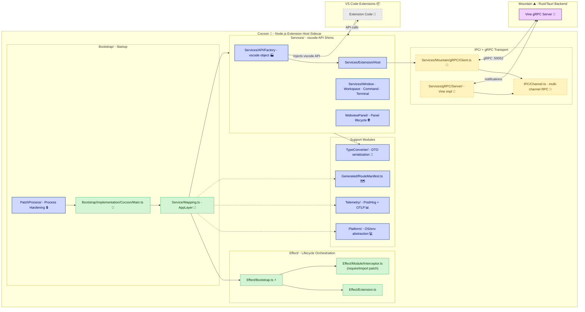

# **Cocoon**&#x2001;🦋

<table>
	<tr>
		<td>
			<a href="https://GitHub.Com/CodeEditorLand/Cocoon" target="_blank">
				<picture>
					<source media="(prefers-color-scheme: dark)" srcset="https://img.shields.io/github/last-commit/CodeEditorLand/Cocoon?label=Last-commit&color=black&labelColor=black&logoColor=white&logoWidth=0" />
					<source media="(prefers-color-scheme: light)" srcset="https://img.shields.io/github/last-commit/CodeEditorLand/Cocoon?label=Last-commit&color=white&labelColor=white&logoColor=black&logoWidth=0" />
					
				</picture>
			</a>
			<br />
			<a href="https://GitHub.Com/CodeEditorLand/Cocoon" target="_blank">
				<picture>
					<source media="(prefers-color-scheme: dark)" srcset="https://img.shields.io/github/issues/CodeEditorLand/Cocoon?label=Issues&color=black&labelColor=black&logoColor=white&logoWidth=0" />
					<source media="(prefers-color-scheme: light)" srcset="https://img.shields.io/github/issues/CodeEditorLand/Cocoon?label=Issues&color=white&labelColor=white&logoColor=black&logoWidth=0" />
					
				</picture>
			</a>
		</td>
		<td>
			<a href="https://github.com/CodeEditorLand/Cocoon" target="_blank">
				<picture>
					<source media="(prefers-color-scheme: dark)" srcset="https://img.shields.io/github/stars/CodeEditorLand/Cocoon?style=flat&label=Star&logo=github&color=black&labelColor=black&logoColor=white&logoWidth=0" />
					<source media="(prefers-color-scheme: light)" srcset="https://img.shields.io/github/stars/CodeEditorLand/Cocoon?style=flat&label=Star&logo=github&color=white&labelColor=white&logoColor=black&logoWidth=0" />
					
				</picture>
			</a>
			<br />
			<a href="https://GitHub.Com/CodeEditorLand/Cocoon" target="_blank">
				<picture>
					<source media="(prefers-color-scheme: dark)" srcset="https://img.shields.io/github/downloads/CodeEditorLand/Cocoon?label=Downloads&color=black&labelColor=black&logoColor=white&logoWidth=0" />
					<source media="(prefers-color-scheme: light)" srcset="https://img.shields.io/github/downloads/CodeEditorLand/Cocoon?label=Downloads&color=white&labelColor=white&logoColor=black&logoWidth=0" />
					
				</picture>
			</a>
		</td>
	</tr>
</table>

The `Effect-TS` native `Node.js` Extension Host for Land&#x2001;🏞️

> **VS Code's extension host is a single `Node.js` event loop. One hung
> `Promise` blocks every other extension. There is no way to cancel an in-flight
> operation, no back-pressure, no preemption.**

_"Every extension runs in its own supervised fiber. One crash doesn't take down
the rest."_

[](https://github.com/CodeEditorLand/Cocoon/tree/Current/LICENSE)
[](https://www.npmjs.com/package/@codeeditorland/cocoon)
[](https://nodejs.org/)
[](https://www.npmjs.com/package/effect)

**[@codeeditorland/cocoon](https://www.npmjs.com/package/@codeeditorland/cocoon)**&#x2001;📦

---

## Overview

**Cocoon** is the `Node.js`/`Effect-TS` extension host for the **Land** Code
Editor. It hosts existing VS Code extensions in a supervised `Effect-TS` fiber
environment, faithfully replicating the VS Code Extension Host API. It
complements `Grove` (`Rust`/`WASM`) by providing the `Node.js` hosting
environment, allowing Land to leverage the vast VS Code extension ecosystem
while adding fiber-level supervision, structured concurrency, and resource
safety.

VS Code's extension host is a single `Node.js` event loop — one hung `Promise`
blocks every other extension. Cocoon solves this by giving each extension its
own `Effect-TS` fiber with cancellation, back-pressure, and preemption. A crash
in one extension doesn't bring down the rest.

**Cocoon is engineered to:**

1. **Host VS Code Extensions** — Run existing VS Code extensions unmodified
   through a comprehensive API shim layer that mirrors `vscode.d.ts`.
2. **Provide Fiber-Level Isolation** — Each extension runs in its own supervised
   `Effect-TS` fiber with independent lifecycle, cancellation tokens, and error
   boundaries.
3. **Enforce Process Hardening** — Patch `process.exit`, block native modules,
   intercept uncaught exceptions, and terminate if the parent `Mountain` process
   exits.
4. **Bridge via gRPC & WebSocket** — Communicate with `Mountain` through `gRPC`
   (`Vine` protocol on port `:50052`) and with `Sky` through a `WebSocket`
   JSON-RPC transport with cryptographic authentication.

---

## Key Features&#x2001;🔐

**`Effect-TS` Fiber Supervision** — Every extension activation runs in its own
`Effect` fiber with structured concurrency. Cancellation propagates cleanly
through the fiber tree, hung operations are preemptible, and fiber crashes are
trapped at the supervision boundary rather than taking down the host process.

**Full `vscode` API Shimming** — The `APIFactory` service constructs a complete
`vscode` API object with namespaces for `window`, `workspace`, `commands`,
`languages`, `debug`, `scm`, `tasks`, `env`, `extensions`, `authentication`,
`tests`, and `comments`. Extension code runs against this shim without
modification.

**Process Security Hardening** — The `PatchProcess` module runs before any
extension activates, intercepting `process.exit`, `process.crash`, native module
loads, uncaught exceptions, and unhandled rejections. A configurable
`SecurityPolicy` controls exit permissions, memory limits, network access, file
system access, and child process spawning.

**Code Generation Pipeline** — The `Codegen` module walks the VS Code
extension-host source tree (`Wind`) and emits `IExtHost*Upstream` schemas
grounded in real upstream source, reusing every `Wind` extractor and resolver
verbatim.

**Multi-Transport Communications** — `gRPC` (`Vine` protocol to `Mountain`),
`WebSocket` JSON-RPC (to `Sky` with hex-secret auth via URL param,
`Sec-WebSocket-Protocol`, or `X-Land-Secret` header), and `IPC` (buffered
multi-channel RPC for local communication).

**Bidirectional Streaming** — The `gRPC` server implements the `Vine` protocol
with bidirectional streaming, allowing `Mountain` to push notifications and
events into Cocoon asynchronously without polling.

**Telemetry & Observability** — `PostHog` event buffering and batching with
identity management, plus `OTLP` fire-and-forget span export for distributed
tracing. Tree-shaken from production builds via `esbuild` `define` substitution.

**Dual-Layer Debug Server** — An HTTP inspection surface (`:9934`) matching
`Mountain`'s `DebugServer` wire protocol, supporting `/health`, `/layers`,
`/execute` (eval in extension host scope), and `/extensions` endpoints for
runtime introspection.

---

## Core Architecture Principles&#x2001;🏗️

| Principle                 | Description                                                                                                                                    | Key Components                                                                                                 |
| ------------------------- | ---------------------------------------------------------------------------------------------------------------------------------------------- | -------------------------------------------------------------------------------------------------------------- |
| **Fiber Isolation**       | Each extension is a separate `Effect` fiber with its own supervision tree, cancellation scope, and error channel. Failures don't cascade.      | `Effect/Extension.ts`, `Effect/Bootstrap.ts`, `Effect/Module/Interceptor.ts`                                   |
| **API Surface Parity**    | Implement the full VS Code extension API (`vscode.d.ts`) so extensions port seamlessly between `Cocoon` and `Grove`.                           | `Services/API/Factory/`, `Services/Handler/VscodeAPI/*`, `Services/Extension/Host/`                            |
| **Defense in Depth**      | Process-level hardening (`PatchProcess`) + `Effect-TS` error boundaries + configurable `SecurityPolicy` + platform-native sandboxing (future). | `PatchProcess/Patcher.ts`, `PatchProcess/Security.ts`, `PatchProcess/Validator.ts`                             |
| **Transport Flexibility** | Multiple communication channels (`gRPC`, `WebSocket`, `IPC`) for different deployment topologies, each behind a typed interface.               | `Services/gRPC/Server/`, `Services/Mountain/gRPC/Client.ts`, `Bootstrap/WebSocket/Server.ts`, `IPC/Channel.ts` |

---

## Architecture

`Cocoon` operates as a standalone `Node.js` process orchestrated by and
communicating with `Mountain`.



---

## Key Components

| Component        | Path                                             | Description                                                                                                                                                              |
| ---------------- | ------------------------------------------------ | ------------------------------------------------------------------------------------------------------------------------------------------------------------------------ |
| Main Entry       | `Source/Bootstrap/Implementation/Cocoon/Main.ts` | Primary entry point composing all `Effect-TS` layers, establishing `gRPC` connection, handshake with `Mountain`                                                          |
| Bootstrap        | `Source/Effect/Bootstrap.ts`                     | Lean async bootstrap orchestrating initialization stages: environment detection, configuration, `gRPC` connection, module interceptor, extension registry, health checks |
| Service Mapping  | `Source/Service/Mapping.ts`                      | Dependency injection container wiring all services into the main `AppLayer`                                                                                              |
| APIFactory       | `Source/Services/API/Factory/Service.ts`         | Constructs the `vscode` API object that extensions receive                                                                                                               |
| Extension Host   | `Source/Services/Extension/Host/Service.ts`      | Manages extension activation and lifecycle with module interception and API injection                                                                                    |
| IPC Channel      | `Source/IPC/Channel.ts`                          | Multi-channel RPC system management with advanced message routing                                                                                                        |
| gRPC Client      | `Source/Services/Mountain/gRPC/Client.ts`        | `Effect-TS` wrapper for `Mountain` `gRPC` operations                                                                                                                     |
| gRPC Server      | `Source/Services/gRPC/Server/Service.ts`         | Cocoon's `gRPC` server implementing the `Vine` protocol with bidirectional streaming                                                                                     |
| WebSocket Server | `Source/Bootstrap/WebSocket/Server.ts`           | JSON-RPC `WebSocket` server for `Sky`↔Cocoon direct transport with cryptographic authentication                                                                          |
| PatchProcess     | `Source/PatchProcess/`                           | Process hardening: patches `process.exit`, handles exceptions, enforces security policy                                                                                  |
| TypeConverter    | `Source/TypeConverter/`                          | Pure functions to serialize `TypeScript` types into plain DTOs for `gRPC` transport                                                                                      |
| Codegen          | `Source/Codegen/`                                | Code generation pipeline walking VS Code extension-host source to emit `IExtHost*Upstream` schemas                                                                       |
| Platform         | `Source/Platform/`                               | Platform abstraction layer providing OS, environment, and process info as `Effect-TS` service                                                                            |
| WebviewPanel     | `Source/WebviewPanel/`                           | Webview panel factory, implementation, and serializer managing lifecycle and state                                                                                       |
| Telemetry        | `Source/Telemetry/`                              | `PostHog` and `OTLP` telemetry bridges with event buffering and identity management                                                                                      |
| Debug Server     | `Source/Debug/Server.ts`                         | HTTP inspection surface (`:9934`) for `/health`, `/layers`, `/execute`, `/extensions` runtime introspection                                                              |
| Generated        | `Source/Generated/RouteManifest.ts`              | Auto-generated route manifest enumerating `Mountain`-side RPC methods                                                                                                    |

---

## Project Structure&#x2001;🗺️

```
Element/Cocoon/
├── Source/
│   ├── Bootstrap/                 # Startup and initialization
│   │   ├── Implementation/Cocoon/ # Main entry point (Main.ts)
│   │   └── WebSocket/             # WebSocket server for Sky transport
│   ├── Codegen/                   # VS Code extension-host codegen pipeline
│   │   ├── Emit/Emit/Ext/Host/    # Schema emission
│   │   ├── Extract/               # Decorator extraction and file filtering
│   │   ├── Run/Ext/Host/          # Codegen runner
│   │   └── Type/Ext/Host/         # Decorator record types
│   ├── Configuration/             # ESBuild and Mountain configuration
│   │   ├── ESBuild/               # ESBuild configs (Bootstrap, Cocoon, Target)
│   │   └── Mountain/              # Mountain integration config
│   ├── Debug/                     # Dual-layer HTTP inspection server
│   ├── Effect/                    # Effect-TS lifecycle orchestration
│   │   └── Module/                # Module interceptor (require/import patches)
│   ├── Generated/                 # Auto-generated route manifest
│   ├── Integration/               # Mountain client integration
│   ├── Interfaces/                # Service interfaces (I* pattern)
│   │   └── I/                     # Configuration, Error, Extension, FileSystem,
│   │       IAPI/Factory/          #   ModuleInterceptor, MountainClient,
│   │       IGRPC/Server/          #   Performance, Security, Terminal
│   ├── IPC/                       # Multi-channel RPC system
│   │   └── Message/               # Message serialization, deserialization,
│   │                              #   batching, validation, types, VSBuffer
│   ├── Orchestration/             # Legacy service orchestration
│   ├── PatchProcess/              # Process hardening and security enforcement
│   ├── Platform/                  # OS, environment, logging abstraction
│   ├── Service/                   # Service wiring (AppLayer mapping)
│   ├── Services/                  # VS Code API shim services
│   │   ├── API/Factory/           # vscode API object construction
│   │   ├── Extension/Host/        # Extension activation and lifecycle
│   │   ├── Extensions/            # Extension scanner
│   │   ├── gRPC/Server/           # Vine gRPC protocol implementation
│   │   ├── Handler/               # API request routing and dispatch
│   │   │   └── VscodeAPI/         # Individual vscode namespace handlers:
│   │   │       Authentication/, Commands/, Comments/, Debug/, Env/,
│   │   │       Extensions/, Languages/, Scm/, Tasks/, Tests/,
│   │   │       Window/, Workspace/
│   │   ├── Mountain/gRPC/         # gRPC client for Mountain communication
│   │   └── Window/                # Window service (dialogs, output, status bar,
│   │                              #   webview panels, terminals, text documents)
│   ├── Telemetry/                 # PostHog + OTLP telemetry bridges
│   ├── TypeConverter/             # DTO serialization for gRPC transport
│   ├── Utility/                   # Shared utilities (events, globs, logging)
│   └── WebviewPanel/              # Webview panel lifecycle management
└── Scripts/                       # Build and codegen scripts
    └── compile-grpc-protocol.js   # gRPC protocol compilation
```

---

## In the Land Project

`Cocoon` operates as a standalone `Node.js` process orchestrated by `Mountain`.
It provides the `Node.js` extension runtime environment that allows existing VS
Code extensions to run unmodified within Land. It complements `Grove`
(`Rust`/`WASM`) as the second extension host, together providing the two
execution environments for Land's extension model:

| Host       | Language                   | Runtime                   | Isolation                                   |
| ---------- | -------------------------- | ------------------------- | ------------------------------------------- |
| **Cocoon** | `TypeScript`, `JavaScript` | `Node.js` via `Effect-TS` | Fiber-level supervision + process hardening |
| **Grove**  | `Rust`, `WASM`             | `WASMtime`                | Hardware-enforced via capability model      |

- **Depends on:** `Mountain` (gRPC host), `@codeeditorland/output` (VS Code
  platform code), `Wind` (extraction pipeline for codegen)
- **Consumed by:** VS Code extensions running in Land
- **Protocol:** `gRPC` (`Vine` protocol on port `:50052`), `WebSocket`
  (`JSON-RPC` with cryptographic auth to `Sky`)

### Interaction Flow: `vscode.window.showInformationMessage`

1. `Mountain` launches Cocoon with initialization data.
2. Cocoon's `Main.ts` bootstraps: `PatchProcess` hardens the environment,
   `Effect/Bootstrap.ts` orchestrates initialization (environment detection,
   configuration, `gRPC` connection, module interceptor, extension registry,
   health checks), and `Service/Mapping.ts` builds the main `AppLayer`.
3. `ExtHostExtensionService` activates an extension, which receives a `vscode`
   API object from `APIFactory`.
4. The extension calls `vscode.window.showInformationMessage("Hello")`.
5. The call is routed to the `Window` service, which creates an `Effect` sending
   a `showMessage` `gRPC` request to `Mountain`.
6. `Mountain`'s `Vine` layer receives the request and dispatches it to the
   native UI handler.
7. `Mountain` displays the native OS notification and awaits interaction.
8. The result flows back via `gRPC` response, completing the `Effect` and
   resolving the extension's `Promise`.

---

## Security&#x2001;🔒

Cocoon enforces security at multiple layers:

| Layer                    | Mechanism                                                                                                                                                                                                                                |
| ------------------------ | ---------------------------------------------------------------------------------------------------------------------------------------------------------------------------------------------------------------------------------------- |
| **Process Hardening**    | `PatchProcess/Patcher.ts` runs before any extension: blocks `process.crash()`, intercepts `process.exit()` (unless `SecurityPolicy.AllowExit`), blocks native module loads (`Module._load("natives")`), sets `Error.stackTraceLimit=100` |
| **Exception Boundaries** | `uncaughtException` and `unhandledRejection` handlers trap orphaned errors to stderr; gRPC RPC takes over error forwarding once connected                                                                                                |
| **Parent Liveness**      | `TerminateOnParentExit` monitors `VSCODE_PID` and exits cleanly if the parent `Mountain` process dies                                                                                                                                    |
| **SecurityPolicy**       | Configurable policy controlling exit permissions, memory limits (`MaxMemoryMB`), network access (`AllowNetwork`), child process spawning (`AllowChildProcesses`), file system access validation, and environment variable restrictions   |
| **Runtime Validation**   | `Validator` service runs continuous security validation: file system access checks, network access checks, memory usage monitoring, suspicious behavior detection, and audit trail generation                                            |
| **Module Interception**  | `Module/Interceptor` patches `require`/`import` to control which modules extensions can load; the `vscode` API object is injected through this interceptor                                                                               |
| **WebSocket Auth**       | Cryptographic authentication via `timingSafeEqual` hex secret comparison: accepted through URL `?secret=`, `Sec-WebSocket-Protocol` header, or `X-Land-Secret` header                                                                    |
| **Memory Enforcement**   | Soft memory limit using `v8.setFlagsFromString("--max-old-space-size=…")`; configurable per-extension via `SecurityPolicy.MaxMemoryMB`                                                                                                   |

Future platform-native layers: `Windows` Job Objects / AppContainer, `Linux`
`seccomp` via `libseccomp`, and `macOS` sandbox via `sandbox-exec`.

---

## Compatibility

Cocoon is designed to be compatible with:

| Target       | Integration                                                                                           |
| ------------ | ----------------------------------------------------------------------------------------------------- |
| **Grove**    | Shares VS Code API surface, activation semantics, and manifest parsing for seamless extension porting |
| **VS Code**  | Implements `vscode.d.ts` type definitions; existing extensions run unmodified                         |
| **Mountain** | Integrates via `gRPC` using the `Vine` protocol on port `:50052` with bidirectional streaming         |
| **Sky**      | Direct `WebSocket` `JSON-RPC` transport with cryptographic authentication                             |
| **Output**   | Consumes compiled VS Code platform code from `@codeeditorland/output`                                 |

---

## Getting Started&#x2001;🚀

### Prerequisites

- **Node.js** v18 or later
- **pnpm** (monorepo package manager)

### Build / Install

`Cocoon` is developed as a core component of the **Land** project. It is built
as part of the monorepo and requires the `Bundle=true` build variable, which
triggers the `Rest` element to prepare the necessary VS Code platform code.

### Key Dependencies

| Package                            | Purpose                                               |
| ---------------------------------- | ----------------------------------------------------- |
| `effect` (v3.21.3)                 | Core library for the entire application structure     |
| `@effect/platform` (v0.96.1)       | `Effect-TS` platform abstractions                     |
| `@effect/platform-node` (v0.107.0) | `Node.js`-specific `Effect-TS` platform               |
| `@grpc/grpc-js` (v1.14.4)          | `gRPC` communication                                  |
| `@grpc/proto-loader` (v0.8.1)      | `.proto` file loading for `gRPC`                      |
| `@codeeditorland/output` (v0.0.1)  | Compiled VS Code platform code from `Land/Dependency` |
| `google-protobuf` & `protobufjs`   | Protocol buffers for `gRPC`                           |

**Debugging Cocoon:** Attach a standard `Node.js` debugger. `Mountain` must
launch Cocoon with debug flags (e.g., `--inspect-brk=PORT_NUMBER`). Logs from
Cocoon are automatically piped to `Mountain`'s console via the `PatchProcess`
module.

---

## API Reference

- [Main Entry Point](https://github.com/CodeEditorLand/Cocoon/tree/Current/Source/Bootstrap/Implementation/Cocoon/Main.ts)
    - Application bootstrap and layer composition
- [Effect Services](https://github.com/CodeEditorLand/Cocoon/tree/Current/Source/Effect/)
    - Lifecycle orchestration (`Bootstrap.ts`, `Extension.ts`,
      `Module/Interceptor.ts`)
- [Service Mapping](https://github.com/CodeEditorLand/Cocoon/tree/Current/Source/Service/Mapping.ts)
    - Dependency injection container and `AppLayer`
- [gRPC Client](https://github.com/CodeEditorLand/Cocoon/tree/Current/Source/Services/Mountain/gRPC/Client.ts)
    - `Mountain` `gRPC` client operations
- [gRPC Server](https://github.com/CodeEditorLand/Cocoon/tree/Current/Source/Services/gRPC/Server/Service.ts)
    - `Vine` protocol server with bidirectional streaming
- [WebSocket Server](https://github.com/CodeEditorLand/Cocoon/tree/Current/Source/Bootstrap/WebSocket/Server.ts)
    - `JSON-RPC` `WebSocket` server for `Sky` transport
- [TypeConverter](https://github.com/CodeEditorLand/Cocoon/tree/Current/Source/TypeConverter/)
    - DTO serialization for `gRPC` transport

---

## Related Documentation

- [Architecture Overview](https://Editor.Land/Doc/architecture) - Internal
  module structure
- [Why Effect-TS](https://Editor.Land/Doc/why-effect-ts) - Design rationale for
  `Effect-TS`
- [Why gRPC](https://Editor.Land/Doc/why-grpc) - Design rationale for `gRPC`
- [Land Documentation](../../Documentation/GitHub/README.md) - Complete
  documentation index
- [Wind 🌬️](https://github.com/CodeEditorLand/Wind) - Service layer (correlated
  frontend element)
- [Worker ⚙️](https://github.com/CodeEditorLand/Worker) - Service worker for
  caching and offline support
- [Vine 🌿](https://github.com/CodeEditorLand/Vine) - `gRPC` protocol definition
- [Grove 🌳](https://github.com/CodeEditorLand/Grove) - `Rust`/`WASM` extension
  host
- [Mountain ⛰️](https://github.com/CodeEditorLand/Mountain) - Native desktop
  shell and `gRPC` backend

---

## License&#x2001;⚖️

This project is released into the public domain under the **Creative Commons CC0
Universal** license. You are free to use, modify, distribute, and build upon
this work for any purpose, without any restrictions. For the full legal text,
see the
[`LICENSE`](https://github.com/CodeEditorLand/Cocoon/tree/Current/LICENSE) file.

---

## Changelog&#x2001;📜

See
[`CHANGELOG.md`](https://github.com/CodeEditorLand/Cocoon/tree/Current/CHANGELOG.md)
for a history of changes specific to **Cocoon** 🦋.

---

## Funding & Acknowledgements&#x2001;🙏🏻

This project is funded through
[NGI0 Commons Fund](https://NLnet.NL/commonsfund), a fund established by
[NLnet](https://NLnet.NL) with financial support from the European Commission's
Next Generation Internet program, under grant agreement No 101135429.

<table>
	<tbody>
		<tr>
			<td align="left" valign="middle">
				<a href="https://Editor.Land">
					
				</a>
			</td>
			<td align="left" valign="middle">
				<a href="https://PlayForm.Cloud">
					
				</a>
			</td>
			<td align="left" valign="middle">
				<a href="https://NLnet.NL">
					
				</a>
			</td>
			<td align="left" valign="middle">
				<a href="https://NLnet.NL/commonsfund">
					
				</a>
			</td>
		</tr>
	</tbody>
</table>

---

**Project Maintainers**: Source Open
([Source/Open@editor.land](mailto:Source/Open@editor.land)) |
[GitHub Repository](https://github.com/CodeEditorLand/Cocoon) |
[Report an Issue](https://github.com/CodeEditorLand/Cocoon/issues) |
[Security Policy](https://github.com/CodeEditorLand/Cocoon/security/policy)
