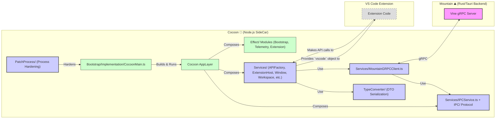

<table>
<tr>
<td align="left" valign="middle">
<h3 align="left"> Cocoon</h3>
</td>
<td align="left" valign="middle">
<h3 align="left">
🦋
</h3>
</td>
<td align="left" valign="middle">
<h3 align="left"> + </h3>
</td>
<td align="left" valign="middle">
<h3 align="left">
<a href="https://Editor.Land" target="_blank">
<picture>
<source media="(prefers-color-scheme: dark)" srcset="https://PlayForm.Cloud/Dark/Image/GitHub/Land.svg">
<source media="(prefers-color-scheme: light)" srcset="https://PlayForm.Cloud/Image/GitHub/Land.svg">

</picture>
</a>
</h3>
</td>
<td align="left" valign="middle">
<h3 align="left">
<a href="https://Editor.Land" target="_blank">
Land
</a>
</h3>
</td>
<td align="left" valign="middle">
<h3 align="left">
🏞️
</h3>
</td>
</tr>
</table>

---

# **Cocoon**&#x2001;🦋

> **VS Code's extension host is a single Node.js event loop. One hung Promise blocks every other extension. There is no way to cancel an in-flight operation, no back-pressure, no preemption.**

_"Every extension runs in its own supervised fiber. One crash doesn't take down the rest."_

Cocoon intercepts `require`/`import` at the Node.js module level and routes all VS Code API calls through Effect-TS fibers. Extensions call `vscode.workspace.openTextDocument()` and get back a `Thenable<TextDocument>` exactly as documented. Internally, each call is a typed Effect that can be interrupted, raced with a timeout, and run concurrently. 50+ extensions activate in parallel. Language server crashes are handled in supervised scopes with automatic restart. The full VS Code marketplace works without modification.

---

## What It Does&#x2001;🔐

- **Every VS Code extension runs unchanged.** The API contract is preserved in full. Nothing needs to be ported.
- **Supervised fiber isolation.** One extension's hung Promise does not block another's fiber.
- **Automatic timeout and restart.** Language server crashes are handled in supervised scopes.
- **Concurrent activation.** 50+ extensions activate in parallel, not sequentially.
- **Performance tracing.** Every extension operation can be traced without code changes.

---

## In the Ecosystem&#x2001;🦋 + 🏞️

---

## Development&#x2001;🛠️

Cocoon is a component of the Land workspace. Follow the
[Land Repository](https://github.com/CodeEditorLand/Land) instructions to
build and run.

---

## License&#x2001;⚖️

CC0 1.0 Universal. Public domain. No restrictions.
[LICENSE](https://github.com/CodeEditorLand/Cocoon/tree/Current/LICENSE)

---

## See Also

- [Cocoon Documentation](https://editor.land/Doc/cocoon)
- [Architecture Overview](https://editor.land/Doc/architecture)
- [Why Effect-TS](https://editor.land/Doc/why-effect-ts)
- [Why gRPC](https://editor.land/Doc/why-grpc)
- [Mountain](https://github.com/CodeEditorLand/Mountain)
- [Wind](https://github.com/CodeEditorLand/Wind)
- [Vine](https://github.com/CodeEditorLand/Vine)

## Funding & Acknowledgements 🙏🏻

**Cocoon** is a core element of the **Land** ecosystem. This project is funded
through [NGI0 Commons Fund](https://NLnet.NL/commonsfund), a fund established by
[NLnet](https://NLnet.NL) with financial support from the European Commission's
[Next Generation Internet](https://ngi.eu) program. Learn more at the
[NLnet project page](https://NLnet.NL/project/Land).

The project is operated by PlayForm, based in Sofia, Bulgaria.

PlayForm acts as the open-source steward for Code Editor Land under the NGI0
Commons Fund grant.

<table>
	<thead>
		<tr>
			<th align="left">
				<strong>Land</strong>
			</th>
			<th align="left">
				<strong>PlayForm</strong>
			</th>
			<th align="left">
				<strong>NLnet</strong>
			</th>
			<th align="left">
				<strong>NGI0 Commons Fund</strong>
			</th>
		</tr>
	</thead>
	<tbody>
		<tr>
			<td align="left" valign="middle">
				
			</td>
			<td align="left" valign="middle">
				
			</td>
			<td align="left" valign="middle">
				
			</td>
			<td align="left" valign="middle">
				
			</td>
		</tr>
	</tbody>
</table>

---

**Project Maintainers**: Source Open
([Source/Open@Editor.Land](mailto:Source/Open@Editor.Land)) |
[GitHub Repository](https://github.com/CodeEditorLand/Cocoon) |
[Report an Issue](https://github.com/CodeEditorLand/Cocoon/issues) |
[Security Policy](https://github.com/CodeEditorLand/Cocoon/security/policy)
