# Cocoon 🦋 — The Node.js Extension Sidecar for Land 🏞️

Welcome to **Cocoon**, a core component of the **Land Code Editor**. Cocoon is a
specialized Node.js sidecar process meticulously designed to host and execute
existing Visual Studio Code extensions. It achieves this by providing a
comprehensive, shimmed environment that faithfully replicates the VS Code
Extension Host API. This allows Land to leverage the vast and mature VS Code
extension ecosystem, offering users a rich and familiar feature set from its
inception.

Cocoon's primary goal within the **MVP Path A** of Land is to enable high
compatibility with Node.js-based VS Code extensions. It communicates with the
main Rust-based Land backend (codenamed `Mountain`) via the `Vine` IPC
protocol—a custom, newline-delimited JSON protocol over stdio. Cocoon translates
extension API calls into actions that `Mountain` can perform (e.g., native
filesystem operations, UI updates in `Sky`, Land's frontend) or handles them
locally within its simulated environment.

## Key Responsibilities & Functionality

Cocoon is responsible for creating and managing the entire lifecycle of a VS
Code-compatible Node.js extension host environment. This sophisticated process
involves:

1.  **VS Code Platform Emulation & Bootstrapping:**

    - **Early Process Hardening (`cocoon-bootstrap.ts`):** Patches global
      Node.js `process` behaviors (`exit`, `crash`) to prevent unintentional
      termination by extensions and to make process termination conditional on
      host policy. Sets critical environment variables like
      `ELECTRON_RUN_AS_NODE=1` and blocks deprecated modules (e.g., `natives`).
    - **Loading Bundled VS Code Code:** Utilizes pre-bundled JavaScript code
      from VS Code's own platform (e.g., `base`, `platform`, `workbench/api`) to
      run the _real_ `ExtHostExtensionService`. This ensures a high degree of
      compatibility with VS Code's internal extension management logic.
    - **Module Path Setup:** Adjusts Node.js module search paths to allow
      internal VS Code modules (e.g., `vs/base/common/uri`) to be resolved
      correctly by the bundled VS Code code.

2.  **API Shimming & Service Orchestration:**

    - **Comprehensive Shim Layer (`shims/*.ts`):** Implements a vast array of
      shims, each emulating a specific VS Code `IExtHost...` service interface
      or a `vscode.*` API namespace (e.g., `workspace-shim.ts` for
      `vscode.workspace`, `commands-shim.ts` for `vscode.commands`).
    - **Dependency Injection (DI) (`index.ts`):** Configures and instantiates VS
      Code's `InstantiationService`. This DI container is populated with
      registrations for both real VS Code services (where feasible, like
      `ExtHostExtensionService`) and Cocoon's shim implementations. This allows
      the real `ExtHostExtensionService` and other platform code to function by
      consuming these (often shimmed) dependencies.
    - **Base Shim Utilities (`_baseShim.ts`):** Provides a foundational class
      offering common utilities for all shims, including standardized logging,
      RPC/IPC communication helpers, argument marshalling/revival primitives,
      and event management tools.

3.  **API Call Interception & Handling (`index.ts`, `shims/*.ts`):**

    - **Dynamic API Factory (`apiFactoryProvider` in `index.ts`):** Constructs
      the `vscode` API object that extensions receive. This factory
      strategically injects Cocoon's functional shims (e.g.,
      `ShimExtHostCommands`, `ShimExtHostWorkspace`) into the API object,
      ensuring that when an extension calls, e.g.,
      `vscode.window.showInformationMessage`, it's Cocoon's
      `ShimExtHostMessageService` that handles the call.
    - **Call Routing:** API calls made by extensions are:
        - Handled locally within Cocoon by the appropriate shim if the
          functionality can be simulated or managed entirely within the sidecar
          (e.g., some `vscode.env` properties).
        - Proxied to `Mountain` via `Vine` IPC (for UI interactions, native
          filesystem access, state persistence) or VS Code's `RPCProtocol` (for
          more structured service-to-service communication tunneled over
          `Vine`).

4.  **Module Interception & Resolution:**

    - **CommonJS (`NodeRequireInterceptor` in `index.ts`):** Manages how
      extensions `require()` modules. It uses registered factories
      (`fs-module-shim-factory.ts`, `node-module-shim-factory.ts`) to provide
      shims for the `vscode` module itself and for selected Node.js built-in
      modules (`fs`, `os`, `crypto`, `process`).
    - **ESM (`CocoonNodeModuleESMInterceptor` in `index.ts`,
      `cocoon-esm-interceptor.ts`):** Intercepts ESM `import 'vscode'`
      statements using Node.js loader hooks, dynamically providing
      extension-specific `vscode` API instances via `data:` URI modules.
    - **`vscode.ts` (Compile-Time API Definition):** Provides the necessary type
      definitions and exports for extensions to compile successfully against the
      VS Code API. The runtime `vscode` object is dynamically constructed.

5.  **IPC & RPC Communication (`cocoon-ipc.ts`):**

    - **`Vine` Protocol:** Implements the Cocoon-side of the `Vine` IPC
      protocol, handling the serialization/deserialization of newline-delimited
      JSON messages exchanged with `Mountain` over stdio.
    - **RPC Adaptation:** Provides an adapter that allows VS Code's standard
      `RPCProtocol` to operate over the `Vine` IPC transport (by tunneling
      `VSBuffer` data within `Vine` notifications), enabling structured, typed
      communication for VS Code services.
    - **Message Lifecycle Management:** Manages request IDs, response matching,
      timeouts, and error handling for IPC interactions.

6.  **Extension Lifecycle Management (`ExtHostExtensionService` via
    `index.ts`):**

    - Relies on the _real_ VS Code `ExtHostExtensionService` (running within
      Cocoon and provided with shimmed dependencies) to perform the scanning,
      loading, activation, and deactivation of extensions based on
      initialization data and activation events received from `Mountain`.

7.  **URI Transformation (`uri-transformer-shim.ts`):**

    - Provides an `IURITransformerService` shim. For the local-only MVP, this
      acts as a NO-OP, but it's crucial for `RPCProtocol` and would be essential
      for remote workspace scenarios.

8.  **Error Handling & Reporting (`index.ts`, `cocoon-bootstrap.ts`):**
    - Installs VS Code's `ErrorHandler` and sets up global listeners for
      `uncaughtException` and `unhandledRejection` to capture errors from
      extensions and Cocoon itself, reporting them to `Mountain`.

**What this means for the Land Project:** Cocoon is the cornerstone of Land's
ability to tap into the rich VS Code extension ecosystem. By emulating the
Node.js extension host environment and meticulously shimming its APIs and
services, Cocoon allows a vast majority of existing VS Code extensions (those
designed for the Node.js runtime) to run directly within the Land editor. This
provides Land with a powerful and extensive feature set from its initial MVP
release, significantly accelerating its development and enhancing user
experience.

---

## Cocoon Architecture 🦋

Cocoon operates as a standalone Node.js process, carefully orchestrated by and
communicating with `Mountain` (Land's Rust/Tauri backend).

| Component within Cocoon                   | Role & Key Responsibilities                                                                                                                                                                                                                                                                                                                                                 |
| :---------------------------------------- | :-------------------------------------------------------------------------------------------------------------------------------------------------------------------------------------------------------------------------------------------------------------------------------------------------------------------------------------------------------------------------- |
| **`Node.js Process`**                     | The runtime environment for Cocoon.                                                                                                                                                                                                                                                                                                                                         |
| **`cocoon-bootstrap.ts`**                 | Performs very early process hardening (patching `process.exit`, `process.crash`), sets `ELECTRON_RUN_AS_NODE=1`, and blocks the deprecated `natives` module. Ensures a stable foundation before other systems load.                                                                                                                                                         |
| **`cocoon-ipc.ts`**                       | Implements the client-side of the `Vine` IPC protocol. Manages newline-delimited JSON message exchange (requests, responses, notifications) with `Mountain` over stdio. Crucially, provides an adapter to tunnel VS Code's `RPCProtocol` over `Vine` notifications, enabling structured service communication.                                                              |
| **`index.ts` (Main Orchestrator)**        | The primary entry point. Initializes bootstrap utilities, IPC/RPC layers, the Dependency Injection (DI) container, and registers all shims. It then instantiates and starts the _real_ VS Code `ExtHostExtensionService`, providing it with the shimmed environment. Manages CJS/ESM `vscode` module interception and the overall initialization handshake with `Mountain`. |
| **`_baseShim.ts`**                        | A foundational abstract class providing common utilities for all shims: standardized logging (with prefixes), helpers for direct IPC via `cocoon-ipc.ts`, RPC proxy acquisition (via `RPCProtocol`), basic argument marshalling/revival primitives (e.g., for URIs, Positions, Ranges), and event emitter utilities.                                                        |
| **`shims/*.ts` (Service Shims)**          | A comprehensive collection of TypeScript modules, each emulating a specific VS Code `IExtHost...` service interface (e.g., `IExtHostWorkspace`, `IExtHostCommands`, `IExtHostDocuments`) or a part of the `vscode.*` API namespace. These shims are the core of the compatibility layer, either handling API calls locally or proxying them to `Mountain` via IPC/RPC.      |
| **`*.module-shim-factory.ts`**            | Specialized factories (`FsModuleShimFactory`, `NodeModuleShimFactory`) for the `NodeRequireInterceptor`. These factories provide shimmed implementations when extensions `require()` specific Node.js built-in modules (like `fs`, `os`, `crypto`, `process`).                                                                                                              |
| **`cocoon-esm-interceptor.ts` & Helpers** | Manages interception of ESM `import 'vscode'` statements using Node.js loader hooks. Works with `dynamic.ts` (generates dynamic module script) and `hook.ts` (the loader hook script itself) to provide extension-specific `vscode` API instances for ESM.                                                                                                                  |
| **`vscode.ts` (Compile-Time API)**        | Re-exports types, classes, and enums from a bundled VS Code API definition (`../Shim/out/vscode.js`). Defines a stub `vscodeApiExportObject` for the _shape_ of the `vscode` module, enabling compile-time type checking for extensions. The runtime `vscode` object is dynamically built by `apiFactoryProvider` in `index.ts`.                                            |
| **Bundled VS Code Platform Code**         | Pre-compiled JavaScript code from VS Code's platform (`base`, `platform`, `workbench/api`, etc.), including the real `ExtHostExtensionService`, `NodeRequireInterceptor`, original API factory (`createApiFactory`), and other core components. Cocoon runs this code, providing its dependencies via the DI system populated with shims.                                   |
| **`ExtHostExtensionService` (Real)**      | The actual VS Code service (from the bundled code) responsible for the full lifecycle of extensions: scanning, parsing manifests, resolving dependencies, determining activation events, activating (`activate()`), and deactivating. It consumes services (many shimmed by Cocoon) from the DI container.                                                                  |
| **`apiFactoryProvider` (in `index.ts`)**  | A crucial function that dynamically constructs the `vscode` API object provided to each extension. It leverages VS Code's original API factory and then strategically overrides or augments specific namespaces (`vscode.commands`, `vscode.window`, `vscode.workspace`, etc.) with instances of Cocoon's functional shims, ensuring API calls are correctly mediated.      |
| **Extension Code**                        | The JavaScript/TypeScript code of the VS Code extensions being hosted and run within the Cocoon environment.                                                                                                                                                                                                                                                                |

**Interaction Flow (Simplified for an API call from an extension, e.g.,
`vscode.window.showInformationMessage`):**

1.  `Mountain` launches `Cocoon` with initialization data (e.g.,
    `ExtHostInitData`).
2.  `Cocoon`'s `index.ts` bootstraps:
    - `cocoon-bootstrap.ts` hardens the process.
    - `cocoon-ipc.ts` establishes stdio communication.
    - DI container is set up with shims.
    - The real `ExtHostExtensionService` is instantiated and initialized.
3.  `ExtHostExtensionService` activates an extension. The extension receives a
    `vscode` API object constructed by `apiFactoryProvider`.
4.  The extension calls `vscode.window.showInformationMessage("Hello")`.
5.  The call is routed through the `vscode` object to the
    `ShimExtHostMessageService` instance (from `message-service-shim.ts`, part
    of the `window` namespace provided by the factory).
6.  `ShimExtHostMessageService` uses `_ipcRequestResponse` from `_baseShim.ts`
    (which calls `sendToMountainAndWait` from `cocoon-ipc.ts`) to send a `Vine`
    IPC message (e.g., method `ui_showMessage` with severity, message, and
    options) to `Mountain`.
7.  `Mountain`'s `Vine` layer (`vine.rs`) receives the message. Its `Track`
    dispatcher routes it to the native UI handler for messages.
8.  `Mountain` displays the native UI notification and waits for user
    interaction.
9.  If the user clicks a button, `Mountain` sends the result (e.g., selected
    item's handle) back to `Cocoon` via a `Vine` response message.
10. `cocoon-ipc.ts` receives and parses the response, resolving the promise in
    `ShimExtHostMessageService`.
11. `ShimExtHostMessageService` processes Mountain's response and resolves the
    promise returned to the extension's `showInformationMessage` call.

---

## Cocoon's Shim Layer: The Bridge to VS Code Extensions

The `shims/` directory, along with other core modules like `cocoon-ipc.ts` and
the interceptors, forms the heart of Cocoon's compatibility layer. Each
component targets a specific piece of the VS Code Extension Host API or internal
services:

| File/Module Category         | Key Shims/Components & Primary `vscode.*` API or Internal Service Emulated/Provided                                                                                                                                                                                                                                                                                                                                  |
| :--------------------------- | :------------------------------------------------------------------------------------------------------------------------------------------------------------------------------------------------------------------------------------------------------------------------------------------------------------------------------------------------------------------------------------------------------------------- |
| **Core Bootstrap & Process** | `cocoon-bootstrap.ts` (Process hardening, env setup)                                                                                                                                                                                                                                                                                                                                                                 |
| **IPC/RPC Layer**            | `cocoon-ipc.ts` (Vine IPC, RPCProtocol adapter)                                                                                                                                                                                                                                                                                                                                                                      |
| **Base Shim Utilities**      | `_baseShim.ts` (Logging, IPC/RPC helpers, marshalling primitives, event utils for all shims)                                                                                                                                                                                                                                                                                                                         |
| **Module Interception**      | `cocoon-esm-interceptor.ts` (ESM `import 'vscode'`), `fs-module-shim-factory.ts`, `node-module-shim-factory.ts` (CJS `require()` for built-ins), `vscode.ts` (compile-time API shape for `vscode`)                                                                                                                                                                                                                   |
| **Window UI Shims**          | `message-service-shim.ts` (`vscode.window.show...Message`), `quick-input-shim.ts` (`vscode.window.showQuickPick/InputBox`), `dialog-service-shim.ts` (`vscode.window.showOpen/SaveDialog`), `output-channel-shim.ts` (`vscode.window.createOutputChannel`), `window-parts-shim.ts` (Status bar, progress, stubs for TreeView/Webview), `ui-shim.ts` (Legacy, parts now in specific shims)                            |
| **Workspace & Documents**    | `workspace-shim.ts` (`vscode.workspace` core, folders, findFiles, trust), `document-shim.ts` (`vscode.workspace.textDocuments`, `TextDocument` API, document events), `file-system-info-shim.ts` (`IExtHostFileSystemInfo` for path case sensitivity, `extUri`)                                                                                                                                                      |
| **File System Access**       | `fs-api-shim.ts` (`vscode.workspace.fs` via IPC to `workspacefs_*` handlers), `fs-shim.ts` (`require('fs').promises` via IPC to _deprecated_ `fs_*` handlers)                                                                                                                                                                                                                                                        |
| **Extension & API Mgmt**     | `commands-shim.ts` (`vscode.commands`), `configuration-shim.ts` (`vscode.workspace.getConfiguration`), `enablement-service-shim.ts` (Extension enabled state), `extensions-shim.ts` (`vscode.extensions` adapter), `proposed-api-shim.ts` (Proposed API checks), `extension-service-shim.ts` (Simulated `IExtHostExtensionService` for reference)                                                                    |
| **Language Features**        | `language-features-shim.ts` (Backend for `vscode.languages.register*Provider`, provider execution via RPC), `language-shim.ts` (Facade for `vscode.languages` provider registration methods)                                                                                                                                                                                                                         |
| **Environment & State**      | `env-shim.ts` (`vscode.env` properties & methods), `storage-paths-shim.ts` (`ExtensionContext` storage URIs), `storage-shim.ts` (`vscode.Memento` for state), `secret-state-shim.ts` (`vscode.SecretStorage`), `uri-transformer-shim.ts` (NO-OP for local MVP)                                                                                                                                                       |
| **Specialized Services**     | `telemetry-shim.ts` (Basic telemetry logging/forwarding), `localization-shim.ts` (Stub for NLS), `api-deprecation-shim.ts` (Deprecated API warnings), `debug-shim.ts` (Stub for `vscode.debug`), `tasks-shim.ts` (Stub for `vscode.tasks`), `terminal-service-shim.ts` (`vscode.window.createTerminal`, env vars), `managed-sockets-shim.ts` (Stub for managed sockets), `language-models-shim.ts` (`vscode.lm` API) |
| **Node.js Built-in Shims**   | `crypto-shim.ts` (`require('crypto')`), `os-shim.ts` (`require('os')`), `process-shim.ts` (`require('process')`)                                                                                                                                                                                                                                                                                                     |

This comprehensive shimming strategy is what allows Cocoon to provide a
high-fidelity VS Code extension environment, bridging the gap between the
standard VS Code Extension Host API and Land's unique backend architecture.

---

## Getting Started with Cocoon Development

Cocoon is developed as part of the main Land project. To work on or run Cocoon:

1.  **Clone the Land Repository (if not already done):** Ensure you clone with
    submodules, as Cocoon relies on VS Code source code bundled by `Rest`.

    ```sh
    git clone ssh://git@github.com/CodeEditorLand/Land.git --recurse-submodules
    cd Land
    ```

2.  **Install Dependencies:** This installs dependencies for Land, including
    those needed to build and run Cocoon.

    ```sh
    pnpm install
    ```

3.  **Build Cocoon:** The `Bundle=true` flag is essential for Cocoon. Building
    Cocoon typically involves bundling its TypeScript source code, along with
    necessary parts of VS Code's platform code, into a set of JavaScript files
    that can be executed by Node.js.

    ```sh
    # For development (example command, adjust to actual Land build process)
    pnpm cross-env Browser=true Bundle=true Clean=true Dependency=Microsoft/VSCode NODE_ENV=development NODE_OPTIONS=--max-old-space-size=16384 pnpm prepublishOnly
    
    # For a release build (example command)
    pnpm cross-env Browser=true Bundle=true Clean=true Dependency=Microsoft/VSCode NODE_ENV=production NODE_OPTIONS=--max-old-space-size=16384 pnpm prepublishOnly --release
    ```

    _(Note: The exact build command might vary based on the Land project's
    evolving build system. Refer to Land's main build scripts for the
    authoritative command.)_

**Debugging Cocoon:**

- Since Cocoon is a Node.js process, you can attach a Node.js debugger to it.
  `Mountain` would need to launch Cocoon with the appropriate Node.js debug
  flags (e.g., `--inspect-brk=PORT_NUMBER`).
- Logs from Cocoon (including `console.log`, `console.warn`, `console.error`
  statements in the shims, `_baseShim.ts`, and `index.ts`, as well as logs from
  the `log-shim.ts` `ShimLogService`) will typically appear in the console
  output of the `Mountain` process that launched Cocoon, or in a dedicated log
  file if `Mountain` or Cocoon's launch configuration redirects its
  stdio/stderr.

---

## System Architecture Diagram 🗺️

```mermaid
graph LR
    subgraph "Cocoon 🦋 (Node.js Extension Host Sidecar)"
        direction TB
        CocoonBootstrap["cocoon-bootstrap.ts"]
        CocoonIndex["index.ts (DI, RPC, ExtSvc Init, API Factory)"]
        CocoonIPC["cocoon-ipc.ts (Vine JS Layer, RPC Adapter)"]
        BaseShim["_baseShim.ts (Utilities)"]
        Shims["Shims "]
        ESMInterceptor["cocoon-esm-interceptor.ts & Helpers"]
        VSCodeAPIStub["vscode.ts (Compile-Time API Shape)"]

        subgraph "VS Code Platform Code (Bundled by Rest)"
            ExtHostExtensionService["ExtHostExtensionService (Real Node Impl)"]
            APIImpl["extHost.api.impl.ts (Original API Factory Creator)"]
            RequireInterceptor["NodeRequireInterceptor (CJS)"]
            VSCodeBasePlatform["VS Code Base/Platform JS (e.g., URI, Event, Services)"]
        end

        ExtensionCode["Extension Code (CJS/ESM)"]

        CocoonBootstrap -->|"Hardens Process"| CocoonIndex
        CocoonIndex -->|"Initializes"| CocoonIPC
        CocoonIndex -->|"Sets up DI for"| ExtHostExtensionService
        CocoonIndex -->|"Configures"| RequireInterceptor
        CocoonIndex -->|"Configures"| ESMInterceptor
        CocoonIndex --"Uses API Factory from"--> APIImpl
        CocoonIndex --"Uses Utilities from"--> BaseShim
        RequireInterceptor --"Uses Factories"--> Shims
        RequireInterceptor --"Intercepts require('vscode')"--> CocoonIndex[apiFactoryProvider]
        ESMInterceptor --"Intercepts import 'vscode'"--> CocoonIndex[apiFactoryProvider]
        CocoonIndex[apiFactoryProvider] --"Provides API Object to"--> ExtensionCode
        APIImpl --"Used by"--> CocoonIndex[apiFactoryProvider]
        ExtHostExtensionService --"Manages/Activates"--> ExtensionCode
        ExtHostExtensionService --"Consumes DI Services (often shims)"--> Shims
        ExtHostExtensionService --"Consumes DI Services"--> VSCodeBasePlatform
        Shims --"Inherit from/Use"--> BaseShim
        Shims --"Use IPC/RPC via"--> CocoonIPC
        BaseShim --"Uses"--> CocoonIPC
        ExtensionCode --"Calls vscode.* API"--> CocoonIndex[apiFactoryProvider]
        VSCodeAPIStub --"Provides Compile-Time Types for"--> ExtensionCode
    end

    subgraph "Mountain 🏞️ (Rust/Tauri Backend)"
        direction TB
        TauriApp["Tauri App "]
        MountainTrack["track.rs (Vine Msg/RPC Dispatcher)"]
        VineIPC_Rust["vine.rs (Vine Rust Layer)"]
        RPCServerHandlers_Rust["rpc_handlers.rs (MainThread...Shape Impls)"]
        NativeActionHandlers_Rust["native_handlers/*.rs (FS, UI, Config, etc.)"]
        MountainEnv_Rust["environment.rs (State Access, Native Calls)"]
        AppState_Rust["app_state.rs (Global Shared State)"]
        EffectRuntime_Rust["effect_runtime.rs (Effect Executor)"]
        RiverSunLibs_Rust["River/Sun Libs (Native FS, etc.)"]

        TauriApp --"Manages"--> AppState_Rust
        TauriApp --"Manages"--> EffectRuntime_Rust
        TauriApp --"Sets up Tauri invoke handler for UI"--> MountainTrack
        TauriApp --"Launches Cocoon & Establishes Stdio for"--> VineIPC_Rust
        MountainTrack --"Receives from / Sends to"--> VineIPC_Rust
        MountainTrack --"Dispatches RPC/IPC to"--> RPCServerHandlers_Rust
        MountainTrack --"Dispatches IPC to"--> NativeActionHandlers_Rust
        MountainTrack --"Uses"--> EffectRuntime_Rust
        RPCServerHandlers_Rust --"Use"--> EffectRuntime_Rust
        RPCServerHandlers_Rust --"Call"--> NativeActionHandlers_Rust
        NativeActionHandlers_Rust --"Use"--> EffectRuntime_Rust
        NativeActionHandlers_Rust --"Access/Modify"--> AppState_Rust
        EffectRuntime_Rust --"Contains/Manages"--> MountainEnv_Rust
        MountainEnv_Rust --"Accesses"--> AppState_Rust
        MountainEnv_Rust --"Uses"--> RiverSunLibs_Rust
    end

    subgraph "VS Code Original Files (Conceptual Contracts & References)"
        direction TB
        VscodeDTS["vscode.d.ts (Public API Contract)"]
        ExtHostProtocol["extHost.protocol.ts (RPC DTOs & Shapes)"]
        VSCodeExtHostServices["VS Code ExtHost Service Interfaces (IExtHost...)"]
    end

    %% IPC/RPC Communication Flow
    CocoonIPC -.->|"Vine Protocol (JSON/stdio)"| VineIPC_Rust

    %% Extension API Call Flow (Example: vscode.window.showInformationMessage)
    ExtensionCode -->|"vscode.window.showInformationMessage()"| CocoonIndex[apiFactoryProvider]
    CocoonIndex[apiFactoryProvider] -->|"ShimExtHostMessageService"| Shims
    Shims -->|"IPC (ui_showMessage) via Vine"| MountainTrack
    MountainTrack -->|"Routes to UI Handler"| NativeActionHandlers_Rust
    NativeActionHandlers_Rust -->|"Displays Native UI & Gets Result"| TauriApp[UI Layer]
    NativeActionHandlers_Rust -.->|"Response via Vine"| MountainTrack
    MountainTrack -.->|"Response via Vine"| Shims
    Shims -.->|"Promise Resolved to Extension"| ExtensionCode

    %% Contract Adherence
    VSCodeAPIStub -.->|"Must align with"| VscodeDTS
    Shims -.->|"Implement IExtHost* from"| VSCodeExtHostServices
    Shims -.->|"Use/Implement RPC Shapes from"| ExtHostProtocol
    RPCServerHandlers_Rust -.->|"Implement/Use RPC Shapes from"| ExtHostProtocol

    classDef mountain fill:#f9f,stroke:#333,stroke-width:2px;
    classDef cocoon fill:#ccf,stroke:#333,stroke-width:2px;
    classDef vscode_originals fill:#cfc,stroke:#333,stroke-width:1px,color:#333;

    class TauriApp,MountainTrack,VineIPC_Rust,RPCServerHandlers_Rust,NativeActionHandlers_Rust,MountainEnv_Rust,AppState_Rust,EffectRuntime_Rust,RiverSunLibs_Rust mountain;
    class CocoonBootstrap,CocoonIndex,CocoonIPC,BaseShim,Shims,ESMInterceptor,VSCodeAPIStub,ExtHostExtensionService,APIImpl,RequireInterceptor,VSCodeBasePlatform,ExtensionCode cocoon;
    class VscodeDTS,ExtHostProtocol,VSCodeExtHostServices vscode_originals;

    linkStyle default interpolate basis
```



---

## Contribution & Future Development

Cocoon is critical for achieving initial and ongoing extension compatibility in
Land. Future work on Cocoon may involve:

- **Increasing API Coverage & Fidelity:** Implementing more shims or
  significantly expanding existing ones (especially stubs for debug, tasks,
  localization, managed sockets, complex UI controllers like `createQuickPick`)
  to support a wider range of VS Code extensions and their features. **Type
  conversion for complex DTOs in language features and language models is a high
  priority.**
- **Resolving Deprecated Backends:** Addressing the deprecated `fs-shim.ts`
  backend by either removing the shim and forcing `vscode.workspace.fs` usage,
  or by reviving/replacing the `native_fs.rs` handlers in `Mountain`.
- **Performance Optimization:** Analyzing and optimizing IPC/RPC communication
  overhead, argument marshalling/revival efficiency, and the performance of
  critical shims.
- **Stability & Error Handling:** Enhancing the robustness of shims, improving
  error diagnostics, and refining error propagation between Cocoon, extensions,
  and `Mountain`.
- **Security Hardening:** Continuously evaluating the security implications of
  running Node.js extensions and refining the sandboxing and permission models
  provided by the shims, IPC, and `Mountain`.
- **ESM Extension Support:** Ensuring the ESM interception mechanism is robust
  and covers all edge cases for how extensions might be structured or import
  dependencies.
- **Configuration & Build Improvements:** Making paths (like
  `vsCodeOutDirectory`) and potentially shim behaviors more configurable.
  Streamlining the build and bundling process.

We welcome contributions! Please refer to the main Land project's contribution
guidelines.

---

## Changelog 📜

Stay updated with our progress! See [`CHANGELOG.md`](CHANGELOG.md) for a history
of changes.

## Funding & Acknowledgements 🙏

Land is proud to be an open-source endeavor. Our journey is significantly
supported by:

This project is funded through
[NGI0 Commons Fund](https://nlnet.nl/commonsfund), a fund established by
[NLnet](https://nlnet.nl) with financial support from the European Commission's
[Next Generation Internet](https://ngi.eu) program. Learn more at the
[NLnet project page](https://nlnet.nl/project/Land).

| Land                                                                                                                                                | PlayForm                                                                                                                                                 | NLnet                                                                                      | NGI0 Commons Fund                                                                                                                                 |
| :-------------------------------------------------------------------------------------------------------------------------------------------------- | :------------------------------------------------------------------------------------------------------------------------------------------------------- | :----------------------------------------------------------------------------------------- | :------------------------------------------------------------------------------------------------------------------------------------------------ |
| [](https://editor.land) | [](https://playform.cloud) | [](https://nlnet.nl) | [](https://nlnet.nl/commonsfund) |
