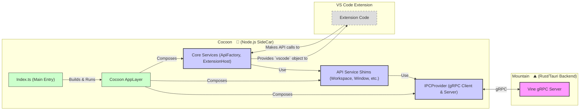

<table>
	<tr>
		<td colspan="1">
			<h3 align="center">
				<picture>
					<source media="(prefers-color-scheme: dark)" srcset="https://PlayForm.Cloud/Dark/Image/GitHub/Land.svg">
					<source media="(prefers-color-scheme: light)" srcset="https://PlayForm.Cloud/Image/GitHub/Land.svg">
					
				</picture>
			</h3>
			</td>
			<td colspan="3" valign="top">
				<h3 align="center"> Cocoon 🦋
			</h3>
		</td>
	</tr>
</table>

---

# **Cocoon** 🦋 The Extension Host for Land 🏞️

Welcome to **Cocoon**, a core component of the **Land Code Editor**. Cocoon is a
specialized Node.js sidecar process meticulously designed to host and execute
existing Visual Studio Code extensions. It achieves this by providing a
comprehensive, **Effect-TS native** environment that faithfully replicates the
VS Code Extension Host API. This allows Land to leverage the vast and mature VS
Code extension ecosystem, offering users a rich and familiar feature set from
day one.

Cocoon's primary goal is to enable high compatibility with Node.js-based VS Code
extensions. It communicates with the main Rust-based Land backend (`Mountain`)
via **gRPC** (`Vine` protocol), ensuring a performant and strongly-typed IPC
channel. Cocoon translates extension API calls into declarative Effects that are
sent to `Mountain` for native execution.

---

## Key Features & Architectural Highlights 🔐

- **Effect-TS Native Architecture:** The entire `Cocoon` application is built
  with **Effect-TS**. All services, API shims, and IPC logic are implemented as
  declarative, composable `Layer`s and `Effect`s, ensuring maximum robustness,
  testability, and type safety.
- **High-Fidelity VSCode API Shims:** Provides a comprehensive set of service
  shims (e.g., for `vscode.workspace`, `vscode.window`, `vscode.commands`) that
  replicate the behavior of the real VS Code Extension Host.
- **gRPC-Powered Communication:** All communication with the `Mountain` backend
  is handled via gRPC, providing a fast, modern, and strongly-typed contract for
  all IPC operations.
- **Robust Module Interception:** Implements high-fidelity interceptors for both
  CJS `require()` and ESM `import` statements, ensuring that calls to the
  `'vscode'` module are correctly sandboxed and routed to the appropriate,
  extension-specific API instance.
- **Process Hardening & Lifecycle Management:** Includes sophisticated process
  patching to handle uncaught exceptions, pipe logs to the host, and
  automatically terminate if the parent `Mountain` process exits, ensuring a
  stable and well-behaved sidecar.

---

## Deep Dive & Component Breakdown 🔬

To understand how `Cocoon`'s internal components interact to provide the
high-fidelity `vscode` API, please refer to the detailed technical breakdown in
[`Documentation/GitHub/DeepDive.md`](https://github.com/CodeEditorLand/Cocoon/tree/Current/Documentation/GitHub/DeepDive.md). This
document explains the roles of the `Core` services (like `ApiFactory` and
`ExtensionHost`), the `Service` shims, and the gRPC-based `IPCProvider`.

---

## `Cocoon` in the Land Ecosystem 🦋 + 🏞️

Cocoon operates as a standalone Node.js process, carefully orchestrated by and
communicating with `Mountain`.

| Component within Cocoon            | Role & Key Responsibilities                                                                                                                                                                                                                     |
| :--------------------------------- | :---------------------------------------------------------------------------------------------------------------------------------------------------------------------------------------------------------------------------------------------- |
| **Node.js Process**                | The runtime environment for Cocoon.                                                                                                                                                                                                             |
| **`Index.ts` (Main Orchestrator)** | The primary entry point. It composes all `Effect-TS` layers, establishes the gRPC connection, performs the initialization handshake with `Mountain`, and starts the extension host services.                                                    |
| **`PatchProcess/`**                | Performs very early process hardening (patching `process.exit`, handling exceptions, piping logs), ensuring a stable foundation before any other code runs.                                                                                     |
| **`Core/` Modules**                | Manages the extension runtime itself. `ExtensionHost.ts` activates extensions, `RequireInterceptor.ts` patches `require`, and `ApiFactory.ts` constructs the `vscode` object given to each extension.                                           |
| **`Service/` Modules**             | A comprehensive collection of Effect-TS `Layer`s, each implementing a specific VS Code `IExtHost...` service interface (e.g., `CommandsProvider`, `WorkspaceProvider`, `WebviewProvider`). These shims are the core of the compatibility layer. |
| **`Service/IPC.ts`**               | Implements both the gRPC client (to call `Mountain`) and server (to receive calls from `Mountain`), managing the entire bi-directional communication lifecycle.                                                                                 |
| **`Type/` & `TypeConverter/`**     | `Type/` contains the concrete TypeScript class and enum definitions for the `vscode` API (e.g., `Uri`, `Range`). `TypeConverter/` provides pure functions to serialize these rich types into plain DTOs for gRPC transport.                     |
| **Extension Code**                 | The JavaScript/TypeScript code of the VS Code extensions being hosted and run within the Cocoon environment.                                                                                                                                    |

### Interaction Flow (Example: `vscode.window.showInformationMessage`)

1.  `Mountain` launches `Cocoon` with initialization data.
2.  `Cocoon`'s `Index.ts` bootstraps the application:
    - `PatchProcess` hardens the environment.
    - `IPCProvider` establishes the gRPC connection and performs a handshake.
    - The main `AppLayer` is built, composing all services.
    - The real VS Code `ExtHostExtensionService` is instantiated within this
      Effect-TS environment.
3.  `ExtHostExtensionService` activates an extension. The extension receives a
    `vscode` API object constructed by the `ApiFactoryProvider`.
4.  The extension calls `vscode.window.showInformationMessage("Hello")`.
5.  The call is routed to the `MessageProvider` service.
6.  The `MessageProvider` creates an `Effect` that sends a `showMessage` gRPC
    request to `Mountain`.
7.  `Mountain`'s `Vine` layer receives the request. Its `Track` dispatcher
    routes it to the native UI handler.
8.  `Mountain` displays the native UI notification and waits for user
    interaction.
9.  The result is sent back to `Cocoon` via a gRPC response.
10. The `Effect` in `Cocoon` completes, resolving the promise returned to the
    extension's API call.

---

## System Architecture Diagram

This diagram illustrates the internal architecture of Cocoon and its place
within the broader Land ecosystem.

---

## Getting Started with Cocoon Development 🚀

Cocoon is developed as a core component of the main **Land** project. To work on
or run Cocoon, please follow the instructions in the main
[Land Repository README](https://github.com/CodeEditorLand/Land). The
`Bundle=true` build variable is essential, as it triggers the `Rest` element to
prepare the necessary VS Code platform code for Cocoon to consume.

**Key Dependencies:**

- `effect`: The core library for the entire application structure.
- `@grpc/grpc-js` & `@grpc/proto-loader`: For gRPC communication.
- VS Code platform code (e.g., `vs/base`, `vs/platform`), sourced from the
  `Land/Dependency` submodule.

**Debugging Cocoon:**

- Since Cocoon is a Node.js process, it can be debugged by attaching a standard
  Node.js debugger. `Mountain` must launch the Cocoon process with the
  appropriate Node.js debug flags (e.g., `--inspect-brk=PORT_NUMBER`).
- Logs from `Cocoon` are automatically piped to the parent `Mountain` process
  thanks to the `PatchProcess` module and will appear in `Mountain`'s console
  output or log files.

---

## License ⚖️

This project is released into the public domain under the **Creative Commons CC0
Universal** license. You are free to use, modify, distribute, and build upon
this work for any purpose, without any restrictions. For the full legal text,
see the [`LICENSE`](https://github.com/CodeEditorLand/Cocoon/tree/Current/) file.

---

## Changelog 📜

Stay updated with our progress! See [`CHANGELOG.md`](https://github.com/CodeEditorLand/Cocoon/tree/Current/) for a history
of changes specific to **Cocoon**.

---

## Funding & Acknowledgements 🙏🏻

**Cocoon** is a core element of the **Land** ecosystem. This project is funded
through [NGI0 Commons Fund](https://NLnet.NL/commonsfund), a fund established by
[NLnet](https://NLnet.NL) with financial support from the European Commission's
[Next Generation Internet](https://ngi.eu) program. Learn more at the
[NLnet project page](https://NLnet.NL/project/Land).

<table>
	<thead>
		<tr>
			<th align="left">
				<strong>Land</strong>
			</th>
			<th align="left">
				<strong>PlayForm</strong>
			</th>
			<th align="left">
				<strong>NLnet</strong>
			</th>
			<th align="left">
				<strong>NGI0 Commons Fund</strong>
			</th>
		</tr>
	</thead>
	<tbody>
		<tr>
			<td align="left" valign="middle">
				
			</td>
			<td align="left" valign="middle">
				
			</td>
			<td align="left" valign="middle">
				
			</td>
			<td align="left" valign="middle">
				
			</td>
		</tr>
	</tbody>
</table>

---

**Project Maintainers**: Source Open
([Source/Open@Editor.Land](mailto:Source/Open@Editor.Land)) |
[GitHub Repository](https://github.com/CodeEditorLand/Cocoon) |
[Report an Issue](https://github.com/CodeEditorLand/Cocoon/issues) |
[Security Policy](https://github.com/CodeEditorLand/Cocoon/security/policy)
