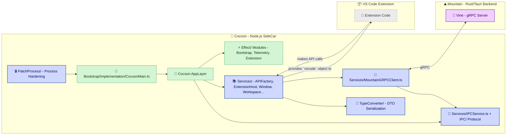

<table>
	<tr>
		<td align="left" valign="middle">
			<h3 align="left">Cocoon&#x2001;🦋</h3>
		</td>
		<td align="left" valign="middle">
			<h3 align="left">&#x2001;+&#x2001;</h3>
		</td>
		<td align="left" valign="middle">
			<h3 align="left">
				<a href="https://Editor.Land" target="_blank">
					<picture>
						<source media="(prefers-color-scheme: dark)" srcset="https://PlayForm.Cloud/Dark/Image/GitHub/Land.svg">
						<source media="(prefers-color-scheme: light)" srcset="https://PlayForm.Cloud/Image/GitHub/Land.svg">
						
					</picture>
				</a>
			</h3>
		</td>
		<td align="left" valign="middle">
			<h3 align="left">
				<a href="https://Editor.Land" target="_blank">Land&#x2001;🏞️</a>
			</h3>
		</td>
	</tr>
</table>

---

# **Cocoon**&#x2001;🦋

The Extension Host for `Land`&#x2001;🏞️.

> **`VS Code`'s extension host is a single `Node.js` event loop. One hung
> `Promise` blocks every other extension. There is no way to cancel an in-flight
> operation, no back-pressure, no preemption.**

_"Every extension runs in its own supervised fiber. One crash doesn't take down
the rest."_

Welcome to **Cocoon**&#x2001;🦋, a core component of the **Land**&#x2001;🏞️ Code
Editor. `Cocoon` is a specialized `Node.js` sidecar process meticulously
designed to host and execute existing `VS Code` extensions. It achieves this by
providing a comprehensive, **`Effect-TS` native** environment that faithfully
replicates the `VS Code` Extension Host API. This allows `Land` to leverage the
vast and mature `VS Code` extension ecosystem, offering users a rich and
familiar feature set from day one.

`Cocoon`'s primary goal is to enable high compatibility with `Node.js`-based
`VS Code` extensions. It communicates with the main `Rust`-based `Land` backend
(`Mountain`) via **`gRPC`** (`Vine` protocol), ensuring a performant and
strongly-typed IPC channel. `Cocoon` translates extension API calls into
declarative `Effect`s that are sent to `Mountain` for native execution.

---

## Key Features & Architectural Highlights&#x2001;🔐

- **`Effect-TS` Native Architecture:** The entire `Cocoon` application is built
  with **`Effect-TS`**. All services, API shims, and IPC logic are implemented
  as declarative, composable `Layer`s and `Effect`s, ensuring maximum
  robustness, testability, and type safety.
- **High-Fidelity `VS Code` API Shims:** Provides a comprehensive set of service
  shims (e.g., for `vscode.workspace`, `vscode.window`, `vscode.commands`) that
  replicate the behavior of the real `VS Code` Extension Host.
- **`gRPC`-Powered Communication:** All communication with the `Mountain`
  backend is handled via `gRPC`, providing a fast, modern, and strongly-typed
  contract for all IPC operations.
- **Robust Module Interception:** Implements high-fidelity interceptors for both
  CJS `require()` and ESM `import` statements, ensuring that calls to the
  `'vscode'` module are correctly sandboxed and routed to the appropriate,
  extension-specific API instance.
- **Process Hardening & Lifecycle Management:** Includes sophisticated process
  patching to handle uncaught exceptions, pipe logs to the host, and
  automatically terminate if the parent `Mountain` process exits, ensuring a
  stable and well-behaved sidecar.

---

## Deep Dive & Component Breakdown&#x2001;🔬

To understand how `Cocoon`'s internal components interact to provide the
high-fidelity `vscode` API, see the following source files:

- **[`Bootstrap/Implementation/CocoonMain.ts`](https://github.com/CodeEditorLand/Cocoon/tree/Current/Source/Bootstrap/Implementation/CocoonMain.ts)** -
  Main entry point and bootstrap orchestration.
- **[`Effect/Bootstrap.ts`](https://github.com/CodeEditorLand/Cocoon/tree/Current/Source/Effect/Bootstrap.ts)** -
  `Effect-TS` bootstrap stages (Environment, Configuration, Mountain Connection,
  Module Interceptor, RPC Server, Extensions, Health Check).
- **[`ServiceMapping.ts`](https://github.com/CodeEditorLand/Cocoon/tree/Current/Source/ServiceMapping.ts)** -
  Dependency injection and service composition.
- **[`Services/APIFactory.ts`](https://github.com/CodeEditorLand/Cocoon/tree/Current/Source/Services/APIFactoryService.ts)** -
  Constructs the `vscode` API object for extensions.
- **[`Services/ExtensionHostService.ts`](https://github.com/CodeEditorLand/Cocoon/tree/Current/Source/Services/ExtensionHostService.ts)** -
  Extension activation and lifecycle management.
- **[`Services/IPCService.ts`](https://github.com/CodeEditorLand/Cocoon/tree/Current/Source/Services/IPCService.ts)** -
  Bi-directional `gRPC` communication.
- **[`Services/MountainGRPCClient.ts`](https://github.com/CodeEditorLand/Cocoon/tree/Current/Source/Services/MountainGRPCClient.ts)** -
  `gRPC` client for `Mountain` backend.
- **[`PatchProcess/`](https://github.com/CodeEditorLand/Cocoon/tree/Current/Source/PatchProcess/)** -
  Process hardening and security.
- **[`TypeConverter/`](https://github.com/CodeEditorLand/Cocoon/tree/Current/Source/TypeConverter/)** -
  DTO serialization for `gRPC` transport.

---

## `Cocoon`&#x2001;🦋 in the `Land`&#x2001;🏞️ Ecosystem&#x2001;🦋&#x2001;+&#x2001;🏞️

`Cocoon` operates as a standalone `Node.js` process, carefully orchestrated by
and communicating with `Mountain`.

| Component                                    | Role & Key Responsibilities                                                                                                                                                                                                                                                     |
| :------------------------------------------- | :------------------------------------------------------------------------------------------------------------------------------------------------------------------------------------------------------------------------------------------------------------------------------ |
| **`Node.js` Process**                        | The runtime environment for `Cocoon`.                                                                                                                                                                                                                                           |
| **`Bootstrap/Implementation/CocoonMain.ts`** | Primary entry point. Composes all `Effect-TS` layers, establishes the `gRPC` connection, performs the initialization handshake with `Mountain`, and starts extension host services.                                                                                             |
| **`PatchProcess/`**                          | Very early process hardening (patching `process.exit`, handling exceptions, piping logs), ensuring a stable foundation before any other code runs.                                                                                                                              |
| **`Effect/` Modules**                        | `Bootstrap.ts` coordinates initialization stages, `Extension.ts` manages extension lifecycle, `ModuleInterceptor.ts` patches `require` and `import`, `Telemetry.ts` provides logging and tracing.                                                                               |
| **`Services/` Modules**                      | `Effect-TS` `Layer`s implementing each `VS Code` `IExtHost...` service interface (e.g., `CommandsProvider`, `WorkspaceProvider`, `WebviewProvider`). Key services: `APIFactory.ts`, `ExtensionHostService.ts`, `IPCService.ts`, `MountainGRPCClient.ts`.                        |
| **`IPC/` & `Services/IPC.ts`**               | `IPC/` contains the protocol layer (`Channel.ts`, `Handler.ts`, `Message.ts`, `Protocol.ts`). `Services/IPC.ts` implements both the `gRPC` client (to call `Mountain`) and server (to receive calls from `Mountain`), managing the full bi-directional communication lifecycle. |
| **`TypeConverter/`**                         | Pure functions to serialize `TypeScript` types into plain DTOs for `gRPC` transport. Organized by feature: `Main/` (URI, Range, TextEdit), `Dialog/`, `TreeView/`, `Webview/`, `Task/`, `WorkspaceEdit/`.                                                                       |
| **Extension Code**                           | The `JavaScript`/`TypeScript` code of the `VS Code` extensions being hosted within the `Cocoon` environment.                                                                                                                                                                    |

### Interaction Flow: `vscode.window.showInformationMessage`&#x2001;🔄

1. `Mountain` launches `Cocoon` with initialization data.
2. `Cocoon`'s
   [`Bootstrap/Implementation/CocoonMain.ts`](https://github.com/CodeEditorLand/Cocoon/tree/Current/Source/Bootstrap/Implementation/CocoonMain.ts)
   bootstraps the application:
    - `PatchProcess` hardens the environment.
    - `Effect/Bootstrap.ts` orchestrates initialization stages (environment
      detection, configuration, `gRPC` connection, module interceptor, RPC
      server, extensions, health check).
    - The main `AppLayer` is built via
      [`ServiceMapping.ts`](https://github.com/CodeEditorLand/Cocoon/tree/Current/Source/ServiceMapping.ts),
      composing all `Effect-TS` services.
3. `ExtHostExtensionService` activates an extension. The extension receives a
   `vscode` API object constructed by
   [`APIFactory`](https://github.com/CodeEditorLand/Cocoon/tree/Current/Source/Services/APIFactoryService.ts).
4. The extension calls `vscode.window.showInformationMessage("Hello")`.
5. The call is routed to the
   [`Window`](https://github.com/CodeEditorLand/Cocoon/tree/Current/Source/Services/Window.ts)
   service.
6. `Window` creates an `Effect` that sends a `showMessage` `gRPC` request to
   `Mountain` via
   [`MountainGRPCClient`](https://github.com/CodeEditorLand/Cocoon/tree/Current/Source/Services/MountainGRPCClient.ts).
7. `Mountain`'s `Vine` layer receives the request. Its `Track` dispatcher routes
   it to the native UI handler.
8. `Mountain` displays the native OS notification and awaits user interaction.
9. The result is sent back to `Cocoon` via a `gRPC` response.
10. The `Effect` in `Cocoon` completes, resolving the `Promise` returned to the
    extension's API call.

---

## System Architecture Diagram&#x2001;🏗️

---

## Getting Started&#x2001;🚀

`Cocoon` is developed as a core component of the main **Land**&#x2001;🏞️
project. To work on or run `Cocoon`, follow the instructions in the main
[`Land` Repository README](https://github.com/CodeEditorLand/Land). The
`Bundle=true` build variable is essential, as it triggers the `Rest` element to
prepare the necessary `VS Code` platform code for `Cocoon` to consume.

**Key Dependencies:**

| Package                          | Purpose                                           |
| :------------------------------- | :------------------------------------------------ |
| `effect` (v3.19.18)              | Core library for the entire application structure |
| `@effect/platform`               | `Effect-TS` platform abstractions                 |
| `@effect/platform-node`          | `Node.js`-specific `Effect-TS` platform           |
| `@grpc/grpc-js`                  | `gRPC` communication                              |
| `@grpc/proto-loader`             | `.proto` file loading for `gRPC`                  |
| `google-protobuf` & `protobufjs` | Protocol buffers for `gRPC`                       |
| `VS Code` platform code          | `vs/base`, `vs/platform` from `Land/Dependency`   |

**Debugging `Cocoon`:**

- Since `Cocoon` is a `Node.js` process, attach a standard `Node.js` debugger.
  `Mountain` must launch `Cocoon` with the appropriate debug flags (e.g.,
  `--inspect-brk=PORT_NUMBER`).
- Logs from `Cocoon` are automatically piped to the parent `Mountain` process
  via the `PatchProcess` module and will appear in `Mountain`'s console output.

---

## See Also&#x2001;🔗

- [Cocoon Documentation](https://editor.land/Doc/cocoon)
- [Architecture Overview](https://editor.land/Doc/architecture)
- [Why `Effect-TS`](https://editor.land/Doc/why-effect-ts)
- [Why `gRPC`](https://editor.land/Doc/why-grpc)
- [`Mountain`](https://github.com/CodeEditorLand/Mountain)
- [`Wind`](https://github.com/CodeEditorLand/Wind)
- [`Vine`](https://github.com/CodeEditorLand/Vine)

---

## License&#x2001;⚖️

This project is released into the public domain under the **Creative Commons CC0
Universal** license. You are free to use, modify, distribute, and build upon
this work for any purpose, without any restrictions. For the full legal text,
see the [`LICENSE`](https://github.com/CodeEditorLand/Cocoon/tree/Current/)
file.

---

## Changelog&#x2001;📜

See [`CHANGELOG.md`](https://github.com/CodeEditorLand/Cocoon/tree/Current/) for
a history of changes specific to **Cocoon**&#x2001;🦋.

---

## Funding \& Acknowledgements&#x2001;🙏🏻

**Cocoon**&#x2001;🦋 is a core element of the **Land**&#x2001;🏞️ ecosystem. This
project is funded through [NGI0 Commons Fund](https://NLnet.NL/commonsfund), a
fund established by [NLnet](https://NLnet.NL) with financial support from the
European Commission's [Next Generation Internet](https://ngi.eu) program. Learn
more at the [NLnet project page](https://NLnet.NL/project/Land).

The project is operated by PlayForm, based in Sofia, Bulgaria.

PlayForm acts as the open-source steward for Code Editor Land under the NGI0
Commons Fund grant.

<table>
	<thead>
		<tr>
			<th align="left"><strong>Land</strong></th>
			<th align="left"><strong>PlayForm</strong></th>
			<th align="left"><strong>NLnet</strong></th>
			<th align="left"><strong>NGI0 Commons Fund</strong></th>
		</tr>
	</thead>
	<tbody>
		<tr>
			<td align="left" valign="middle">
				
			</td>
			<td align="left" valign="middle">
				
			</td>
			<td align="left" valign="middle">
				
			</td>
			<td align="left" valign="middle">
				
			</td>
		</tr>
	</tbody>
</table>

---

**Project Maintainers**: Source Open
([Source/Open@Editor.Land](mailto:Source/Open@Editor.Land)) |
[GitHub Repository](https://github.com/CodeEditorLand/Cocoon) |
[Report an Issue](https://github.com/CodeEditorLand/Cocoon/issues) |
[Security Policy](https://github.com/CodeEditorLand/Cocoon/security/policy)
